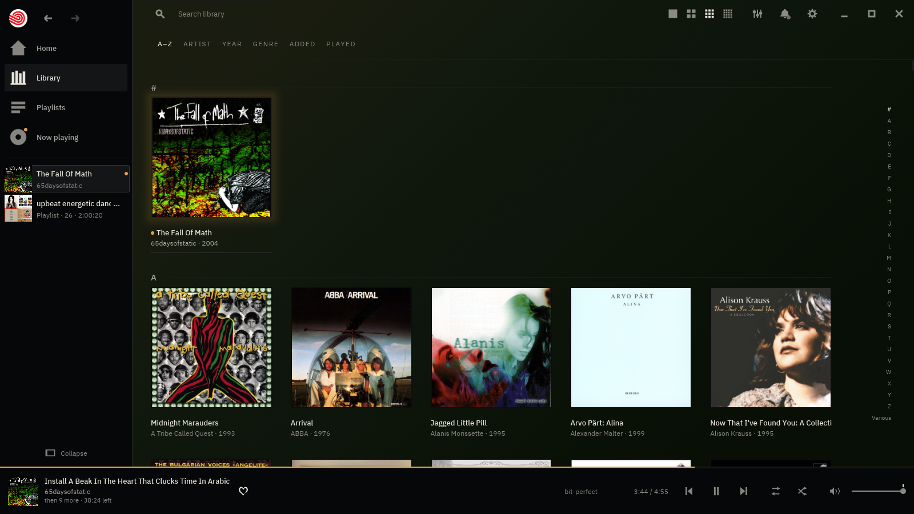
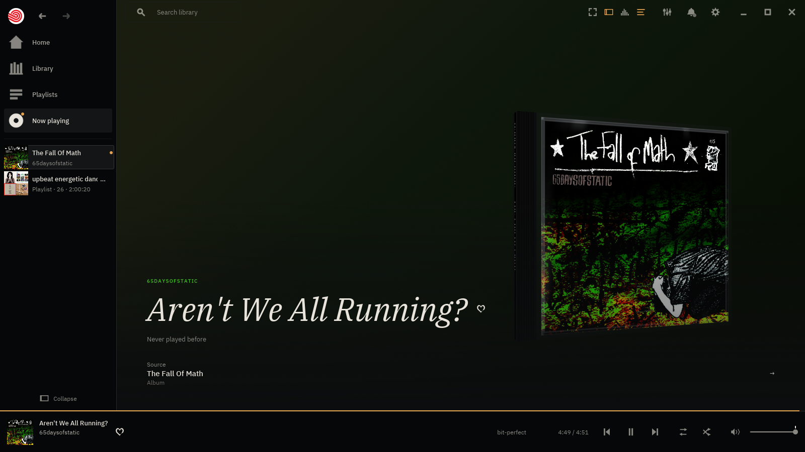
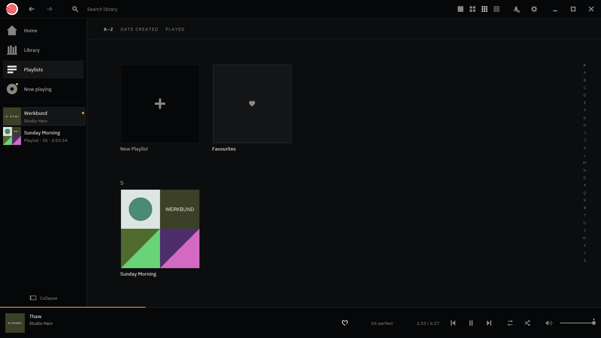
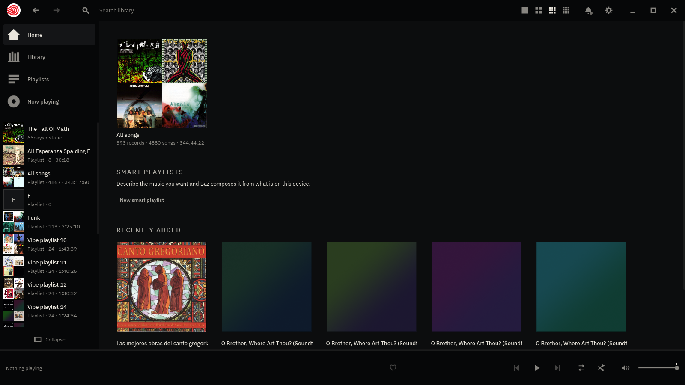

<p align="center">
  
</p>
<h1 align="center">baz</h1>
<p align="center">
  <strong>A music player for the music you already own.</strong><br>
  Point it at a folder — a drive, a NAS — and your records are the home screen.
  Click one and it plays front to back, gapless. No account, no subscription,
  nothing between you and your files.
</p>



> **Public beta.** The core loop is finished — you can find your music, play
> it, make lists of it, and nothing baz does loses or corrupts anything. It is
> also pre-1.0, it has rough edges, and the ones we know about are listed
> further down rather than left to be discovered. Reports are the point of a
> beta: [open an issue](https://github.com/mattcree/baz/issues).
>
> **Getting it today means building it** — one command, below. The signed-by-
> nobody binaries and the Flathub listing arrive with the `v0.1.0` tag, which
> has not been cut yet.

foo, bar… baz. The name is an homage and the debt is real: **baz is inspired by
foobar2000** — instant, correct, no commercial agenda, and the conviction that
the files on your disk are the point rather than an import step. **It is not
foobar2000 and is not trying to be.** Different platform, different decade, and
its own opinions about the interface — foobar2000 hands you a configuration
surface and waits, where baz puts the collection on screen and gets out of the
way. What baz borrowed is the posture. The rest of it is its own, including the
care the paid players (Roon, Plexamp, Audirvana) spend on making a collection
worth looking at, without any of their clouds.

## What it does

**Your folders, unchanged.** Name as many as you like, including a mounted
NAS. baz reads them and never writes to them: no tags rewritten, no files
moved, no `.baz` directories left behind. A rescan is incremental — one `stat`
per unchanged file, so a 10 000-track library re-checks in about 10 ms — and a
share that is not mounted is reported, not pruned. Nothing leaves the index
until four separate checks agree the folder is really gone.

**Gapless, and it is measured rather than claimed.** WAV, FLAC and ALAC cross a
track boundary **bit-exact** — the test suite asserts the joined decode
sample-for-sample against the continuous one. MP3 is trimmed from its LAME
header and Ogg Vorbis from its granule positions, both to a bounded error the
tests pin. A track boundary in baz is bookkeeping, not an audio event: the next
track is already decoded and waiting in a lock-free ring.

**The output follows the music.** baz opens the device at the rate of what you
are playing and resamples nothing; a track at a different rate reopens the
device rather than being converted to fit. The one case where it *must*
convert — hardware with no mode for the material — is reported on screen
instead of done quietly. The bottom bar's `bit-perfect` readout means three
things at once and all of them are checked: baz converted nothing, the fader is
at unity, and the file was not folded down from more than two channels. On
Linux an optional `exclusive-output` build takes the ALSA device outright,
`hw:` only, with resampling switched off in the driver.

**Multichannel folds to stereo** — 3.0, 4.0, 5.0 and 5.1, by the ITU-R BS.775
matrix, with the speaker layout *read from the container* rather than guessed
from the channel count (Vorbis and WAVE order 5.1 differently, and getting that
wrong puts the centre channel in one ear). 7.1 and 6.1 are still refused, and
say which layout they found.

**Search as you type, for songs and for records.** No field to click into
first: any letter, anywhere, starts filtering the wall, and the search well
takes the caret with it. Records rank by how well the query fits and which
field it landed in; the songs that matched are listed too, rather than folded
away into their albums. <kbd>Enter</kbd> plays the best match.

**Playlists are files you own.** One UTF-8 `.m3u8` per list, in baz's own data
folder, written as plain text any other player can read. Edit one in a text
editor and baz notices; the reader never writes back, so a line baz did not
understand is still there afterwards, byte for byte. Undo is eight deep per
list, and `Delete` sends the file to the desktop's trash — never `unlink` — so
the recovery is your file manager's own `Restore`. Deleting a list never
touches the music.

**ReplayGain, both halves.** baz honours the `REPLAYGAIN_*` and R128 tags
foobar2000, rsgain and loudgain wrote, and it can measure your library itself:
a full EBU R128 / ITU-R BS.1770-4 pass, gated integrated loudness and true
peak, verified against the EBU Tech 3341 compliance signals. It is per album
edition and resumable, it skips what is already known, and it stores what it
finds in its own index rather than in your files. Off by default, because
`Off` means no gain arithmetic at all.

**It belongs to the desktop.** Full MPRIS2 — GNOME's and KDE's media controls,
the lock screen, `playerctl` and the hardware media keys all drive baz and show
the title, artist, album and cover. Volume is readable and settable from there,
through the same fader curve the on-screen control uses, and the position it
reports is the engine's own knowledge rather than a clock running alongside it.
With no session bus baz prints one line and runs exactly as before.

**A wall you can arrange.** Six arrangements — A–Z, artist, year, genre, added,
played — and four densities, changed with <kbd>Ctrl</kbd>+scroll or the four
marks at the top right. baz remembers where you left it.

|  |  |
|---|---|
|  |  |
| **Now playing** — the record, and the rest of the run beside it. | **A playlist** — thirty-five songs off four records, and one `.m3u8` on disk. |



## Installing

**Building it is the way in today**, and it is one command plus, on Linux, one
system package:

```sh
git clone https://github.com/mattcree/baz
cd baz
cargo build --release --locked -p baz
./target/release/baz [MUSIC_DIR]
```

Audio output is part of every baz GUI build. On Linux, building it needs the
platform's audio headers — `libasound2-dev` on Debian/Ubuntu,
`alsa-lib-devel` on Fedora, or `alsa-lib` on Arch; macOS and Windows need no
extra package.

baz keeps its index, its playlists and its play history under
`~/.local/share/baz/` (and the platform equivalents), and its settings under
`~/.config/baz/`. **Nothing is written next to your music.** Deleting the index
costs you one rescan; deleting `playlists/` costs you your playlists, because
they are the only copy.

[`docs/INSTALL.md`](docs/INSTALL.md) has the rest: the Flatpak, the release
archives and their checksum step, the exact paths on all three platforms, and
the sandbox permissions (there is no network permission, because baz does not
use the network).

**Linux is the platform baz is developed and used on.** The Windows and macOS
binaries are built and tested by CI on every change — the same suite, on all
three operating systems — but nobody has sat in front of baz on either. They
are honest builds, not a supported experience, and they are unsigned: macOS
will refuse an unnotarized download until you clear the quarantine attribute,
and Windows SmartScreen will warn.

## What baz will not do

This list is a feature, and it is not going to get shorter.

- **No account.** There is nothing to sign in to and no identity to have.
- **No telemetry.** baz reports nothing about you, to anyone, ever.
- **No cloud, and no network at all.** The Flatpak ships without network
  permission because there is nothing to ask for.
- **No library anywhere but your disk.** The index is a cache of what is in
  your folders — throw it away and a rescan rebuilds it. Your files are the
  truth, and your playlists are plain text in a folder you can copy.
- **No writing to your music.** Not tags, not filenames, not folder layout —
  including ReplayGain, which baz measures into its own index and leaves your
  files alone.

## Keyboard

**Start typing.** Any letter, anywhere, filters the wall — there is no field to
click into first, and the search well fills in as you type. That is why every
letter shortcut below wears a modifier: the letters belong to the query now.
Nothing has focus when baz starts, so <kbd>Space</kbd> means play/pause on the
very first frame.

| Key | Does |
|---|---|
| any printable character | filter the wall by it, from wherever you are — the search well takes the caret with the first keystroke |
| <kbd>Enter</kbd> | play the best match for what you typed; with no query, play the selected record |
| <kbd>Esc</kbd> | peel one layer, top down: a drag in flight, then a menu, then the playlists panel, then a field, then the place you are in, then the query |
| <kbd>Space</kbd> | play / pause |
| <kbd>←</kbd> <kbd>→</kbd> | seek 5 s back / forward |
| <kbd>Shift</kbd>+<kbd>←</kbd> <kbd>→</kbd> | seek 30 s back / forward |
| <kbd>Ctrl</kbd>+<kbd>→</kbd> | next track |
| <kbd>Ctrl</kbd>+<kbd>←</kbd> | previous track — or restart this one, if you are more than 3 s in |
| <kbd>↑</kbd> <kbd>↓</kbd> | volume up / down, one step (~1 dB at the top of the fader) |
| <kbd>Ctrl</kbd>+<kbd>M</kbd> | mute / unmute |
| <kbd>Ctrl</kbd>+<kbd>-</kbd> <kbd>Ctrl</kbd>+<kbd>=</kbd>, or <kbd>Ctrl</kbd>+scroll | hang the wall closer or wider — **spacious**, **balanced**, **compact**, **dense** |
| <kbd>1</kbd> … <kbd>6</kbd> | arrange the wall by **A–Z**, **artist**, **year**, **genre**, **added** or **played** — the same six words in the strip |
| <kbd>/</kbd>, or <kbd>Ctrl</kbd>+<kbd>F</kbd> | put the caret in the search field without typing anything |
| <kbd>Ctrl</kbd>+<kbd>U</kbd> | go to **Now playing** — what is playing, and what is **up next**, on one surface |
| <kbd>Ctrl</kbd>+<kbd>P</kbd> | open the playlists panel, or close it |
| <kbd>Ctrl</kbd>+<kbd>B</kbd> | collapse the left-hand lane, or bring it back |
| <kbd>Ctrl</kbd>+<kbd>,</kbd> | go to the settings, or come back |
| <kbd>Ctrl</kbd>+<kbd>Z</kbd> | undo the last edit to the list you are looking at (eight deep, no redo) |

Media keys — play/pause, previous, next, stop — work too. On Linux they usually
arrive over MPRIS rather than as key presses, which is the same thing by a
different road. The *volume* media keys are deliberately left alone: on every
desktop they mean the system's volume, and baz's fader is baz's own.

**Shuffle has no key**, only the control in the bottom bar. The rule runs one
way — every action needs a visible control, not every control needs a key — and
shuffle is a standing choice made once an evening rather than a reflex.

**The number row is the one place a bare key is not the query.** `1`–`6` pick
the arrangement and the rest of the row does nothing, because a row where `1`
rearranges the wall and `7` types a `7` would be two rules wearing one shape.
The cost, stated rather than discovered: you cannot start a search with a digit
from the wall. Press <kbd>/</kbd> first and every digit types.

**While the search field has focus, every key belongs to the field**: Space
types a space, the arrows move the caret, `n` types an `n`. That is not a
heuristic — baz asks the toolkit whether a widget consumed the key and never
second-guesses the answer — which is also why exactly one keystroke per search
reaches the table above: the first one, which hands the caret to the field.

## Known limitations

The list that makes the rest of this page worth believing. Everything here is
something you can hit; each one is written down at length in
[`docs/BACKLOG.md`](docs/BACKLOG.md).

**Formats**

- **Opus files are not played, and they are not listed either.** `.opus` is out
  of the scanned extensions entirely, so those files are simply absent rather
  than shown-and-broken. Symphonia has no Opus decoder in any released version,
  and the only route is a C dependency this project has refused elsewhere. It
  is closed on evidence rather than deferred — and it reopens the day a beta
  tester says they have Opus files, so [say
  so](https://github.com/mattcree/baz/issues).
- **AAC has no gapless trim.** MP3, Vorbis, FLAC, WAV and ALAC are all trimmed;
  AAC in MP4 is not, because symphonia's MP4 reader consults neither the edit
  list nor `iTunSMPB`. An AAC album carries about 23 ms of encoder priming at
  each track boundary.
- **Multichannel AAC does not decode at all** — upstream refuses the stream
  before a frame exists. 7.1 and 6.1 are refused in any format.
- **A folded 5.1 file plays 7.66 dB quieter than a stereo master** until you
  analyse it. That is the headroom the downmix matrix needs to be provably
  clip-free; a ReplayGain pass measures this decoder's own output and gives the
  level back exactly.
- **FLAC inside an MP4 container is labelled ALAC.** The wrong name and the
  right fidelity tier, on a combination essentially absent from real libraries.

**Playback**

- **Skip and seek are drain-and-restart, not sample-accurate splices.** Tens of
  milliseconds, not an audible gap in ordinary use, but it is not the
  frame-exact splice the gapless path is.
- **Seeking into an Ogg Vorbis file loses one lapped block** — 1024 frames,
  23.2 ms at 44.1 kHz. Every other format seeks exactly or time-accurately.
- **Exclusive output needs the sound card to itself**, and on a desktop
  something usually has it. PipeWire held the maintainer's DAC for a whole
  session; every exclusive open refused with `DeviceBusy`. baz reports that and
  does not offer to fix it.
- **A file that needs converting is decoded whole before the first sound** when
  the device offers no mode at the source rate — about 2.6 s for a five-minute
  24/48 FLAC.

**Library**

- **A folder you delete leaves its records on the wall.** Deliberate: from the
  filesystem's side, a deleted folder and an unmounted NAS are the same
  `NotFound`, and wiping a present listener's library to tidy a stale row is
  the worse failure. The mechanism to forget a record on your say-so has
  shipped and **its control has not** — so for now the stale rows stay.
- **A file baz could not read names itself only in the terminal.** A scan
  prints one `[scan] skipped <path>: <reason>` line per failure, which is
  enough at a shell and nothing at all inside the Flatpak. Where that readout
  belongs in the interface is still an open question.
- **The wall's thumbnail cache decodes one size for several densities**, so the
  tightest steps hold covers larger than they draw.

**A defect that is not ours, and is not guarded**

A corrupt or hostile audio file can make the decoder **reserve several
gigabytes** before it reads a byte — four such sites across FLAC, Ogg and WAV,
and five more in MP4, all of them unchecked 32-bit lengths in symphonia. On
64-bit Linux this costs nothing measurable: the reservation is a lazy mapping,
the read fails, peak memory stays around 3 MB. **On macOS the pages are
actually found**, and three test inputs cost five seconds. Under a container
limit, strict overcommit or a 32-bit build it is an abort.

baz declines to guard it, and the reason is not effort: a correct pre-check is a
second parser for four container formats, and the day baz's copy and
symphonia's original disagree about where a block ends, baz refuses a file that
plays. Real WAV files declare `0xFFFFFFFF` routinely. For a music player,
refusing a good record is the worse failure. The full argument, the
reproducers and the upstream fix that would close it are in
[ADR-0040](docs/adr/0040-a-hostile-file.md).

## Accessibility — read this before you install

**baz has no screen-reader support.** Not partial, not planned-for-soon: none.
The toolkit it is built on ([iced](https://iced.rs) 0.13) publishes no
accessibility tree, and its buttons take no keyboard focus. If you use a screen
reader, baz will not work for you today, and we would rather you learn that
here than after installing it.

That choice was made openly — ADR-0005 chose iced knowing it, with
"AccessKit-dependent accessibility" written into its accepted costs — and
[ADR-0017 §4](docs/adr/0017-design-direction.md) publishes it rather than
letting it be inherited quietly.

What baz does guarantee, because these are the guarantees still available and
being unable to make the big one is a reason to be strict about the rest:

- **Every action has a visible, pointer-reachable control.** No action is
  keyboard-only, and no control's only affordance is hover. It has already cost
  design proposals that were prettier without it.
- **Contrast floors are tested**, every ink against every surface, with opacity
  composited before measuring rather than assumed away.
- **Hit targets have a floor**, asserted in the test suite.
- **No state is signalled by colour alone.**

## How it is built

A Rust workspace: `baz-core` is a headless engine — playback, library,
protocol — and the GUI is a thin client over its command/event protocol, so
nothing on screen can make a sample late. The toolkit is
[iced](https://iced.rs), chosen by a measured spike (ADR-0005). Every decision
of consequence is written down in [`docs/adr/`](docs/adr/), including the ones
that went the other way.

baz is developed with substantial AI assistance, openly: AI-assisted commits
carry co-author trailers. Trust is deliberately **not** placed in provenance —
it is placed in gates anyone can inspect. Every change passes rustfmt, clippy
with warnings denied, the whole test suite on three operating systems —
**1 255 tests**, which is what `cargo test --workspace` counts on Linux at
default features — cargo-deny licence and advisory checks, and scheduled
fuzzing of every byte-facing parser; the audio-correctness tests are asserted
against external
references — reference decoders, synthesized ground truth, the EBU's own
compliance signals — and never against baz's own output. A human owns every
merge. The charter is [`docs/ENGINEERING.md`](docs/ENGINEERING.md).

What has actually shipped is in [`CHANGELOG.md`](CHANGELOG.md); what is
deliberately deferred, and why, is in [`docs/BACKLOG.md`](docs/BACKLOG.md);
what is being worked on next is [`docs/WORK.md`](docs/WORK.md).

## Licence

[GPL-3.0-or-later](LICENSE) (ADR-0001).
