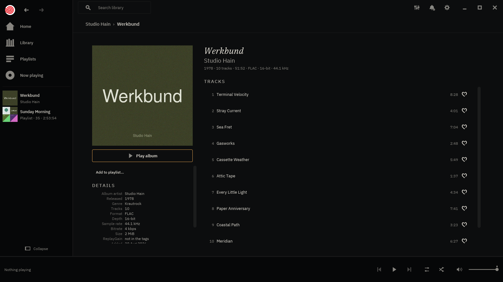
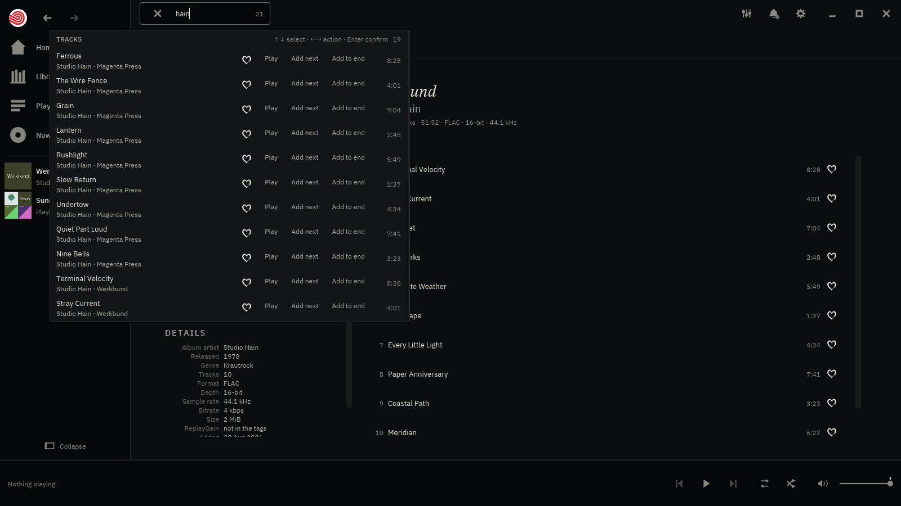
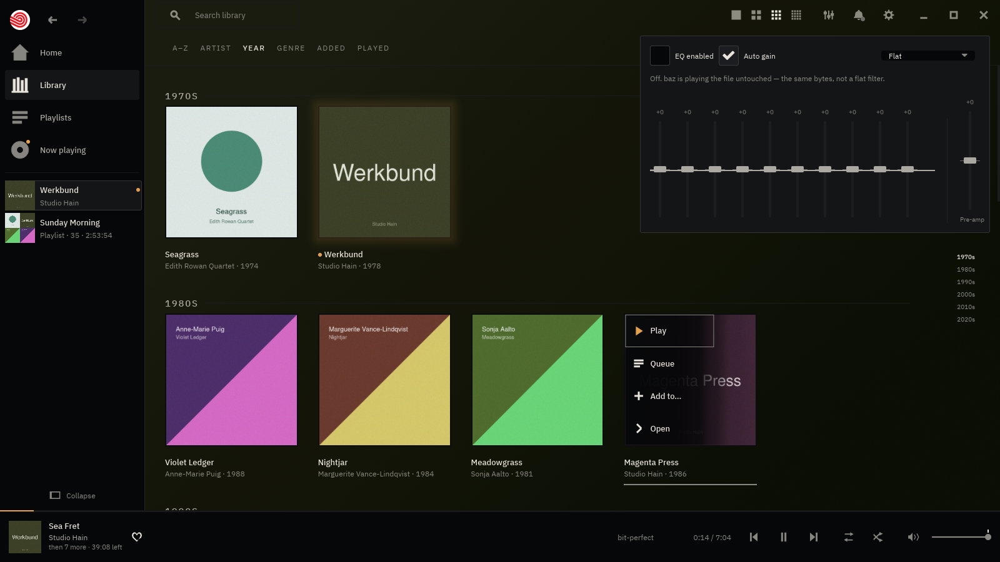
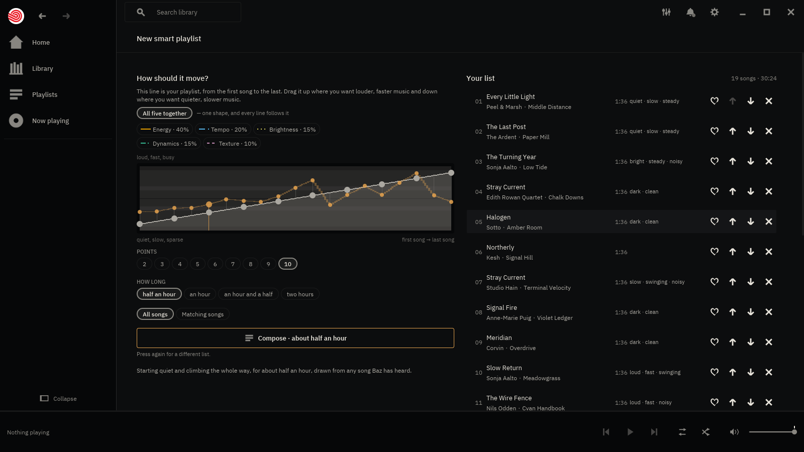

<p align="center">
  
</p>
<h1 align="center">baz</h1>
<p align="center">
  <strong>A music player for the music you already own.</strong><br>
  Point it at a folder — a drive, a NAS — and your records are the home screen.
  Double-click one and it plays front to back, gapless. No account, no subscription,
  nothing between you and your files.
</p>


> **Public beta.** You can find your music, play it, make lists of it, and
> nothing baz does loses or corrupts anything. It is also pre-1.0 and has rough
> edges — the ones we know about are [listed below](#known-limitations) rather
> than left to be discovered. Reports are the point of a beta:
> [open an issue](https://github.com/mattcree/baz/issues).

foo, bar… baz. The name is an homage and the debt is real: **baz is inspired by
foobar2000** — instant, correct, no commercial agenda, and the conviction that
the files on your disk are the point rather than an import step. It is not
foobar2000 and is not trying to be. What baz borrowed is the posture; the rest
is its own, including the care the paid players spend on making a collection
worth looking at, without any of their clouds.

## What you get

- **Your records on a wall.** Every album you own, with its cover, arranged by
  A–Z, artist, year, genre, when you added it or when you last played it. Four
  densities. baz remembers where you left it.
- **It just plays.** Gapless between tracks — a live album or a mixed record
  runs as one piece, with no click and no pause. FLAC, MP3, WAV, ALAC, AAC,
  AIFF and Ogg Vorbis.
- **Nothing touches your files.** baz reads your folders and never writes to
  them: no tags rewritten, no files moved, nothing left behind. Move your
  music and baz finds it again.
- **Start typing to find anything.** Any letter, anywhere, searches tracks and
  albums at once. Enter plays it; one key away is *add to the queue instead*.
- **Playlists you own.** Ordinary `.m3u8` text files any other player can read,
  in a folder you can copy. Undo goes eight deep, and deleting a list sends the
  file to your desktop's trash — never straight to nowhere.
- **Playlists by feel.** Draw a shape — start quiet, climb, hold, come down —
  and baz builds a list that follows it by listening to your own library, on
  your own machine. Six ready-made moods if you would rather just pick one.
- **A queue, favourites, shuffle, repeat and a sleep timer.** The ordinary
  things, where you expect them.
- **It sounds right.** baz plays your files at their own sample rate and
  changes nothing on the way out; when it *has* to change something it says so
  on screen. If your files carry ReplayGain tags it will use them, and it can
  measure your library itself.
- **Shape the sound when you want to.** A ten-band equalizer is one click away
  from every room, with named curves, your own saved presets and automatic
  headroom protection. Leave it off and the direct, bit-perfect path remains.
- **It belongs to your desktop.** Media keys, the lock screen and GNOME's and
  KDE's own controls all drive baz and show the cover.
- **Sixteen themes**, plus a plain file format for writing your own.

|  |  |
|---|---|
|  |  |
| **Now playing** — cover, rotating jewel case, or a spectrum-led room with no album object. | **Playlists** — the ones you have made, beside Favourites and the way to a new one. Each is an ordinary `.m3u8` on disk. |
|  |  |
| **A record** — the sleeve at size, the run in play order, and both editions the library merged. | **Search** — app-wide, from any place, reaching tracks as well as records. |
|  |  |
| **Equalizer** — ten bands, a live response curve, safe auto gain, built-in situations and curves you can save. | **Home** — the collection at a glance: all songs, recent additions and the way back to the music. |



**A smart playlist.** Draw how the music should move from the first song to
the last and baz fills it from your own collection, using what the songs
actually sound like rather than what their tags say. Read the words beside the
rows down the list: *quiet · slow · dark* at the top, *loud · fast · noisy* at
the bottom. Every track is analysed on your own machine, and none of your
audio leaves it.

> These are real screenshots from the shipping binary, captured against the
> project's representative music fixture — not mock-ups.
> `docs/screenshots/capture.sh` refreshes them reproducibly.

The long version of all of this — every audio claim and how it is checked — is
in [`docs/FEATURES.md`](docs/FEATURES.md).

## Installing

Downloads for Linux, Windows and macOS are on the
[releases page](https://github.com/mattcree/baz/releases). They are unsigned:
macOS will refuse the download until you clear the quarantine attribute, and
Windows SmartScreen will warn.

Or build it — one command, plus one system package on Linux:

```sh
git clone https://github.com/mattcree/baz
cd baz
cargo build --release --locked -p baz
./target/release/baz [MUSIC_DIR]
```

Linux needs the platform's audio headers to build: `libasound2-dev` on
Debian/Ubuntu, `alsa-lib-devel` on Fedora, `alsa-lib` on Arch. macOS and
Windows need nothing extra.

baz keeps its index, its playlists and its play history under
`~/.local/share/baz/` (and the platform equivalents), and its settings under
`~/.config/baz/`. **Nothing is written next to your music.**
[`docs/INSTALL.md`](docs/INSTALL.md) has the rest: the Flatpak, the checksum
step, and the exact paths on all three platforms.

**Linux is the platform baz is developed and used on.** The Windows and macOS
builds are tested by CI on every change — the same suite, on all three
systems — but nobody has sat in front of baz on either.

## What baz will not do

This list is a feature, and it is not going to get shorter.

- **No account.** There is nothing to sign in to and no identity to have.
- **No telemetry.** baz reports nothing about you, to anyone, ever.
- **No cloud or online music service.** Your library, analysis and playlists
  stay on your machine. The optional update check is the sole exception to
  baz's offline-first default; turn it off in Settings and baz makes no
  network request. The Flatpak continues to ship without network permission.
- **No library anywhere but your disk.** The index is a cache of what is in
  your folders — throw it away and a rescan rebuilds it.
- **No writing to your music.** Not tags, not filenames, not folder layout.

## Keyboard

Start typing to search — that is why every letter shortcut wears a modifier.
Nothing has focus when baz starts, so <kbd>Space</kbd> plays on the very first
frame.

| Key | Does |
|---|---|
| any letter | search tracks and albums |
| <kbd>Space</kbd> | play / pause |
| <kbd>←</kbd> <kbd>→</kbd> | seek 5 s (hold <kbd>Shift</kbd> for 30 s) |
| <kbd>Ctrl</kbd>+<kbd>←</kbd> <kbd>→</kbd> | previous / next track |
| <kbd>↑</kbd> <kbd>↓</kbd> | volume |
| <kbd>Ctrl</kbd>+<kbd>U</kbd> | now playing, and what is up next |
| <kbd>Ctrl</kbd>+<kbd>P</kbd> | playlists |
| <kbd>Ctrl</kbd>+<kbd>,</kbd> | settings |
| <kbd>Ctrl</kbd>+<kbd>Z</kbd> | undo the last edit to this list |
| <kbd>1</kbd> … <kbd>6</kbd> | arrange the wall |
| <kbd>Ctrl</kbd>+scroll | closer or wider |
| <kbd>Esc</kbd> | back out of whatever is open |
| <kbd>?</kbd> | this table, on screen |

Media keys work too. The *volume* media keys are deliberately left alone: they
mean your system's volume, and baz's fader is baz's own. The full table,
including why shuffle has no key, is in
[`docs/FEATURES.md`](docs/FEATURES.md#keyboard-in-full).

## Known limitations

The list that makes the rest of this page worth believing — the ones you can
actually hit. The complete set, with the reasoning, is in
[`docs/FEATURES.md`](docs/FEATURES.md#the-rest-of-the-rough-edges) and
[`docs/BACKLOG.md`](docs/BACKLOG.md).

- **Opus files are not played, and they are not listed either.** There is no
  Opus decoder available to baz that does not pull in a C dependency this
  project has refused elsewhere, so those files are absent rather than
  shown-and-broken. It reopens the day a beta tester says they have Opus files,
  so [say so](https://github.com/mattcree/baz/issues).
- **AAC albums are not gapless.** About 23 ms of silence at each track
  boundary, because the format's own trim data is not readable here. Every
  other format baz plays is trimmed.
- **A folder you delete leaves its records on the wall.** Deliberate: an
  unmounted NAS and a deleted folder look identical from the filesystem, and
  wiping a present listener's library to tidy a stale row is the worse failure.
  A control to forget a record on your say-so is coming.
- **Selection is one track at a time.** No shift-click run of twelve songs
  yet — it is the next thing being built.
- **A corrupt or hostile file can make the decoder reserve a lot of memory**
  before it reads a byte. On 64-bit Linux this costs nothing measurable; under
  a container limit it could be an abort. The reasoning for leaving it
  unguarded — guarding it would mean refusing files that play — is in
  [ADR-0040](docs/adr/0040-a-hostile-file.md).

## Accessibility — read this before you install

**baz has no screen-reader support.** Not partial, not planned-for-soon: none.
The toolkit it is built on publishes no accessibility tree, and its buttons take
no keyboard focus. If you use a screen reader, baz will not work for you today,
and we would rather you learn that here than after installing it. That choice
was made openly and is published in
[ADR-0017 §4](docs/adr/0017-design-direction.md) rather than inherited quietly.

What baz does guarantee, because being unable to make the big promise is a
reason to be strict about the rest:

- **Every action has a visible, pointer-reachable control.** No action is
  keyboard-only, and no control's only affordance is hover.
- **Contrast floors are tested**, every ink against every surface.
- **Hit targets have a floor**, asserted in the test suite.
- **No state is signalled by colour alone.**

## Under the hood

A Rust workspace: a headless engine does playback and the library, and the
interface is a thin client over it, so nothing on screen can make a sample
late. baz is developed with substantial AI assistance, openly — and trust is
placed in gates anyone can inspect rather than in provenance: rustfmt, clippy
with warnings denied, the whole test suite on three operating systems, licence
and advisory checks, and scheduled fuzzing of every byte-facing parser. Audio
correctness is asserted against external references, never against baz's own
output. A human owns every merge.

[`docs/FEATURES.md`](docs/FEATURES.md) has the detail,
[`docs/ENGINEERING.md`](docs/ENGINEERING.md) is the charter, and
[`docs/adr/`](docs/adr/) holds every decision of consequence including the ones
that went the other way. What has shipped is in
[`CHANGELOG.md`](CHANGELOG.md); what is next is in
[`docs/WORK.md`](docs/WORK.md).

## Licence

[GPL-3.0-or-later](LICENSE) (ADR-0001).
