# baz — UX audit and information architecture

> **Partly superseded by [ADR-0016](../adr/0016-design-direction.md).** This
> document's diagnosis and its places/inspector/popover/bar model still govern
> and shipped as ADR-0015. Four things in it no longer do:
>
> | No longer governs | Now |
> |---|---|
> | §4.8's rejection of type-ahead — *"the transport wins, `/` remains the door"* | **Superseded.** Bare printable characters filter the wall; `n` / `m` / `q` move to the modifier layer; the search **field is kept** as the visible affordance and the only focusable widget. ADR-0016 §1.2 |
> | §4.2 / §4.5's 102 px bar with its 380 px seek column | **Superseded.** A 2 px segmented needle flush on the window's bottom edge takes the seek row's job; the bar keeps Previous · Play/Pause · Next and drops to 58 px. ADR-0016 §1.1 |
> | §5's fourteen increments | **Superseded** by ADR-0016 §7's single sequence. Increments 1–8 shipped; 9–13 are re-ordered into it. |
> | §1.2's "the shelf has one sort and no facets" as a scope call | **Taken up.** Group keys (ARTIST / YEAR / GENRE / ADDED / PLAYED) and an index rail derived from the active key. ADR-0016 §1.7 |
>
> Still load-bearing and **not** superseded: the audit itself (§1), the IA
> diagnosis and model (§2), the flow specification (§3), the responsive regimes
> and iced-limit table (§4.3, §4.6), and the accessibility gap it declares —
> which ADR-0016 §4 turns from a declaration into a stance.

> A design specification, not an implementation. Written 2026-08-08 against
> `1919193` (the merge that added the settings panel). Screenshots in
> [`audit/`](audit/) were taken from the real binary on a private Xvfb with a
> throwaway library; how, and why they are trustworthy, is in
> [§0.2](#02-how-the-screenshots-were-made).
>
> The brief: *"pretty soon we need to get a team of expert UX/UI people to
> create a fluid, sensible, reasonable user flow… it's important we have
> detailed specs and reasoning for the way of laying it out. we want a
> beautiful and modern experience."* And the starting thread: *"an example of a
> strange UI is the two side panels we have now. that seems unreasonable."*
>
> There are three now.

---

## 0. Preliminaries

### 0.1 What this document is judged against

Not taste. Three things, in this order:

1. **The vision's pillars** (`docs/VISION.md`) — especially *the library is the
   interface*, *one gesture to music*, *presentation that honours the artwork*,
   and *progressive disclosure*.
2. **The five people** (`docs/research/05-personas.md`) — Marta (browses and
   inspects metadata), Devon (plays an album front to back, never looks at a
   queue), Priya (shuffles, cares what is next), Karl (wants the signal chain
   proven), Sam (wants it scriptable and sovereign).
3. **The bar the paid products set** (`docs/research/06-paid-product-teardown.md`)
   — Plexamp's player polish and Roon's browsable depth are what "beautiful and
   modern" means here.

Everything in this document is constrained by ADR-0006: a redesign must be
**view composition only** wherever possible, tokens live in `theme.rs`, and
pure state stays iced-free. §5 says exactly where that line is crossed and why.

### 0.2 How the screenshots were made

Every image is the real binary, rendered headless, with nothing touching the
maintainer's session:

- a private `Xvfb :137` at 1400×1000, `env -u WAYLAND_DISPLAY
  WINIT_UNIX_BACKEND=x11`;
- scratch `XDG_DATA_HOME` / `XDG_CONFIG_HOME` / `XDG_CACHE_HOME` **and** a
  scratch `HOME`, so the real library database and config were never opened;
- a throwaway 29-album / 287-track fixture of generated covers and **digitally
  silent** FLAC/WAV, never `~/Music`;
- captures targeted at *this* process's window by pid, after a sibling agent's
  window was found sharing an earlier display.

One deliberate deviation from the brief, stated rather than hidden. The brief
said to build **without** `device-output` so nothing could make noise — but
that build hides the entire transport (screenshot 21 is what it looks like),
and the bottom bar in each transport state is exactly what the audit needs. So
the audit build has `device-output` **and** a private `HOME` whose `.asoundrc`
routes ALSA's default PCM to the `null` device. Two independent guarantees of
silence: the sink discards every sample, and every sample is a zero. Screenshot
21 is from the `device-output`-less build so that state is covered too.

Processes started by this work were killed and their absence verified with
`ps`; no process started by anything else was touched.

One state could not be captured and is described from the code instead: the
**converting** signal-path readout (`48 → 44.1 kHz`). The null device accepts
any rate, so a 24/96 album played through it reports `bit-perfect` (screenshot
13) rather than a conversion. The affirmative case — the one Karl actually
wants — is captured; the converting case is specified from
`player::SignalNote`.

---

## 1. Audit, surface by surface

### 1.1 First run — [`01-first-run.png`](audit/01-first-run.png)

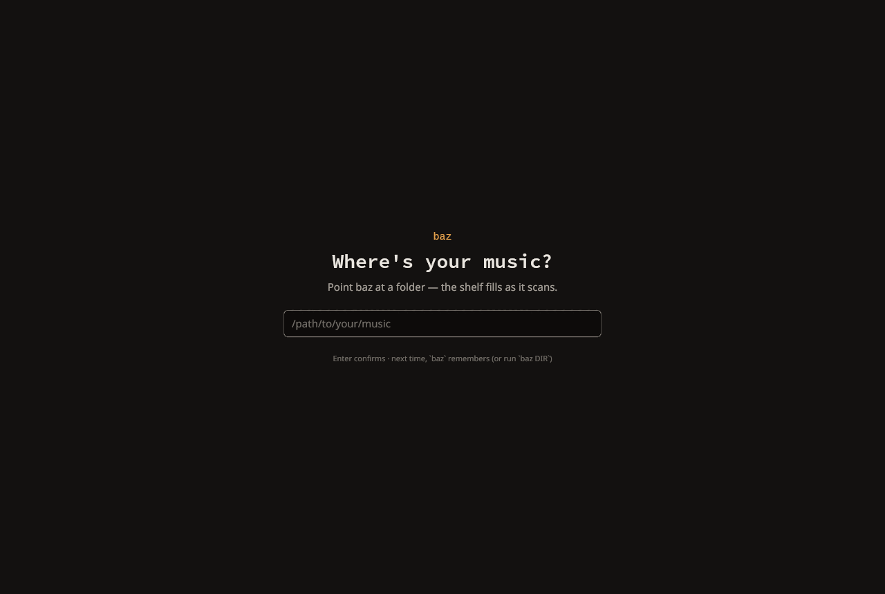

**What works.** One question, one field, one footnote, on an otherwise empty
warm-charcoal field. It is the right *shape*: no wizard, no theme chooser, no
account. The wordmark in lamp amber over the hero question is the only place
the accent appears, which is a good first lesson in what amber means. The
footnote teaches two things at once (`Enter` confirms; `baz DIR` exists) in
caption ink that nobody has to read.

**What doesn't.**

- **It asks a developer question.** The only way in is to *type an absolute
  path*. The persona sketch specifies "a folder picker and a drag-target"; the
  research target is "two required decisions" and this makes the first of them
  a typing exercise. Devon — who "bounces on configuration before first
  playback" — meets a text field where he expected a folder. This is the single
  worst moment in the product today, because it is the first one.
- **The suggestion is invisible when it is absent.** With `~/Music` present the
  field is pre-filled; without it (as here) the field is empty and the hero
  text does not say what a good answer looks like beyond a placeholder.
- **The transport is absent from this screen.** Correct — there is nothing to
  transport — but it means the bottom bar *appears* on the transition, which is
  the one layout jump baz allows itself. Worth keeping; worth knowing.

### 1.2 The shelf — [`02-shelf.png`](audit/02-shelf.png)

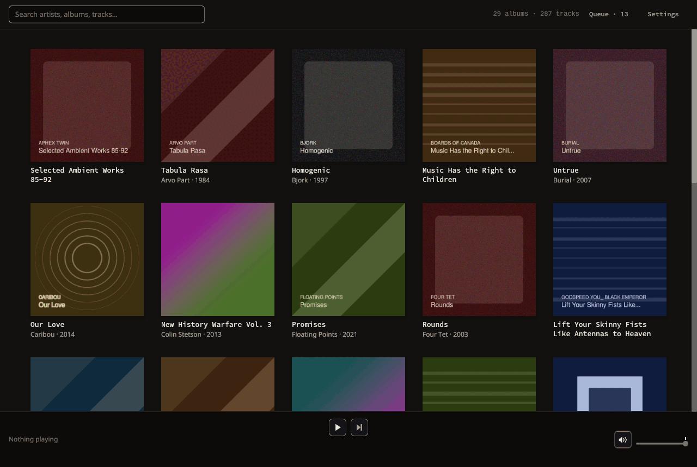

**What works, and it is a lot.** This is the pillar, and it lands. Art at
`ART_PX` = 208 px in a `CELL_W` = 240 px cell reads as a wall of sleeves rather
than a table with pictures. The chrome genuinely recedes: `WALL` behind, no
grid lines, no card at rest — the tile's button style is *invisible* until
hovered, which is exactly right for a surface whose job is to disappear behind
the artwork. Captions are two quiet lines (title in `MEDIUM` at
`SIZE_BODY` = 13, artist · year in `PAPER_DIM` at `SIZE_META` = 12). The
deterministic hash-gradient placeholder for missing art is a good idea done
well: two albums without covers do not look like errors, they look like albums.
Virtualization is invisible, which is the compliment.

**What doesn't.**

- **The grid block is centred on its *content*, not on its columns.** Filter to
  one result and the surviving tile jumps from x≈160 to x≈640 — half a window —
  because the row is only as wide as the items in it
  ([`09-search-one-result.png`](audit/09-search-one-result.png)). The eye has
  to go and find the thing it just narrowed to.
- **Caption baselines do not align across a row.** A two-line title pushes its
  artist line down; in row 0 of the screenshot, four artists sit on one baseline
  and *Music Has the Right to Children*'s sits 17 px lower. In a grid whose
  whole job is calm repetition, this is the loudest thing on the screen after
  the art.
- **Hover and selection are nearly the same mark.** `CARD` on hover,
  `CARD_HIGH` + `HAIRLINE_STRONG` when selected — one surface step and a
  hairline apart. In a screenshot you cannot tell which tile is selected and
  which is merely under the pointer.
- **The shelf has one sort and no facets.** Marta's entire persona is filing by
  label, era and catalogue number; the shelf offers artist order and a text
  box. That is a scope call, not a defect, but the *place* those controls will
  go does not exist yet, which is an IA problem (§2).

### 1.3 The rail — album, queue, settings

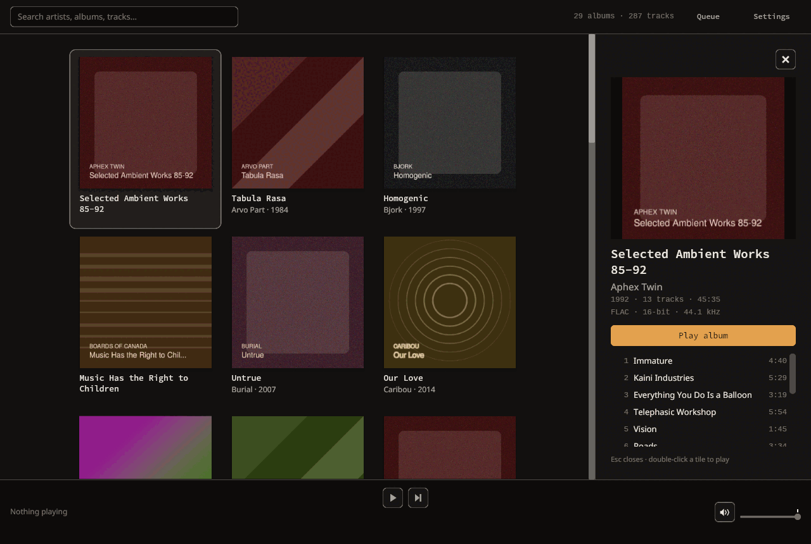
[`03-album-panel.png`](audit/03-album-panel.png)

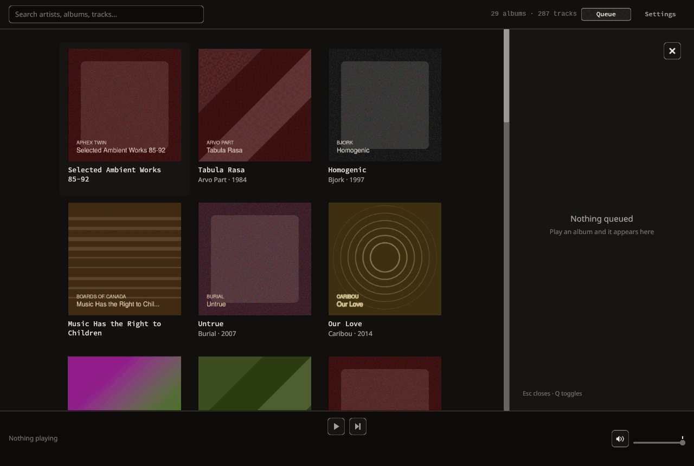
[`04-queue-empty.png`](audit/04-queue-empty.png)

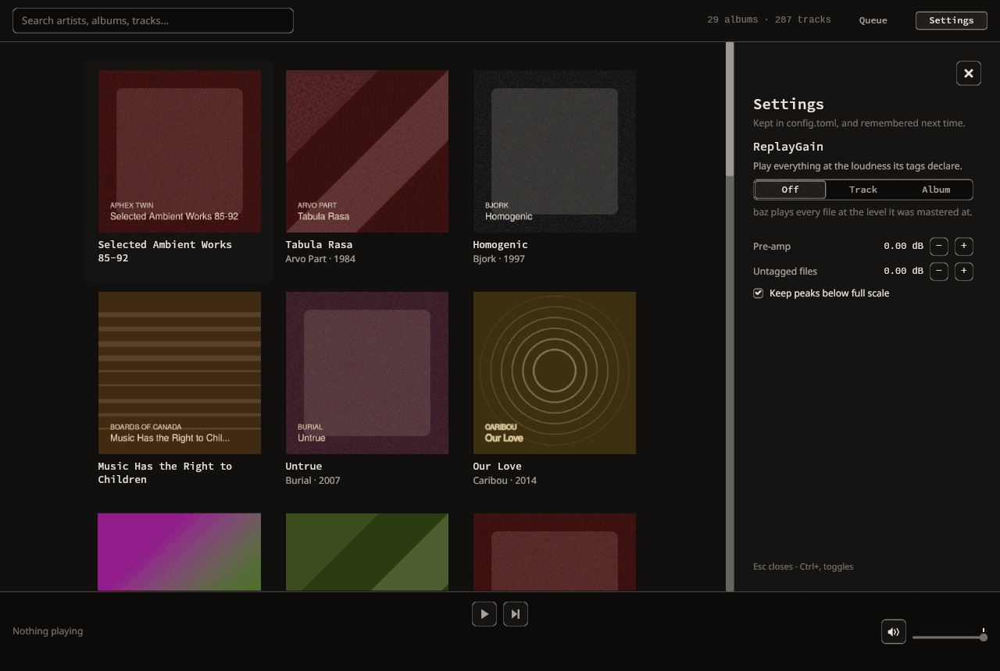
[`06-settings-panel.png`](audit/06-settings-panel.png)

These three are one surface, so they are audited as one.

**What works.**

- The **album panel** is the best-argued surface in the app. Art at 292 px —
  *larger* than a shelf tile, which is the correct relationship between browse
  and detail. Title / artist / `1992 · 13 tracks · 45:35` / `FLAC · 16-bit ·
  44.1 kHz` is a real metadata hierarchy in four lines, and the encoding line
  is Karl's and Marta's without being anybody else's problem. `Play album` is
  the only lamp-filled control in the entire interface, which makes the primary
  action unmistakable.
- The **queue panel** answers a question nothing else could answer, and marks
  the playing row with the same amber dot the shelf uses. `2 of 13 · 45:35` is
  a good one-line readout. Played rows fall to `PAPER_FAINT`, upcoming stay
  `PAPER` — the emphasis moves down the list with the music, which is a lovely
  detail.
- The **settings panel** reuses the album panel's segmented control for the
  ReplayGain mode rather than inventing one, reserves `SETTING_NOTE_H` so
  changing mode does not shove the controls under the pointer, and keeps every
  string in `replaygain.rs` where it is tested. The craft is not in question.
- All three share `PANEL_W` = 340 and `GAP_XL` = 24 padding, so switching
  between them reflows nothing. That property is real and it was worth having.

**What doesn't — and this is the centre of the audit.**

**(a) Three unrelated subjects take turns in one slot.** An album is *a thing
you pointed at*. The queue is *a live readout of the engine*. Settings are
*application preferences*. They share nothing except a width. The user is asked
to hold a model in which those three are alternatives.

**(b) The dismissal model needs a paragraph.** `Q` toggles the queue,
`Ctrl+,` toggles settings, clicking a tile raises the album, `Esc` and `✕`
close *what is showing* (revealing the album underneath), `Ctrl+B` hides *the
rail* and restores whatever it held. And — the rule that gives the game away —
un-hiding an **empty** rail opens the queue, because the layout key had to
invent content from somewhere. A key whose job is "give the shelf its width
back" creates a panel. That is not a bug in `panels.rs`; `panels.rs` is
careful, pure and exhaustively tested. It is the state machine correctly
implementing a model that has no answer.

**(c) The frequencies are two orders of magnitude apart, and the code says so.**
`keys.rs` argues that `Ctrl+,` earns its modifier because a preferences key is
"pressed a handful of times in a *lifetime*", while `Q` is bare because a view
key is pressed "dozens of times a session". Both arguments are right. Together
they are an argument that these two surfaces should not be siblings.

**(d) The cost is paid by the wrong tenant.** The rail takes 340 px of a
1280 px window: the shelf goes from **five columns to three** — 40% of the
library gone. Of the three tenants, only the album panel *needs* the shelf
beside it (you compare, you click the next sleeve). The queue does not; the
settings certainly do not. The surface that pays the price is the one that
justifies it.

**(e) The rail is simultaneously too narrow and too empty.** Look at
[`06-settings-panel.png`](audit/06-settings-panel.png): five controls, the
steppers crushed against the right edge at `STEPPER_HIT` = 24 px, and roughly
360 px of nothing beneath them before the hint line. Two shelf columns were
spent on that. Now look at
[`11-album-long-title.png`](audit/11-album-long-title.png): a soundtrack title
takes **three lines**, per-track artists double the row height, and **3 of 12
tracks** are visible. The same 340 px is a wasteland for one tenant and a
sardine tin for another.

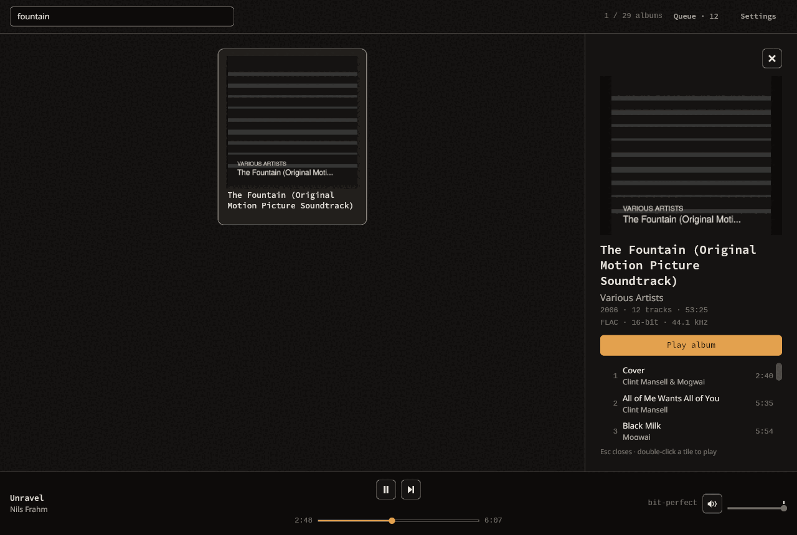

**(f) The album panel does not say where you are in the album.** Compare
[`07-album-panel-playing.png`](audit/07-album-panel-playing.png) with
[`05-queue-playing.png`](audit/05-queue-playing.png): the same thirteen titles
and the same thirteen durations, and only the one you did *not* open marks the
playing track. Devon plays an album front to back and never opens a queue —
so for the persona the shelf exists to serve, the position indicator is behind
a key he has no reason to press.

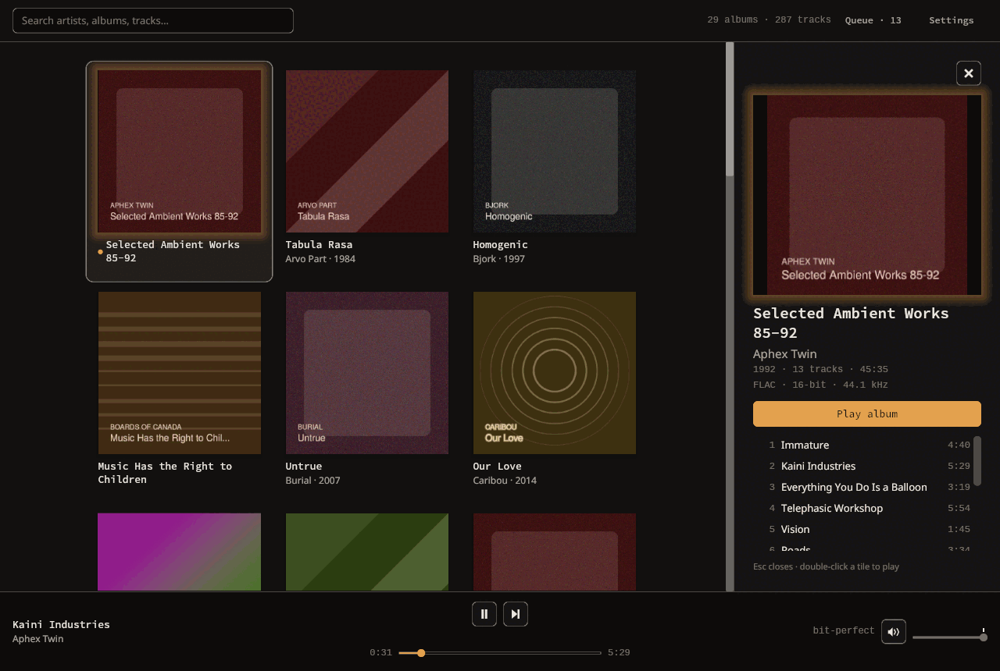
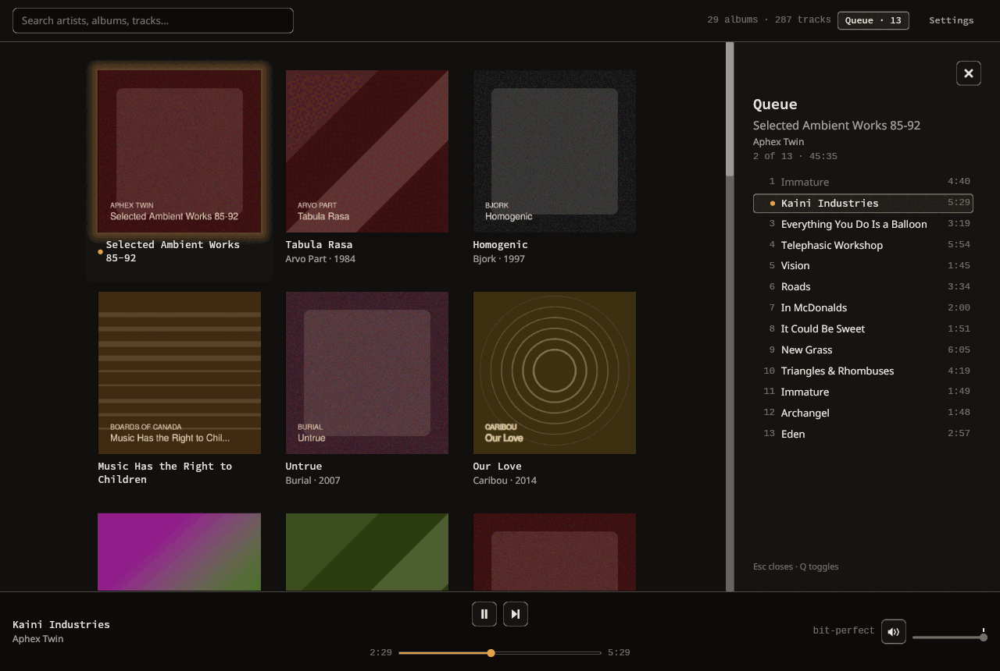

**(g) For the only queue baz can build, the queue panel is a duplicate.** There
is exactly one way to queue anything: play an album, which replaces the queue
wholesale. So the queue panel is the album panel's track list, again, with the
position marked. Two surfaces, one list.

**(h) Opening the rail moves the thing you clicked, and breaks the gesture the
panel advertises.** [`12-doubleclick-reflow.png`](audit/12-doubleclick-reflow.png)
is a double-click on the fifth tile of row 0. The first press opened the rail;
the shelf reflowed from five columns to three; the second press landed 180 px
from where the tile now is. **Nothing played.** The panel's own footer says
"double-click a tile to play". It works for the first column and fails for the
last, and which it does depends on arithmetic the user cannot see.

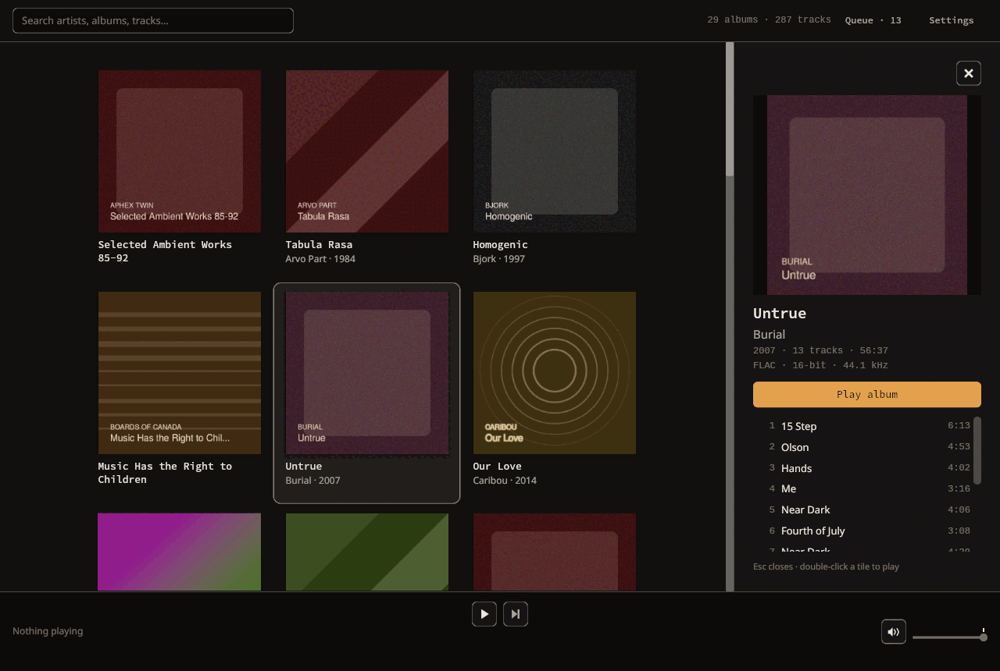

**(i) The rail can show an album the library view says is not there.** Select an
album, then filter it out of the shelf: the panel keeps showing it. Selection
and the visible set are unsynchronised.

**(i2) Hiding it is the only way to see the library again without losing your
place.** [`08-rail-hidden.png`](audit/08-rail-hidden.png) is `Ctrl+B`: five
columns are back and the selection is remembered. That the escape hatch exists
is good; that it is needed dozens of times a session is the finding.

**(j) The ✕ owns a row of its own.** `TRANSPORT_HIT` = 32 px plus `GAP_MD` = 12
of column spacing at the top of every panel — 44 px of vertical budget in the
app's most contested column, spent on a control that `Esc` already provides
and that appears in the one place no content wants.

**(k) It does not survive a small window.**
[`17-window-1000-rail.png`](audit/17-window-1000-rail.png): at 1000 px the
shelf is two columns and the album panel's track list has been squeezed to
**zero rows**. [`18-window-760-rail.png`](audit/18-window-760-rail.png): at
760×640 the rail is 45% of the window, the top bar's `Settings` label **wraps
to two lines**, and `Play album` — the primary action — is **off the bottom of
the panel and unreachable**, because only the track list scrolls, not the
panel.

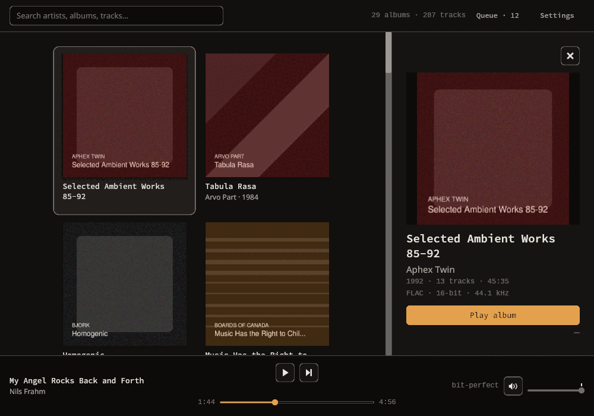
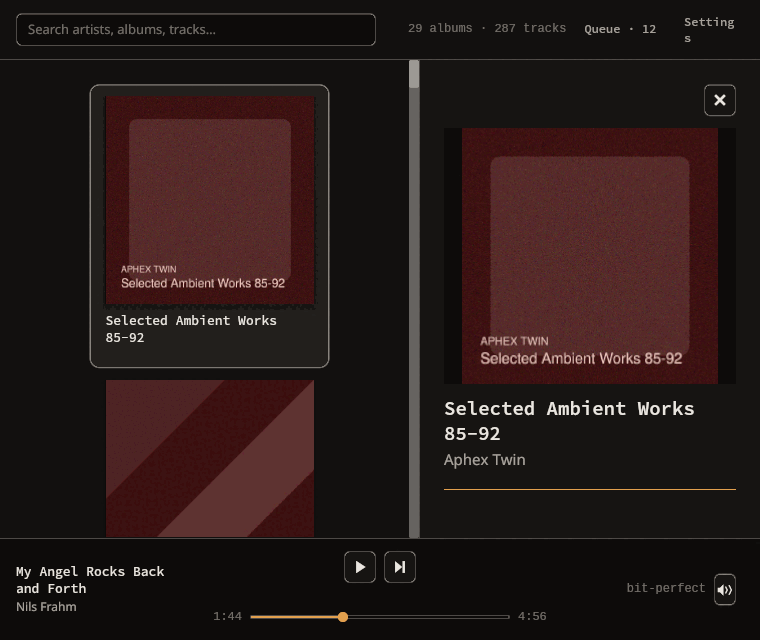

The settings panel's defence, from `panels.rs`, is worth engaging with
honestly, because three of its four points are correct:

> *the rail is the "one deliberate layer down" progressive disclosure names; it
> cannot cover the covers or the transport; it inherits every dismissal baz
> already has; it scales the way settings grow.*

Points two and three are true and this proposal keeps what they protect
(§2.4, §4.6). Point four is the one that does not survive contact: the settings
that are coming are the output chain with a signal-path display, watch folders,
library roots, and per-feature enrichment consent. None of those is a section
in a 292 px column. And point one mistakes *a layer* for *the only layer* —
which is precisely the disease. When the only non-shelf place in the product is
the rail, every new surface is a rail panel, and the rail becomes a junk
drawer with a keyboard shortcut per item.

### 1.4 The top bar — visible in every full screenshot

**What works.** Slim, and it earns its height: search left, counts right, in
`MONO` at `SIZE_META` so `29 albums · 287 tracks` becomes `1 / 29 albums`
without shifting. Scan and error states are extra segments in the same row,
never a modal — the right instinct. The `Queue · 13` toggle carries the count
in a fixed `QUEUE_TOGGLE_W` = 92 px so gaining it moves nothing, and `Settings`
was deliberately given the same width so the pair reads as a pair.

**What doesn't.**

- **Two of its four elements do not belong to the library.** Search and counts
  are about the library; `Queue` is about the engine and `Settings` is about
  the application. The bar has no subject.
- **`Queue · 13` keeps counting after the queue has ended.** It reports the
  length of the last queue, not what is next; after `QueueEnded` it still says
  13 while the bottom bar says *Nothing playing*
  ([`09-search-one-result.png`](audit/09-search-one-result.png)).
- **`Settings` wraps at 760 px** because 92 px was fitted to `Queue`, not to
  the longer word ([`18-window-760-rail.png`](audit/18-window-760-rail.png)).
- **The search field takes focus at startup**, so the keyboard belongs to a
  text box before the user has done anything: the first `Space` types a space
  instead of playing. The README documents this honestly, which does not make
  it good.
- **`Esc` does not clear the search on the first press.** The README's key
  table says "Esc clears the search"; in practice the focused `text_input`
  consumes `Esc` to blur itself, `keys::binding_for` never sees it, and the
  query survives. It takes two presses. (Discovered by driving it, and
  reproducible: `melody` → `Esc` → the query is still `melody`.)

### 1.5 The bottom bar — [`13`](audit/13-bar-playing.png), [`14`](audit/14-bar-paused-seek-hover.png), [`15`](audit/15-bar-volume-hover.png), [`19`](audit/19-window-760-bar.png)

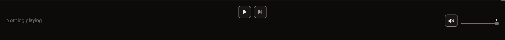
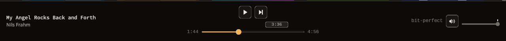
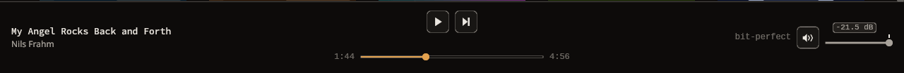

**This is the best thing in the product and most of it should not be touched.**
Three zones, the centre one fixed at `SEEK_ROW_W` = 380 px so the transport
stays optically centred whatever the title length; timestamps in fixed
`STAMP_W` = 52 px slots so crossing the hour does not slide the groove; a
`PREVIEW_H` = 15 px lane reserved above the groove whether or not anything
hovers; `SIGNAL_W` = 120 px reserved for a readout that is usually absent; the
volume block fixed at `VOLUME_BLOCK_W` = 136 px in every state including muted.
The result is a bar in which *nothing moves as the music moves*, and that is
rarer than it sounds — it is the difference between this and Plexamp's
transport, in baz's favour.

The details are right too. The hover preview tip (`3:36` floating over the
groove, screenshot 14) is a Plexamp-grade touch. The seek fill is lamp amber
because position is playback truth; the volume fader is deliberately *not*,
because a setting is not a claim about the music. `bit-perfect` sits next to
the fader that is the one control which could make it untrue — an adjacency
that needs no explanation.

**What doesn't.**

- **There is no Previous.** `Command::Previous` exists in the protocol, with a
  3-second restart-versus-step-back rule already specified, and no button, no
  key, and `CanGoPrevious = false` over MPRIS. Every listener on earth expects
  `|◀` next to `▶`. This is the most-missed control in the app.
- **There is no route to "what is next" from the transport**, which is where a
  listener looks for it. The only door is a toggle in the *top* bar, two
  hundred pixels away from the thing it describes.
- **It wraps below ~900 px.** [`19-window-760-bar.png`](audit/19-window-760-bar.png):
  *My Angel Rocks Back / and Forth / Nils Frahm* — three lines where the module
  docs promise "neither line wraps" and set `Wrapping::None`
  (`iced_core::text::Wrapping::None` is documented as "No wrapping"). The left
  zone is `Length::Fill`, so at narrow widths it is handed a limit narrower
  than the string and the paragraph breaks anyway.

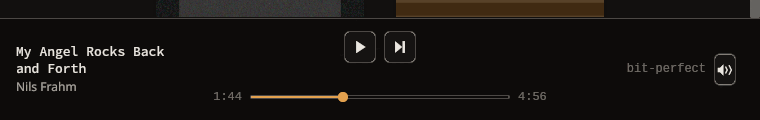

### 1.6 Search — [`09`](audit/09-search-one-result.png), [`10`](audit/10-search-no-results.png)

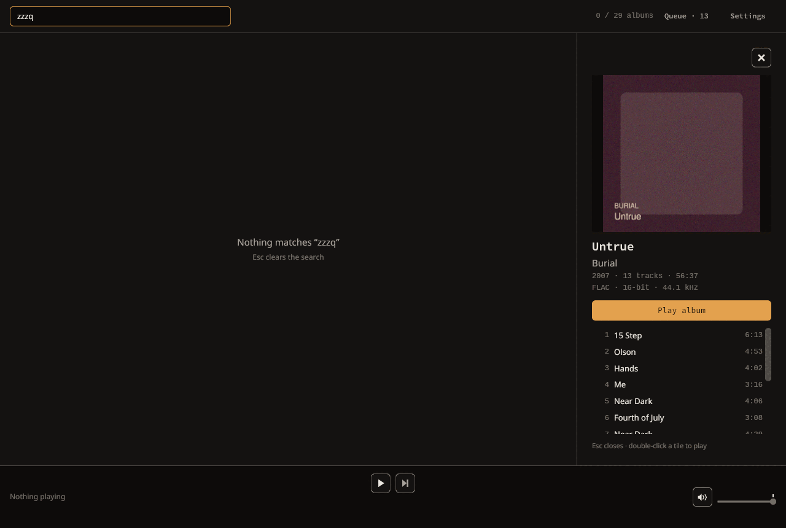

**What works.** Instant; the counts line switches to `1 / 29 albums`; the empty
state names the query in curly quotes and names the way out (`Esc clears the
search`). No modal, no spinner, no "0 results found" boilerplate.

**What doesn't.** The result set jumps to the middle of the window (§1.2); the
escape hatch the empty state advertises needs two presses (§1.4); and there is
no way to act on a result set as a whole — no "play all of these", which is the
gesture Priya's persona is built around.

### 1.7 States with nothing in them

**Untagged album** — [`20-untagged-album.png`](audit/20-untagged-album.png).
The fixture accidentally produced Marta's nightmare case: a folder of files
with no tags at all. baz infers the album title from the directory name (`In
Rainbows (2007)`), the artist from its parent, declines to invent a year, and
files it beside the tagged copy. Nothing is dropped and nothing is guessed
loudly. That is exactly the right behaviour and it deserves to be said.

**Built without audio output** —
[`21-without-audio.png`](audit/21-without-audio.png). The entire transport
disappears and the album panel's footnote changes to `Esc closes · built
without audio output`. Honest, quiet, correct.

**Scanning.** Not capturable with a 287-track fixture (the scan finishes in
under 100 ms). From the code: the top bar gains `scanning…` in lamp amber and
the shelf's empty state reads *"The shelf fills as the scan finds your music…"*.
The amber is the one place in the interface where the accent is spent on
something that is not playback truth; the palette rationale reserves it for
playback, and a scan is not playback. Small, but it is the only leak.

### 1.8 The design system underneath

`theme.rs` is not scaffolding; it is a design system with reasons attached, and
the redesign should inherit almost all of it. The palette is a *place* — warm
near-black `WALL`, `RECESS` beneath it for inset chrome, `CARD` and `CARD_HIGH`
above — with steps small enough to pass a squint test and hairlines at
α = 0.08 / 0.17 that you find only when you look for them. One accent, spent
only on playback truth, and the discipline is enforced in prose *and* in unit
tests (`the_unity_detent_is_visible_without_being_loud` asserts the detent is
not amber). The spacing ladder is a clean base-4: 2 / 4 / 8 / 12 / 16 / 24.
Type is a six-step scale with monospace standing in for tabular figures because
iced 0.13 has no OpenType feature control.

The gap is not in the tokens. It is that the tokens describe *components* and
nobody has written down the **places** they compose into. That is what §2 is.

---

## 2. The information architecture

### 2.1 The diagnosis, in one sentence

**The rail is a slot, not a place** — and because it is the only non-shelf
surface baz has, every new idea becomes a tenant of it, so three unrelated
subjects now take turns in 340 px behind a toggle model the user has to hold in
their head.

The corollary matters more than the complaint: the fix is not to arbitrate the
slot better. It is to give baz *places*, so that each thing can go where it
belongs.

### 2.2 The model

> **The window holds one PLACE at a time, one INSPECTOR attached to that place,
> one POPOVER attached to the transport, and the now-playing BAR always.**

Four kinds, and — the point — **one member of each kind**. There is nothing to
arbitrate, no stack to remember, and one dismissal rule per layer.

| Kind | Member | What it is | Lifetime | Dismissed by |
|---|---|---|---|---|
| **Place** | **Library** (home) | The shelf, its search, its counts | the session | — |
| **Place** | **Settings** | Everything that is a standing decision | seconds, rarely | `Esc`, Back |
| **Inspector** | **Album** | The detail of the thing you pointed at *in* the Library | while an album is selected | `Esc`, ✕, clicking the tile again, `Ctrl+B` |
| **Popover** | **Up next** | The queue: what the engine holds and where it is | a glance | `Esc`, `Q`, click-outside, the affordance again |
| **Bar** | **Now playing** | What is playing, where in it, how loud, what the chain is doing | always | never |

Rules that follow, and are the whole of the model a user must learn:

1. **A place fills the window.** Places replace each other; two are never on
   screen together. Leaving a place and coming back restores it exactly —
   scroll offset, query, selection.
2. **An inspector belongs to a place and to nothing else.** The Library's
   inspector is the Album inspector, permanently. It is open **exactly when an
   album is selected** — selection and visibility are one fact, which is what
   `panels.rs` already believes; it just had roommates.
3. **A popover belongs to the bar.** It overlays, it never reflows, and it is
   anchored to the control that opened it.
4. **The bar is in every place**, including Settings, unchanged.
5. **`Esc` peels one layer, top down**: popover → inspector → (in Settings)
   back to the Library. It never has to choose between unrelated things.

### 2.3 Where each of today's three tenants goes, and why

**The album stays a column, and becomes the column's only tenant.**

Because it is the one surface that genuinely needs the shelf beside it. Marta's
loop is *click, read, click the next sleeve* — a full-view album with a Back
button turns a one-click compare into a three-step round trip, and a modal
sheet covers the covers. Keeping it beside the shelf preserves the loop, and
making it the sole tenant makes the rail's rule collapse from a paragraph to a
sentence: **the column is open when an album is selected.**

Cost, stated plainly: the shelf still drops from five columns to three at
1280 px. Mitigations in §4 — a responsive width band, and a hard breakpoint
below which the inspector takes the content area instead of splitting it.
Growth path, also stated: when the album view earns more than a column
(credits, relationships, lyrics, editorial), promote it to a **Place** with
Back. The <940 px regime in §4.3 builds that code path now, so the promotion is
a change of breakpoint, not a rewrite.

**The queue becomes a popover from the now-playing bar.**

Because it is not about the library, it is about the transport — and it should
live next to the thing it describes. Priya's question is *what is coming*, and
she asks it while looking at the bottom bar. It is transient by construction,
which is what the fifth pillar means by "queues are transient". It never
reflows the shelf, so glancing at it costs zero covers. And it is the natural
home for `JumpTo` and `UpdateQueue`, which now exist (ADR-0014).

Cost: an overlay that iced 0.13 cannot make modal in the accessibility sense
(§4.6). And Devon, who never opens a queue, gains nothing — which is why the
*other* half of this move is §2.5.

**Settings becomes a place.**

Because it is not a glance and it is not about the shelf. The settings that
exist barely fill half a column; the settings that are coming — output device
and exclusive mode, a signal-path display, library roots and watch folders,
per-feature enrichment consent, appearance — do not fit in one at all. A place
also lets Karl have the thing the backlog says he cannot have today: a full
readout of the *direct* signal path, which is a diagram, not a caption.

Cost: leaving the shelf. That is the right cost — you are not browsing while
you set a pre-amp — and it is free to reverse, because the Library's state
already lives in one struct.

### 2.4 What the rail's defenders were right about, and how it is kept

- *"A floating sheet would sit on top of the covers."* Correct, and that is why
  the album inspector is **not** a sheet and the settings are **not** a
  popover. The only overlay in this proposal is 360 px wide, anchored to the
  bar, and covers the bottom-right corner of the shelf for a few seconds.
  **No scrim** — dimming ten thousand covers to show twelve rows would be the
  exact mistake the palette rationale warns against.
- *"It cannot cover the transport."* Kept: the popover is anchored *above* the
  bar and the bar keeps every reserved pixel.
- *"It inherits dismissals iced 0.13 gives no primitive for."* Half kept. The
  inspector keeps all three (✕, `Esc`, `Ctrl+B`). The popover needs
  click-outside, which iced 0.13 *does* support — `stack` +
  `mouse_area(...).on_press(Close)` under an `opaque(popover)`; `opaque` is
  documented as capturing mouse presses inside its bounds precisely so events
  do not pass through stack layers. Verified in `iced_widget-0.13.4`.
  Focus containment is genuinely unavailable and is declared as a limit (§4.6).

### 2.5 The change that makes the queue optional again

**Mark the playing track in the album inspector, with the same lamp dot.**

For an album queue — the only queue baz can build today — this removes the
queue's entire reason to exist for Devon and Marta. The inspector already lists
exactly the tracks that were queued, in the order they were queued; the only
thing it fails to say is which one is sounding. Adding the dot makes the
inspector a *now-playing view of an album*, which is what Devon wants and what
Longplay and Plexamp both do.

The queue popover then means what it should mean: **the place you go when the
queue is no longer just an album** — after a jump, after an edit, and later
after shuffle and radio. That is Priya's surface, and it stops being Devon's
tax.

### 2.6 The navigation map

```
                      ┌───────────────────────────────┐
     Ctrl+,  ───────► │           SETTINGS            │
                      │  (place: fills the window)    │
   ◄─── Esc / Back ── └───────────────────────────────┘
                                    ▲
                                    │
┌───────────────────────────────────┴───────────────────────────────┐
│  LIBRARY  (place)                                                 │
│  ┌──────────────────────────────┐  ┌───────────────────────────┐  │
│  │  shelf                       │  │  ALBUM INSPECTOR          │  │
│  │  (search, counts, grid)      │  │  open ⇔ an album is       │  │
│  │                              │  │  selected                 │  │
│  └──────────────────────────────┘  └───────────────────────────┘  │
│                          ┌───────────────────┐                    │
│                          │  UP NEXT popover  │◄── Q / the bar     │
│                          └───────────────────┘                    │
└───────────────────────────────────────────────────────────────────┘
┌───────────────────────────────────────────────────────────────────┐
│  NOW-PLAYING BAR — present in every place, never moves            │
└───────────────────────────────────────────────────────────────────┘
```

### 2.7 Options rejected, and what each would have cost

| Option | Cost that killed it |
|---|---|
| **Keep the rail, arbitrate it better** (priority rules, a segmented switcher at its head) | Cheapest by far, and it answers the symptom. Three unrelated subjects still share one slot; the switcher makes the sharing *explicit*, which makes it worse — the user now reads a control whose purpose is to explain a compromise. |
| **Album detail as a modal sheet over the shelf** | Covers the covers; needs focus containment iced 0.13 lacks; breaks Marta's click-the-next-sleeve loop entirely (every comparison becomes open → read → dismiss → open). |
| **Album as a full-window place with Back, now** | Best room for metadata, and the eventual destination. Today it costs Marta a three-step loop for a one-click question, and hides the shelf — the identity — for the most common interaction in the product. Deferred, not rejected: §4.3 builds the code path. |
| **A single "contextual inspector" that shows album *or* queue depending on context** | This is the current rail with a story attached. "Context" would have to guess between "the album I clicked" and "what is playing", which are different things a listener wants *at the same time*. |
| **Queue as a rail panel (status quo)** | Redundant with the inspector for album playback; costs two shelf columns for a glance; lives in the wrong bar. |
| **Settings as a rail panel (status quo)** | Too narrow for the output chain that is coming and 60% empty for the settings that exist; and it establishes "the rail" as the answer to every future question. |
| **Settings as an OS-style preferences window** | A second window is a second thing to manage, and baz is a single-window application with a bar that must always be visible. |

---

## 3. Flow specification

Notation: **[state]** is what is on screen; *(engine)* is the protocol traffic.

### 3.1 First run → first play

Target, from the research: **under 60 seconds, two required decisions.**

| # | User does | System does | State after |
|---|---|---|---|
| 1 | Launches `baz` | No config, no CLI dir → the Setup place. Keyboard focus is on the folder field (the only field). | **[Setup]** hero question, folder field pre-filled with `~/Music` if it exists, **Choose folder…** button beside it, drop target = the whole window. No bar. |
| 2 | Clicks **Choose folder…** *or* drags a folder onto the window *or* types a path and presses `Enter` | Validate. On failure, an `ALERT` line under the field; the field keeps its text. | **[Setup]** with error, or → 3 |
| 3 | — | Config written; library opened; scan worker started; place becomes **Library**. Keyboard focus goes to **the library, not the search field**. | **[Library]** empty shelf, top bar reads `scanning…`, bottom bar appears reading *Nothing playing* |
| 4 | Waits ~1 s | Tiles arrive as the scan batches land, ~10 Hz | **[Library]** shelf filling; counts climbing |
| 5 | Clicks a sleeve | Selection set → inspector opens; shelf reflows once | **[Library + Inspector]** art, header, `Play album`, track list |
| 6 | Presses `Enter`, or `Space`, or clicks **Play album** | *(engine)* `SetQueue{paths}` then `Play` | **[Library + Inspector]** playing: sleeve haloed, tile haloed + dotted, **the playing row dotted in the track list**, bar shows title/artist/position |

Two required decisions: the folder, and the album. Step 6 is reachable by mouse
*or* by keyboard from step 5 — today it is mouse-only, because nothing on the
shelf takes keyboard focus and `Space` with a stopped engine does not know what
you are looking at.

### 3.2 Browse → play an album (Devon)

| # | User does | System | State |
|---|---|---|---|
| 1 | Scrolls the shelf | Virtualized rows; thumbnails requested for the visible range | **[Library]** |
| 2 | Clicks a sleeve | Inspector opens. **The grid keeps its column count** for the click that opened it (§4.4), so nothing moves under the pointer during the gesture | **[Library + Inspector]** |
| 3 | Clicks **Play album** *or* double-clicks the sleeve *or* presses `Enter` | *(engine)* `SetQueue` + `Play` | playing |
| 4 | Wants track 7 | Clicks the row | *(engine)* `JumpTo{position: 6}` — the album is the current queue, so no re-queue | playing from 7 |
| 5 | Never opens the queue | — | The inspector's dot is the position indicator |

Step 4 is the interaction ADR-0014 unblocked and the inspector should be the
first place to spend it: a track row in an album list has meant "play from
here" since CD players had displays.

### 3.3 Search → play (everyone)

| # | User does | System | State |
|---|---|---|---|
| 1 | Presses `/` or `Ctrl+F`, or clicks the well | Focus the search field | **[Library]** field focused |
| 2 | Types | Filter per keystroke; counts become `n / N albums`; **results stay anchored to the left of a full-width column block** (§4.4) | filtered shelf |
| 3 | Clicks a result | Inspector opens for it | **[Library + Inspector]** |
| 4 | Presses `Enter` while the field still has focus | Plays the **first** result if exactly one album matches; otherwise does nothing (see below) | playing |
| 5 | Presses `Esc` | **First press clears the query** and keeps focus; second press blurs | unfiltered |

Step 4 is deliberately conservative: `Enter` plays only when the result set is
one album, because "play the first of 40 matches" is a guess. Step 5 is a
change from today's behaviour and needs the workaround in §4.6 — iced 0.13's
`text_input` swallows `Esc`, so the field also carries an inline ✕ and the
README is corrected to describe what actually happens.

### 3.4 See and manipulate what is next (Priya)

| # | User does | System | State |
|---|---|---|---|
| 0 | — | The bar's left zone always shows `3 / 12` in `MONO` beside the title | the question answered without opening anything |
| 1 | Clicks the now-playing block, or presses `Q` | **Up next** popover opens above the bar, anchored to its right edge; the now-playing block takes the raised-card "active" style | **[Library + popover]** |
| 2 | Reads | Header `Up next`, summary `3 of 12 · 51:20`, rows: played faint, playing carded + dotted, upcoming full | — |
| 3 | Clicks row 9 | *(engine)* `JumpTo{position: 8}`. The row is marked from `TrackStarted`, **never optimistically** | playing 9 |
| 4 | Clicks a row's ✕ | *(engine)* `UpdateQueue{paths}` — the list minus that entry. If it was not the playing track, not one delivered sample moves | queue edited, music undisturbed |
| 5 | Presses `Esc`, `Q`, or clicks the shelf | Popover closes. The shelf never reflowed | **[Library]** |

Drag-to-reorder is **not** in this flow. iced 0.13 has no pointer capture, so a
drag that leaves the row is not tracked; it needs a hand-built widget on the
`groove.rs` pattern, and it is a separate increment (§5, step 9).

### 3.5 Change a setting (Karl and Sam)

| # | User does | System | State |
|---|---|---|---|
| 1 | Presses `Ctrl+,` or clicks **Settings** at the far right of the top bar | Place becomes **Settings**. The Library's scroll, query and selection are retained untouched. The bar stays | **[Settings]** section list left, content right, bar below |
| 2 | Picks **Playback** | Sections: ReplayGain (as today), Output, Signal path | — |
| 3 | Presses `Album` on the ReplayGain mode | *(engine)* `SetReplayGain{…}`; config written; the readout under it updates from `ReplayGainChanged` | mode set |
| 4 | Reads **Signal path** | The full chain for the track playing now: `96 kHz / 24-bit source → unity (no arithmetic) → 96 kHz output → exclusive: hw:3,0`. This is the backlog's missing *direct* readout | Karl's proof |
| 5 | Presses `Esc` | Place returns to **Library**, exactly as left | **[Library]** |

The bottom bar's two-word `bit-perfect` stays exactly where it is. It is the
glance; this is the layer down. That is what progressive disclosure means, and
it is not something a 292 px column can do.

### 3.6 Understand playback state

The single question "what is happening" is answered at three depths, and each
depth is one step from the last:

| Depth | Where | Says |
|---|---|---|
| Glance | Bottom bar | title · artist · elapsed / total · position · volume · `bit-perfect` or `48 → 44.1 kHz` |
| Glance | Shelf + inspector | the playing album is haloed and dotted; **the playing track is dotted in the inspector's list** |
| One step | Up next popover | `3 of 12 · 51:20` and the whole list |
| One layer | Settings → Playback → Signal path | source rate/depth → gain stage → output rate → shared or exclusive, plus why any conversion is happening |

Rules that must survive:

- **Nothing in the bar moves when any of this changes.** The signal note
  appears into a reserved `SIGNAL_W` = 120 px slot; the `3 / 12` readout gets
  its own fixed slot for the same reason.
- **Every reading is event-derived.** No optimistic marking anywhere, including
  the new interactive rows: a clicked queue row is marked when `TrackStarted`
  says so, per ADR-0014's front-end contract.
- **The accent stays reserved.** The queue popover's playing row gets the dot,
  not an amber wash; the settings' readouts get `PAPER`, never `LAMP`.

---

## 4. Layout specification, with reasons

### 4.1 The system that is kept, and why

Base unit **4**; the ladder `GAP_XXS` 2 / `GAP_XS` 4 / `GAP_SM` 8 / `GAP_MD` 12
/ `GAP_LG` 16 / `GAP_XL` 24 is unchanged. Type is unchanged: `SIZE_CAPTION` 11
/ `SIZE_META` 12 / `SIZE_BODY` 13 / `SIZE_EMPHASIS` 15 / `SIZE_TITLE` 19 /
`SIZE_HERO` 28, with `MONO` for every figure. Radii unchanged: `RADIUS_CTRL` 6,
`RADIUS_SEGMENT` 4, `RADIUS_TILE` 10, `RADIUS_CHIP` 4; artwork stays square.
Depth strategy unchanged: hairlines plus whisper-quiet surface steps, one soft
shadow under artwork and nothing else.

**The palette does not change.** The single-accent discipline is doing real
work — halo, dot, seek fill, `Play album`, focus ring, and nothing else — and
every surface this proposal adds already has a non-accent answer in the system
(`segment` / `panel_toggle` express "this one is chosen" with a surface step
and a hairline). A second accent would immediately be spent on selection
states the steps already carry, and the first casualty would be the meaning of
the first accent. One correction is owed in the other direction: the `scanning…`
note in the top bar is currently `LAMP`, and a scan is not playback truth — it
should be `PAPER_DIM`.

### 4.2 Regions of the Library place

```
┌──────────────────────────────────────────────────────────────┐
│ TOP BAR         fixed height ≈ 56 px (TOP_BAR_H) + hairline   │
│ [search 360–480]              [counts]        [Settings ▸]    │
├───────────────────────────────────────┬──────────────────────┤
│ SHELF                                 │ ALBUM INSPECTOR      │
│ fluid width, fluid height             │ fixed-band width      │
│ column pitch CELL_W 240               │ 340–420 px            │
│ art ART_PX 208, cell CELL_H 284       │ full height           │
│ outer GRID_PADDING 24                 │ padding GAP_XL 24     │
├───────────────────────────────────────┴──────────────────────┤
│ NOW-PLAYING BAR  fixed ≈ 102 px: 2×GAP_MD 12 + 32 + GAP_SM 8   │
│                  + SEEK_ROW_H 37 + a 1 px hairline             │
│ [now playing · 3/12] [prev play next / seek] [signal] [vol]   │
└──────────────────────────────────────────────────────────────┘
```

**Fixed** (may not vary with content or state): the bar's height and all three
of its zones' internal geometry; the transport column at `SEEK_ROW_W` 380; the
timestamps at `STAMP_W` 52; the signal slot at `SIGNAL_W` 120; the volume block
at `VOLUME_BLOCK_W` 136; the new queue-position readout; the tile pitch; the
inspector's width for a given window width; the popover's width.

**Fluid**: the shelf's column count and height; the inspector's height; the
popover's height; the search field between 360 and 480 px.

### 4.3 Responsive behaviour — three regimes, one breakpoint that matters

| Window width | Shelf | Inspector | Reason |
|---|---|---|---|
| **≥ 1600** | ≥ 5 columns | 420 px (`INSPECTOR_MAX_W`) | Extra width should go to *covers*, not to a wider column of text; 420 is where the track list stops gaining useful line length. |
| **1200–1599** | 3–5 columns | `clamp(0.28 × W, 340, 420)` | 28% is the proportion at which the shelf keeps at least three columns at the bottom of the band: `columns(1200 − 340)` = 3. |
| **940–1199** | 2–3 columns | 340 px (`INSPECTOR_MIN_W`) | Below 340 the header, the segmented control and the encoding line stop fitting. |
| **< 940** | hidden while the inspector is open | fills the content area, with a **Back** affordance at its head | `columns(940 − 340)` = 2, and it is 1 by 800 px; a "shelf" of one or two sleeves is not a shelf. Replacing beats splitting. |

At the other end, [`16-window-1400.png`](audit/16-window-1400.png) shows what
the extra width currently buys with the rail closed: another column of covers,
which is the right answer and the reason the inspector's width is capped rather
than proportional all the way up.

The `< 940` regime is the *same view function* as the eventual full-window
Album place. Building it now costs one branch and buys the growth path in §2.3
for free.

Vertical: below **700 px** of window height the inspector's **entire content
scrolls**, not just its track list — this is the fix for `Play album` being
unreachable at 760×640 ([`18`](audit/18-window-760-rail.png)). The bar and the
top bar keep their fixed heights at every size; they are the frame.

The bottom bar's wrap at narrow widths (§1.5) is fixed by giving the left zone
a **maximum** width rather than pure `Fill`, and letting the middle column keep
its fixed 380: at 760 px the left zone is capped, the title clips as designed
rather than breaking, and the three-line state cannot occur.

### 4.4 The shelf grid

Two changes, both small, both fixing something visible:

1. **A row is always `cols × CELL_W` wide**, not `min(items, cols) × CELL_W`.
   The block is centred as it is today, but its width no longer depends on how
   many items happen to be in it — so filtering from 29 albums to 1 leaves the
   survivor in the first column position instead of teleporting it to the
   middle of the window. One line in `views::shelf`, and a pure assertion in
   `shelf.rs`.
2. **The column count for the *current* gesture is held constant.** Clicking a
   tile must not move that tile before the second click of a double-click can
   land ([`12`](audit/12-doubleclick-reflow.png)). The reflow is applied on the
   next frame after `DOUBLE_CLICK` (400 ms) has elapsed, or immediately if the
   inspector was already open (a swap costs no reflow — the property
   `panels.rs` already guarantees). This preserves the shelf's width reflow for
   every case except the 400 ms in which it breaks a documented gesture.

Caption alignment: give the tile's caption block a **fixed height of two lines**
at `SIZE_BODY` (2 × 13 × `LINE_HEIGHT` 1.3 ≈ 34 px) with the title clipped at
two lines, so the artist line sits on one baseline across every row. `CELL_H`
284 already has the room; today the height is content-driven.

Hover versus selection: keep `CARD` for hover, and give selection `CARD_HIGH`
plus a **2 px** `HAIRLINE_STRONG` edge instead of 1 px. It is the smallest
change that makes the two states tell apart in a still frame, and it stays
inside the depth strategy (no shadow, no accent).

### 4.5 The three surfaces, specified

**Album inspector.**

- Width per §4.3; height fills; padding `GAP_XL` 24; background `panel` =
  `CARD`; a 1 px `HAIRLINE` vertical rule against the shelf (as today).
- **The ✕ moves onto the header line**, right-aligned, level with the album
  title — reclaiming the 44 px the dedicated row costs. `TRANSPORT_HIT` 32 is
  kept for the target.
- Order: sleeve (width = panel − 2 × 24, square, `sleeve()` shadow or halo) →
  title (`SIZE_TITLE` 19 `SEMIBOLD`, **capped at two lines**, ellipsised) →
  artist (`SIZE_EMPHASIS` 15 `PAPER_DIM`) → meta (`SIZE_META` `MONO`
  `PAPER_FAINT`) → encoding line → edition selector when there is a choice →
  `Play album` (lamp, full width) → track list → footnote.
- **Track rows gain two things**: the lamp dot in the `TRACK_NO_W` 24 column
  when that track is playing (replacing the number, exactly as the queue does,
  so the column never changes width), and a hover state + pointer cursor,
  because clicking now means "play from here".
- The list keeps the reserved `scroll_gutter()` lane.
- Below 700 px window height, the whole panel scrolls.

**Up next popover.**

- `POPOVER_W` 360; max height `0.6 × window height`; anchored 16 px
  (`GAP_LG`) above the bar and 16 px from the right edge.
- Surface `CARD_HIGH`, 1 px `HAIRLINE_STRONG` edge, `RADIUS_CTRL` 6, and the
  room's one soft shadow. **No arrow or notch** — iced 0.13's container borders
  are four-sided only, so a pointer triangle would have to be a second widget;
  the anchor is expressed by position and by the affordance's active state
  instead.
- Contents: header row (`Up next` at `SIZE_EMPHASIS`, ✕ right), summary line
  (`3 of 12 · 51:20`, `MONO` `PAPER_FAINT`), then the existing queue rows
  unchanged in style — position or dot in the 24 px column, title over artist,
  duration in `MONO` — plus a per-row ✕ that appears on hover only.
- **No scrim.**

**Settings place.**

- ≥ 1000 px: a `SETTINGS_NAV_W` 200 px section list on the left (`segment`
  styling for the current section), content right, capped at
  `SETTINGS_CONTENT_W` 640 px and left-aligned within its area — a settings
  form should not have 60-em line lengths.
- < 1000 px: single column, sections stacked, headings sticky.
- Sections at v1: **Library** (folders, rescan, the stale-row prune the backlog
  wants) · **Playback** (ReplayGain — today's panel content verbatim; output
  device; exclusive mode; signal path) · **Appearance** (theme, tile size when
  they exist) · **About**.
- The existing `stepper_row`, `mode_selector`, `SETTING_VALUE_W` 68,
  `SETTING_NOTE_H` and `STEPPER_HIT` 24 all survive unchanged; they were built
  for a 292 px content width and they are still fine at 640.

### 4.6 What iced 0.13 forces, and the fallback in each case

| Limit | Where it bites | Fallback specified |
|---|---|---|
| No pointer capture | Drag-to-reorder the queue | Ship `JumpTo` (click) and remove (`UpdateQueue`) first; reorder waits for a hand-built widget on the `groove.rs` pattern, which is the precedent for "we need pointer geometry, so we wrote the widget". |
| No focus containment, no accessibility tree, buttons take no keyboard focus | The popover cannot be modal; the shelf cannot be arrow-navigated | The popover is explicitly **not** modal: `Esc` closes it and every other binding keeps working underneath. Shelf keyboard navigation is **not specified** — it would need focusable buttons the toolkit does not have. This is declared as a known accessibility gap, not designed around. |
| `text_input` consumes `Esc` before the subscription sees it | "`Esc` clears the search" is false on the first press | Add an inline ✕ inside the search well (the field's own affordance), keep `Esc` as blur-then-clear, and **correct the README** to describe the two presses. Also: **stop focusing the search field at startup**, so the keyboard belongs to the transport from the first frame. |
| No rounded or clipped images | Sleeves everywhere, popover rows | Keep every artwork square. It is already the palette rationale's position ("sleeves are square like the physical object"), so this costs nothing. |
| Container borders are four-sided | Popover arrow; sticky section headings with a bottom rule only | No arrow (above). Section headings use a `horizontal_rule` sibling, not a border. |
| No built-in icons | `Previous` glyph | Add one glyph to `icon.rs` — a mirror of `Next`, which is already rasterised procedurally. The queue affordance uses **type**, not an icon, for the same reason `Settings` is a word: baz's glyph set is small and deliberate. |
| No OpenType feature control | Every changing figure | `MONO` continues to be the tabular-figure substitute, including the new `3 / 12` readout. |
| No blur / backdrop filters | Popover separation | Surface step + hairline + the existing soft shadow. No scrim (§2.4). |

### 4.7 Where every existing element lands

| Today | Tomorrow | Note |
|---|---|---|
| Setup screen | **Setup place**, plus a folder picker and a drop target | The one flow change with a persona citation behind it |
| Shelf grid | Library place, unchanged except §4.4 | |
| Top bar search + counts | Top bar, unchanged | Gains an inline ✕ |
| Top bar `Queue · n` toggle | **Removed** — replaced by the bar's now-playing affordance + `3 / 12` readout | The count survives, closer to its subject |
| Top bar `Settings` toggle | Top bar far right, now **navigation** to a place | Sized to its own label; no longer wraps |
| `views::side_panel` | **Album inspector**, sole tenant of the column | Gains the playing dot and clickable rows |
| `views::queue_panel` | **Up next popover** | Same rows, same marking, new container, now interactive |
| `views::settings_panel` | First section of the **Settings place** | Content verbatim |
| `views::bottom_bar` | Unchanged, plus Previous, plus the now-playing affordance, plus `3 / 12` | Every addition is a fixed-width slot |
| `panels.rs` | `selection.rs` (album selection + inspector visibility) and a small `overlay` | `Rail` ceases to exist |
| `theme.rs` tokens | All kept; a handful added (§5) | `PANEL_W` → `INSPECTOR_MIN_W` |

### 4.8 Keyboard model

| Key | Today | Proposed | Reason |
|---|---|---|---|
| `Space` | play / pause | play / pause; **when stopped with an album selected, plays it** | "One gesture to music" from the keyboard; uses `SetQueue` + `Play`, already there |
| `Enter` | — | play the selected album (Library); play the single search result | The obvious partner to a selection |
| `←` `→` | seek ±5 s | unchanged | |
| `Shift`+`←` `→` | seek ±30 s | unchanged | |
| `N`, `Ctrl`+`→` | next | unchanged | |
| — | — | **`Ctrl`+`←` = Previous** | `Command::Previous` exists and is unwired; MPRIS's `CanGoPrevious` becomes true |
| `↑` `↓` | volume | unchanged | |
| `M` | mute | unchanged | |
| `/`, `Ctrl`+`F` | focus search | unchanged | |
| `Q` | show/hide the queue panel | show/hide the **Up next popover** | Same key, same meaning, better place |
| `Ctrl`+`,` | show/hide the settings panel | go to / return from the **Settings place** | Same key; it is now navigation, which is what the macOS convention it borrows means |
| `Ctrl`+`B` | hide/restore the rail | hide/restore the **inspector**, remembering the selection | Now an honest sidebar toggle, because there is exactly one sidebar. The "un-hiding an empty rail opens the queue" rule is **deleted**; un-hiding with nothing selected selects the *playing* album if there is one, else does nothing |
| `Esc` | clear search, else close the rail panel | popover → inspector → back from Settings; in the search field, blur then clear | One rule per layer |

Not adopted, and why: **type-ahead search** ("type anywhere to search", from the
persona sketch) cannot coexist with bare-letter transport bindings (`n`, `m`,
`q`). The transport wins — those letters are muscle memory from every player —
and `/` remains the door. Stated as a tension resolved, not an oversight.

---

## 5. Migration path

ADR-0006 says a redesign should cost layer 3 and nothing else. It very nearly
does. The honest list of what is **not** view composition:

- `Place` — a two-variant enum on `App` (`Library` | `Settings`). New pure
  state, trivially testable.
- `Overlay` — `Option<Popover>`, replacing `Rail::Queue` in `panels.rs`. New
  pure state; the existing exhaustive-path test carries over.
- `selection.rs` — `panels.rs` with the roommates removed: `selected:
  Option<u64>` + `hidden: bool`. Strictly *less* state than today.
- `queue_edit` — pure helpers turning "remove entry *i*" / "insert after *i*"
  into the whole path vector `UpdateQueue` wants. Pure, iced-free, unit-tested;
  this is the only genuinely new logic.
- "Is the inspector's album the queue that is playing?" — a comparison over
  paths, belonging in `vm` or `player`.

Everything else — every layout, every surface, every style — is `views/` and
`theme.rs`.

**The increments.** Each one leaves the app usable and shippable; the two that
remove a surface replace it in the same commit.

| # | Change | Layer | Why here |
|---|---|---|---|
| 1 | **Mark the playing track in the album inspector** with the lamp dot | view only | Highest value per line in the whole plan; makes the queue optional for Devon before anything moves |
| 2 | **Grid block width = `cols × CELL_W`**; caption block fixed at two lines; selection edge to 2 px | `shelf.rs` (pure, tested) + view | Three visible fixes, no new concepts |
| 3 | **Hold the column count for 400 ms after a tile click** | view + one timestamp | Repairs double-click-to-play, which the UI advertises |
| 4 | **Click a track row to play from there** (`JumpTo`, or `SetQueue`+`JumpTo`) | small pure helper + view | Spends ADR-0014 where it is most missed |
| 5 | **Previous**: glyph in `icon.rs`, button in the bar, `Ctrl`+`←`, MPRIS `CanGoPrevious` | view + keys + mpris | Independent of everything else; closes a backlog item |
| 6 | **Up next popover**: `Rail::Queue` → `Overlay`; bar gains the now-playing affordance and the `3 / 12` slot; `Q` retargets; top-bar Queue toggle removed | pure `Overlay` + views | The first surface to leave the rail. `stack` + `opaque` + `mouse_area` |
| 7 | **Queue rows become interactive**: `JumpTo` on click, ✕ per row via `UpdateQueue` | `queue_edit` (pure) + view | Now the popover earns its existence |
| 8 | **Settings becomes a place**: `Screen`/`Place` gains `Settings`; `Rail::Settings` removed; content moves verbatim into the first section | pure `Place` + views | The rail now has one tenant. `panels.rs` → `selection.rs` in the same commit |
| 9 | **Inspector responsiveness**: width band, the `< 940` replace-the-shelf regime, whole-panel scroll below 700 px height, ✕ onto the header line, two-line title cap | `theme.rs` + view | The layout work, once the rail is a single thing |
| 10 | **Bottom-bar left zone gets a max width** so it cannot wrap | `theme.rs` + view | Restores the promise the module docs make |
| 11 | **Search**: inline ✕; stop focusing the field at startup; README key table corrected | view + `app.rs` + docs | Small, and it changes the first frame for the better |
| 12 | **Setup**: folder picker + drop target | view + one dependency decision | The only item that may need a dependency (a native file dialog); it is also the first thing every new user meets |
| 13 | **Settings → Playback → Signal path**: the full direct-chain readout | view over existing `PlayerState` | Closes the backlog's "no readout for the direct signal path" and gives Karl his proof |
| 14 | *(later)* Drag-to-reorder, on a hand-built widget | new widget | Deferred by toolkit limit, not by preference |

Order rationale: 1–5 are pure wins that need no IA change and could land this
week; 6–8 are the IA move itself, one surface at a time, each replacing what it
removes; 9–11 are the layout consequences; 12–13 are the two flows the audit
found weakest at their edges (the first minute, and the deepest layer).

**What must not regress, and how to know.** The properties the current code
pins with tests are the ones a redesign is most likely to break:

- the bar reserves every slot it can be in (`theme.rs` tests) — extend to the
  new `3 / 12` slot and the Previous button;
- the shelf virtualizes at every width the inspector can produce — extend the
  existing two-width test to the width *band*;
- every keyboard binding resolves to a message an on-screen control also sends
  (`app.rs` tests) — extend to `Ctrl`+`←` and `Enter`;
- no reachable state shows an inspector without an album (`panels.rs`'s
  exhaustive walk) — carries over to `selection.rs` unchanged, and gets simpler.

---

## 6. Summary

The two side panels were not a mistake; they were a symptom, and the third one
proves it. baz had exactly one place to put anything that was not the shelf, so
everything that was not the shelf went there — an object you pointed at, a live
readout of the engine, and the application's preferences, taking turns in
340 px behind five different dismissal gestures.

The proposal is not a better rail. It is **places**: the Library and the
Settings are places, the album is the Library's inspector and the column's only
tenant, the queue is a popover from the transport it describes, and the
now-playing bar is in all of them and never moves. Then `Esc` means one thing
per layer, `Ctrl+B` becomes an honest sidebar toggle, the shelf loses width
only for the surface that needs the shelf beside it, and the settings that are
coming — the output chain, the signal path, the watch folders — have somewhere
to arrive.
