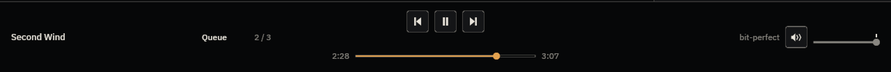
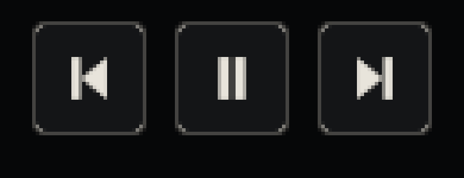
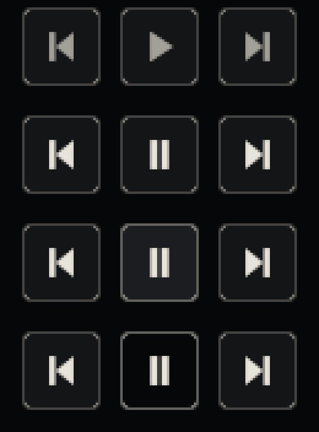
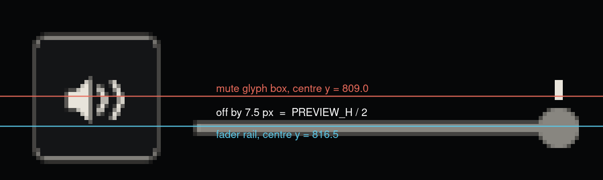

# baz — Fluidity

> **Status**: evaluation + work order (2026-08-08). Written in answer to a
> direct question from the owner:
>
> > *"are you struggling to get a webapp like fluidity with whatever front end
> > framework we have? it looks just subtly clunky compared to other work I've
> > seen"*
> >
> > *"just weird alignment (mute button + the vol slider), the clunky looking
> > button styles around what should be icon buttons... honestly just all quite
> > clunky"*
>
> **Amends `docs/design/02-visual-language.md` §7 and §8, and reopens the
> "Motion is 0 ms — UPHELD" row of ADR-0017.** §7's *conclusion* stands for
> most of the app; its *premise* does not survive measurement, and the premise
> is what has been cited ever since. This document carries the measurements.
>
> Nothing here has been implemented. The prescriptions are written so the next
> agent can apply them without re-deriving anything.

---

## The short answer

The framework is not the problem, and neither is the palette. Three separate
things are:

1. **A factual error in our own spec** told us motion was unavailable. It is
   available, it costs nothing when nothing is moving, and it has been
   available the whole time — baz already ships the exact mechanism, in
   `app.rs`, for something else.
2. **Icon buttons are wearing card chrome** that carries no information: the
   rest state and the disabled state are pixel-identical, and the pressed state
   makes the button's fill the same colour as the bar it sits in.
3. **The mute glyph is 7.5 px above the fader it belongs to**, because it is
   centred against the fader's *lane-plus-rail* block instead of against the
   rail — a mistake the seek row, ten lines away in the same file, already
   solves correctly and documents.

(2) and (3) are the two the owner named. (1) is why fixing them will still
leave the app feeling stepped rather than smooth.

---

## 1. Motion — is "0 ms everywhere" actually forced?

### 1.1 What the spec says, and what is wrong with it

`docs/design/02-visual-language.md` §7:

> **Every state change in baz takes 0 ms.** iced 0.13 ships no animation
> runtime; producing a transition means driving state from a `window::frames()`
> subscription, **which redraws whether or not anything is moving**. baz
> measures its startup in hundreds of milliseconds and its memory in a 150 MiB
> thumbnail budget.

and §8's table row:

> | transitions | no runtime; `frames()` redraws while idle | 0 ms everywhere (§7) |

The emphasised clause is the load-bearing one, and it is **half true in a way
that inverts the conclusion**.

It is true of an **unconditional** `window::frames()` subscription. It is not
true of a subscription that exists only while something is moving — and
subscriptions in iced 0.13 are *rebuilt from state after every update*, then
diffed, and the ones that went away are dropped. A subscription is not a
resource you acquire; it is a function of your state.

**baz already relies on this.** `crates/baz/src/app.rs:1180-1186`:

```rust
// Only while a tile click is holding the grid's columns still, and
// never otherwise: the hold's expiry is the one layout change with
// no input behind it, so it is the one thing that needs a clock to
// notice it. (See [`shelf::ColumnHold`].)
if state.column_hold.holding() {
    subs.push(iced::time::every(COLUMN_HOLD_TICK).map(|_| Message::ColumnHoldTick));
}
```

and, four lines above it, the same pattern again — a `window::frames()`
subscription that is *dropped* once it has done its job:

```rust
// Frame events only until startup-to-interactive is logged.
if !self.first_frame_logged {
    subs.push(window::frames().map(|_| Message::FirstFrame));
}
```

So the shipped app already starts a clock on an event, runs it for a bounded
period, and stops it completely. That is an animation driver with the
interpolation left out.

### 1.2 Why `frames()` free-runs, mechanically

Worth stating exactly, because it is the reason the folk belief is so durable.

`window::frames()` does **not** request redraws. It is a passive listener
(`iced_runtime-0.13.2/src/window.rs:172`):

```rust
pub fn frames() -> Subscription<Instant> {
    event::listen_raw(|event, _status, _window| match event {
        crate::core::Event::Window(Event::RedrawRequested(at)) => Some(at),
        _ => None,
    })
}
```

What makes it free-run is the other end: `iced_winit-0.13.0/src/program.rs`
calls `window.raw.request_redraw()` after every message batch (`:1038`,
`:1096`). So mapping each redraw *into a message* closes a loop — redraw
produces a message, the message produces a redraw. The loop is real, it is
uncapped, and it never stops **while the subscription is mapped to a message**.

Remove the subscription and the loop opens. The event loop then parks in
`ControlFlow::Wait` (`program.rs:834-845`), and iced 0.13 additionally honours
`RedrawRequest::At(instant)` via `ControlFlow::WaitUntil` — a scheduled, single,
non-repeating wakeup, available to any custom `Widget` through
`Shell::request_redraw` (`iced_core-0.13.2/src/shell.rs:39`). baz writes custom
`Widget`s already (`groove.rs`), so even the widget-level route is open.

### 1.3 The experiment

A standalone binary pinned to **iced 0.13.1 with baz's exact feature set**
(`advanced`, `image`, `tokio`), drawing a 1280×860 window with 120 tiles per
frame — deliberately more widgets than baz's shelf shows at that size. It runs
five phases and reports, per phase, wall time, process CPU from
`/proc/self/stat`, and the number of `view()` calls. `view()` runs once per
rendered frame, and the counter lives *inside* `view` in a `Cell`, so the
instrument is passive and cannot change what the event loop decides to do.

Three transitions run together, at the three durations §7 says it would permit
if iced ever gained a runtime: a **hover fade** (90 ms), a **popover
fade-and-slide** (140 ms), and a **panel width tween** (150 ms).

Four drivers:

| driver | subscription |
|---|---|
| `off` | none — the control |
| `timer` | `iced::time::every(8 ms)`, **only while a tween is live** (the `ColumnHold` pattern) |
| `frames` | `window::frames()`, **only while a tween is live** |
| `always-frames` | `window::frames()`, unconditionally — the arrangement §7 assumes |

Phases: 3 s warm-up · idle · **20 discrete 150 ms transitions over 10 s** (what
a hand moving around the bar actually produces) · continuous animation · idle.

### 1.4 Results — real GPU

AMD Radeon RX 7700/7800 XT, Wayland, vsync. *This measurement put a window on
the maintainer's display for about 50 seconds. There is no headless path to a
real-GPU number, and reporting software-rasterised CPU as if it were the
shipping cost would be a false receipt — so the intrusion was taken
deliberately rather than avoided.*

| driver | idle before | 20 × 150 ms burst (10 s) | continuous (4 s) | **idle after** |
|---|---|---|---|---|
| `timer` (bounded) | 6.0 % | 257 frames · **5.1 %** | 242 frames (60 fps) · **4.0 %** | 8 frames · **0.0 %** |
| `always-frames` | 241 frames (60 fps) · 2.0 % | 600 frames · 1.9 % | 241 frames · 2.0 % | 241 frames (60 fps) · 2.0 % |

The decisive line the harness prints for the bounded driver:

```
frames after the last tween settled: 1  (over the 3.9 s since)
wall time since the last frame drawn: 3.88 s
```

**One further frame, then 3.88 seconds of complete silence at 0.0 % CPU.** The
clock stops. `always-frames` never stops: 60 fps in every phase, including both
idle phases, forever.

### 1.5 Results — no GPU at all

Same binary under Xvfb with llvmpipe (software rasterisation) — the pessimistic
case, and the one that matters for a VM, a remote session, or a machine with no
usable driver. Idle rows are 6 s.

| driver | idle before | 20 × 150 ms burst | continuous (6 s) | idle after |
|---|---|---|---|---|
| `off` | 1 frame · 0.5 % | 21 frames · 20.8 % | 2 frames · 3.3 % | 1 frame · 1.7 % |
| `timer` (bounded) | 1 frame · 2.8 % | 372 frames · 243 % | 745 frames (124 fps) · 711 % | 11 frames · 10.0 % |
| `frames` (bounded) | 1 frame · 2.8 % | 606 frames · 245 % | 1686 frames (281 fps) · 718 % | 15 frames · 9.2 % |
| `always-frames` | **1345 frames (223 fps) · 628 %** | 635 frames · 134 % | 324 frames · 122 % | **336 frames · 117 %** |

Again: `1 frame after the last tween settled, then 5.92 s of silence` for the
bounded drivers. `always-frames` idles at **628 % of one core**.

Percentages above 100 are real — llvmpipe rasterises across threads. These
absolute numbers are a software-rendering artefact and should not be quoted as
baz's cost; the **frame counts** and the **stop** are what transfer.

### 1.6 What this settles

- **§7's fear is justified — for the arrangement it names.** An unconditional
  `window::frames()` really does redraw forever, really does cost 2 % of a core
  on a good GPU and 628 % without one. Never ship that.
- **§7's conclusion does not follow.** A subscription gated on "is anything
  moving" costs *nothing* when nothing is moving: 0.0 % CPU, zero frames,
  measured on both renderers. The owner's reasoning is correct — you only need
  to redraw while a transition runs.
- **A 150 ms transition is 9 frames.** Asserted as a unit test, not a guess:
  `a_150ms_transition_is_about_nine_frames_at_60hz` ticks a tween at 16.667 ms
  and gets exactly nine live frames before it stops asking.
- **Startup-to-interactive does not move.** Launch-to-first-frame across the
  four drivers ranged 47–63 ms under Xvfb with no ordering by driver, and the
  driver cannot affect it in principle: the subscription is first consulted
  *after* the first update. For scale, two runs of the *unmodified* baz binary
  in this session measured **717.0 ms** and **791.4 ms** — a 74 ms spread
  between identical binaries, larger than anything motion could contribute.
- **The memory promise is untouched.** `size_of::<Tween>() == 48` bytes,
  asserted in a test. Twenty animated scalars is under a kilobyte against a
  150 MiB thumbnail budget.

### 1.7 The smallest honest API for baz

Shaped deliberately like `shelf::ColumnHold`, which is the codebase's existing
answer to "a rule that needs a clock": **pure state and pure arithmetic, told
what time it is rather than asking**, so the whole rule is unit-testable
without a window and without a clock. It belongs in `crates/baz/src/motion.rs`.

```rust
/// One animated scalar. Settled until something asks it to move, and it
/// settles again on its own.
pub struct Tween { /* value: f32, flight: Option<Flight>, curve: Curve */ }

impl Tween {
    pub fn settled(value: f32) -> Self;
    pub fn with_curve(self, curve: Curve) -> Self;

    /// Send it to `target` over `duration`, from wherever it is now.
    /// A zero duration, or a target already reached, settles immediately and
    /// asks for no clock — that is the degrade-to-instant path, and it is the
    /// same code path as "motion disabled".
    pub fn go(&mut self, target: f32, duration: Duration, now: Instant);
    pub fn set(&mut self, target: f32);          // jump, no motion

    pub fn value(self) -> f32;                   // what `view` draws; no clock contact
    pub fn live(self) -> bool;                   // "must I keep a clock?"
    pub fn tick(&mut self, now: Instant) -> bool; // advance; false once settled
}

pub enum Curve { Linear, EaseOut }   // EaseOut = 1 - (1-t)^3. No spring, no overshoot.
```

`app.rs` gains one arm and one guard, and nothing else:

```rust
// in update()
Message::MotionTick(now) => { self.motion.tick(now); Task::none() }

// in subscription() — structurally identical to the ColumnHold guard above it
if self.motion.live() {
    subs.push(iced::time::every(MOTION_TICK).map(|_| Message::MotionTick(Instant::now())));
}
```

Nine unit tests exercise the whole rule with no window (all passing in the
spike). The three that carry the argument:

| test | what it pins |
|---|---|
| `a_flight_is_live_until_its_duration_elapses_and_then_never_again` | it stops, and no later instant revives it |
| `overshooting_the_end_settles_on_the_target_not_past_it` | a 400 ms stall lands exactly on the target — a transition may arrive late, never wrong |
| `retargeting_mid_flight_starts_afresh_from_where_it_is` | pointer in-out-in produces two short correct movements, not one stale one |

Plus `a_zero_duration_is_the_degrade_to_instant_path`, which is how a future
"reduce motion" setting is implemented: pass `Duration::ZERO` and every call
site becomes a hard cut with no branching anywhere else.

**Use `iced::time::every`, not `window::frames()`, even gated.** Both stop
correctly (measured), but gated `frames()` free-runs *while it is live* —
281 fps under llvmpipe against `timer`'s 124 — because it is still the
redraw-produces-message loop, just switched off at the ends. A timer is
rate-limited by construction.

### 1.8 What this does not license

§7's prohibitions are **upheld in full** and should be restated in whatever
amends it. Never animated, at any version: the bar's geometry; the shelf grid —
no stagger, no pop-in, no fade as thumbnails decode, a thumbnail replacing its
placeholder stays an instant swap; album art; and — the one to keep quoting —
**anything requiring a redraw while the window is idle**. That last clause is
now enforceable rather than aspirational, because `live()` is a boolean the
subscription reads.

**This reverses a decision ADR-0017 recorded as `UPHELD`.** It needs the
owner's sign-off and an ADR amendment, not just this document.

---

## 2. iced 0.14 — what does it change?

Released 2025-12-07. baz is pinned to 0.13.1 (ADR-0005). Evaluated by vendoring
the sources, reading `CHANGELOG.md` and the `widget`/`animation` modules, and
compiling a probe — not from release notes.

### 2.1 It has an animation facility

`iced_core-0.14.0/src/animation.rs`, re-exported as `iced::animation`, backed by
the new `lilt` dependency:

```rust
pub struct Animation<T> where T: Clone + Copy + PartialEq + Float { … }

pub fn new(state: T) -> Self;                   // default 100 ms
pub fn easing(self, easing: Easing) -> Self;
pub fn duration(self, d: Duration) -> Self;
pub fn go_mut(&mut self, new_state: T, at: Instant);
pub fn is_animating(&self, at: Instant) -> bool;
pub fn interpolate(&self, start: I, end: I, at: Instant) -> I;   // Animation<bool>
```

**It is the same shape as §1.7's `Tween`, and it does no more.** It owns no
clock, requests no redraws, emits no messages; every method that needs time
takes an explicit `Instant`. You still gate a frame subscription on
`is_animating` yourself. So 0.14's animation API is **not a reason to upgrade
for motion** — it is a fifty-line helper baz can write, has written in the
spike, and can test more thoroughly than a dependency it does not control.

The genuinely new thing in 0.14 is **reactive rendering**: 0.13's unconditional
`request_redraw()` after every event batch (`iced_winit-0.13.0/src/program.rs:1038`)
is gone, moved behind the non-default `unconditional-rendering` feature
(`iced_winit-0.14.0/src/lib.rs:1164-1181`). An idle 0.14 window draws zero
frames. That is a real improvement — but §1.4 measured a bounded 0.13 window
already idling at **0.0 % CPU**, so for baz the prize is smaller than it looks.

### 2.2 Our catalogued limits: **1 of 9 fixed**

Checked against 0.14 source, not notes.

| §8 limit | 0.14 | evidence |
|---|---|---|
| rounded / clipped images | **FIXED, wgpu only** | `iced_core-0.14.0/src/image.rs:27` adds `border_radius`; also `crop()`, `scale()`. **But `iced_tiny_skia`'s raster path never reads it** (`engine.rs:565-592` → `raster.rs:41-78`) — rounded art silently renders square on the software fallback, so baz could not rely on it anyway |
| pointer capture during a drag | not fixed | no `set_cursor_grab`/capture API anywhere in `iced_winit-0.14.0`, `iced_runtime-0.14.0`. `groove.rs`'s `CursorLeft`/`Unfocused` workaround stands verbatim |
| 4-sided borders only | not fixed | `iced_core-0.14.0/src/border.rs:6-16` — one colour, one width. Byte-identical to 0.13 |
| OpenType feature control | not fixed | zero hits for `letter_spacing`, `small_caps`, `tnum`, `font_feature` across `iced_core`/`iced_graphics` |
| accessibility tree / AccessKit | not fixed | zero hits for `accesskit`/`accessibility` in `iced_core`, `iced_winit`, `iced_widget` |
| text ellipsis | not fixed | `text::Wrapping` is `{None, Word, Glyph, WordOrGlyph}` — character-identical to 0.13 |
| shadow spread | not fixed | `shadow.rs` unchanged: colour, offset, blur only |
| focus ring on buttons | not fixed | zero occurrences of `focus` in `iced_widget-0.14.2/src/button.rs`; `Focusable` is implemented by `text_input` and `text_editor` only |
| radial gradients / blur / backdrop | not fixed | `gradient.rs:9-11` — `enum Gradient { Linear(Linear) }`, single variant |

The one thing baz most wants from a toolkit upgrade — **an accessibility tree**
— is not there, and §8's honest note that contrast floors and hit targets are
"the whole of what the toolkit can offer here" is still accurate.

### 2.3 Migration cost, measured on baz

The upgrade was attempted in this worktree: `iced = "0.14"`, then
`cargo check --workspace --all-targets`. **57 errors across 11 files**, and that
is a **floor** — rustc stops before later passes, so fixing the first batch will
reveal more.

| file | errors | what breaks |
|---|---|---|
| `theme.rs` | 16 | `button::Style` + `snap` (×6); `rule::Style` loses `width`, gains `snap`, **loses `Default`**; `scrollable::Scroller.color` → `background`; `scrollable::Style` + `auto_scroll`, **loses `Default`**; `scrollable::Status` and `text_input::Status` became struct variants; `theme::Palette` + `warning` |
| `app.rs` | 14 | `text_input::Id` and `scrollable::Id` no longer exist; `text_input::focus` / `scrollable::scroll_to` moved to `iced::widget::operation`; `Space::with_width/with_height` removed |
| `views/bottom_bar.rs` | 6 | `Space` constructors; `horizontal_rule` removed from `iced::widget` |
| **`groove.rs`** | 5 | **`Widget::on_event` → `update`**, event **by reference**, returns nothing; `event::Status::Captured` → `shell.capture_event()`; `layout` and `operate` take `&mut self` |
| `views/settings.rs` · `shelf.rs` · `queue.rs` · `top_bar.rs` · `side_panel.rs` · `views/mod.rs` | 13 | `Space` constructors, `horizontal_rule` |
| `mpris/server.rs` | 1 | `Subscription::run_with_id` removed |

The error count understates `groove.rs`. Its ~350 lines of tests assert on the
`event::Status` that `on_event` returned; every one becomes a
`shell.is_event_captured()` read after `update`. That is the single largest
mechanical chunk and it lands on baz's most carefully tested widget.

**Behavioural changes that compile clean and look different:**

- **`crisp` is a *default* feature** in 0.14. It sets `snap: true` on every
  quad, snapping to the pixel grid. baz's design is 1 px hairlines and
  half-pixel rail centring (`rail_y - rail.width / 2.0`) — the visual regression
  risk lands squarely on the surface this document is trying to repair. Opt out
  with `default-features = false`.
- `theme::Palette` generation was rewritten in Oklch. Small blast radius (baz
  styles nearly everything itself), but not zero.

**Dependency delta**, measured with `cargo tree` before and after:

- **342 → 367 unique packages** (+25).
- **Two complete D-Bus stacks**: `cargo tree -i zbus` reports `zbus@4.4.0` *and*
  `zbus@5.18.0`. 0.13 reaches zbus 4.4 via `dark-light`; 0.14 reaches 5.18 via
  the new `mundy`. baz's own `Cargo.toml` predicted this exactly — *"Move to 5
  when iced's transitive copy does."* **It has.** The direct dep must be bumped
  in the same commit or baz links both.
- **Nine image-codec crates for formats baz never decodes through iced**:
  `ravif`, `rav1e`, `av1-grain`, `av-scenechange`, `avif-serialize`, `exr`,
  `image-webp`, `tiff`, `gif`. 0.14's `image` feature turns on `image/default`;
  baz wants the new **`image-without-codecs`** instead, since it decodes
  jpeg/png itself and hands over `Handle::from_rgba`.
- No new system dependencies. Pure Rust on Linux still holds — the property
  ADR-0005 was chosen for survives.
- MSRV 1.88 / edition 2024. baz is on 1.92 / 2024 — no constraint.
- Incidental win: `lru` 0.12 → 0.16 retires the RUSTSEC-2026-0002 exception
  `deny.toml` currently carries for `iced_glyphon`'s pinned copy.

**The workspace was left on 0.13.1.** The bump and its lockfile were reverted;
`git status` is clean apart from this document and its images.

### 2.4 Recommendation: **upgrade later — before the needle, not now**

Not now:

- **It does not solve the problem that prompted it.** Motion works on 0.13
  today, measured, at 0.0 % idle. 0.14's `Animation` is the same helper we can
  write in fifty testable lines.
- **It fixes 1 of 9 catalogued limits**, and that one only on wgpu — the
  tiny-skia fallback silently renders rounded images square, so baz could not
  depend on it.
- **57+ errors across 11 files**, concentrated in `theme.rs`, `app.rs`,
  `views/**` and `groove.rs` — *precisely the files two agents are editing right
  now*. This is the worst possible merge, for a change with no user-visible
  payoff.
- **`crisp` risks the exact surface this document is repairing.**

Not never — and the trigger is specific:

- **Upgrade before the needle is written.** ADR-0017 plans a second custom
  `Widget`. Porting one `Widget` impl and its tests to 0.14's `update` signature
  is the cost we already know; porting two is strictly more. Do the upgrade in
  the window after the current design work merges and before the needle starts.
- Do it as **one isolated infrastructure commit** with no design changes in it,
  so the `crisp`/Oklch visual delta can be screenshot-diffed against a known
  baseline (`magick compare -metric AE`, wgpu renderer, per `docs/DEVELOPMENT.md`).
- In the same commit: bump direct `zbus` 4.4 → 5, switch `image` →
  `image-without-codecs`, and set `default-features = false` on iced to keep
  `crisp` off until it is evaluated deliberately.
- **Independently of the upgrade**, revisit if AccessKit, pointer capture, or
  text ellipsis ever land. Those are the three that would change what baz can
  promise.

---

## 3. The two complaints — diagnosed

Both measured off a real render: the shipped release binary, six-variable
isolated per `docs/DEVELOPMENT.md`, silent WAV fixtures, ALSA default routed to
`null` in the scratch `HOME`. The isolation receipt:

```
[mpris] no session bus; desktop media controls unavailable (I/O error: No such file or directory (os error 2))
```

Numbers below are window pixels read out of the raw RGB dump, not eyeballed.



### 3.1 Icon buttons wearing chrome



**Where it comes from.** `views/bottom_bar.rs:336` `glyph_button()` wraps every
transport glyph — Previous, Play/Pause, Next — *and the mute glyph* in a
`button` styled by `theme::transport` (`theme.rs:773`), which gives all four
states a filled background and a 1 px border at `RADIUS_CTRL`:

```rust
let (background, border, text_color) = match status {
    button::Status::Hovered  => (PLINTH_LIT, HAIRLINE_STRONG, PAPER),
    button::Status::Pressed  => (RECESS,     HAIRLINE_STRONG, PAPER),
    button::Status::Disabled => (PLINTH,     HAIRLINE,        PAPER_FAINT),
    button::Status::Active   => (PLINTH,     HAIRLINE,        PAPER),
};
```

**Measured, all four states, fill against the bar's own `RECESS` surface:**



| state | fill | contrast vs bar |
|---|---|---|
| Disabled | `rgb(20,21,23)` | 1.10 : 1 |
| **Active (rest)** | `rgb(20,21,23)` | **1.10 : 1 — pixel-identical to disabled** |
| Hovered | `rgb(28,29,32)` | 1.20 : 1 |
| **Pressed** | `rgb(6,7,8)` | **1.00 : 1 — the fill *is* the bar** |

Four findings, in order of severity:

1. **The chrome distinguishes nothing.** Rest and disabled are the same
   pixels. The box is drawn identically whether the control can be used or not.
   A container that is always present and always the same is not an affordance,
   it is decoration — and drawn three times in a row, 8 px apart, it reads as a
   toolbar from another decade. This is the "clunky looking button styles around
   what should be icon buttons" exactly.
2. **Hover never touches the mark.** This is the important one, and it is not
   visible in the style function. The glyph is not text — it is a rasterised
   image (`bottom_bar.rs:344`):

   ```rust
   iced_image(icon::handle(glyph)).opacity(theme::glyph_opacity(enabled, pending))
   ```

   `icon::handle` inks every glyph in `theme::GLYPH` (= `PAPER`) at raster time,
   and `glyph_opacity(enabled, pending)` takes **no hover argument**. So
   `theme::transport`'s `text_color` field is dead code for these four controls,
   and the mark is byte-identical at rest and under the pointer. *All* hover
   feedback is the box announcing itself: fill 1.10 → 1.20 : 1 (below the noise
   floor) and border `HAIRLINE` → `HAIRLINE_STRONG`, 2.04 → 3.25 : 1.
3. **Press inverts wrongly.** `RECESS` is the bar's own surface colour, so on
   press the card's fill vanishes into the bar and only its outline is left. The
   button reads as a *hole*, not as pressed. Visible in the fourth row above.
4. **`theme::transport`'s doc comment describes a different control** — "a card
   that raises on hover and sinks on press". There is no raise and no sink:
   `shadow` is `Shadow::default()` in all four arms.

**Prescription — a bare icon button.** The mark is the control; the box goes.
The lever is **glyph opacity**, not `text_color`, because of finding (2) — and
that is already the codebase's idiom (`GLYPH_OPACITY_DISABLED`'s doc comment
derives itself the same way).

Add `theme::icon_button` (background `None`, `Border::default()`, all four
states) and extend `glyph_opacity` to take the hover and press status:

| state | background | border | glyph opacity | composites to, over the bar |
|---|---|---|---|---|
| **Rest** | none | none | **0.57** | `rgb(135,133,128)` ≈ `PAPER_FAINT` `rgb(136,134,128)` |
| **Hover** | none | none | **1.00** | `PAPER` `rgb(232,228,219)` |
| **Press** | none | none | **0.75** | `rgb(176,173,166)` |
| **Disabled** | none | none | **re-derive — see below** | must stay clearly below rest |

Rationale for each:

- **No background and no border in any state.** The 32 × 32 `TRANSPORT_HIT`
  target stays exactly as it is — the hit area is unchanged, only invisible.
  Geometry does not move, so §6.5's reserved-slot invariants and ADR-0017's
  "state changes touch ink not geometry" both hold.
- **Rest at 0.57, not 1.0.** Today the glyph is full `PAPER` and the box
  supplies the "this is a control" signal. Remove the box and full-paper glyphs
  shout. `PAPER` at 0.57 over `RECESS` lands on `rgb(135,133,128)` —
  `PAPER_FAINT` `rgb(136,134,128)` to within one 8-bit value — so the mark sits
  at the weight the rest of the room gives quiet ink, with **no new colour and
  no re-rasterisation**.
- **Hover lifts the mark to full `PAPER`.** That is a **3.3× step in relative
  luminance** (0.238 → 0.777), against today's *zero*. This single change is
  what will make the controls feel responsive.
- **Press dims rather than fills.** A press that removes light is unambiguous
  against a near-black wall; a press that adds a darker fill is not, as measured.
- **Disabled must be re-derived, not reused.** `GLYPH_OPACITY_DISABLED = 0.45`
  is documented as landing "roughly `PAPER_FAINT` over `PLINTH`" — but removing
  the box changes the ground from `PLINTH` `rgb(20,21,23)` to `RECESS`
  `rgb(6,7,8)`, so 0.45 now composites to `rgb(108,106,103)`, and rest is
  `PAPER_FAINT` already. Pick a value that stays visibly below rest **and**
  clears §5.2's contrast floor, and update the constant's doc comment — it goes
  stale the moment the box is removed.
- **The tooltip stays.** It is the accessible name and iced still publishes no
  accessibility tree in either version (§2.2). Removing chrome does not remove
  the label.

`theme::transport` should be **deleted**, not kept alongside — it styles only
these four controls, and leaving both invites drift.

> **With motion (§4.1):** a bare icon button whose only state signal is ink
> makes a 90 ms ink fade worth more than it would be today, because the ink is
> now carrying the whole message. This is the single place where removing the
> chrome and adding motion compound.

### 3.2 Mute and the volume fader not aligning



**Measured off the render** (window pixels):

| element | extent | centre |
|---|---|---|
| mute glyph box | x 1128–1159 (32 px), y **793–825** | **y = 809.0** |
| fader rail | x 1168–1263 (96 px), y **815–818** | **y = 816.5** |

**The mute glyph sits 7.5 px above the rail it controls.**

**The cause is not baseline and not differing heights — it is centring in
unequal containers.** `views/bottom_bar.rs:476-491`:

```rust
row![
    glyph_button(icon::Glyph::speaker(state.muted), …),   // TRANSPORT_HIT = 32 tall
    column![
        preview_lane(state.preview, theme::VOLUME_W, theme::LEVEL_W),  // PREVIEW_H = 15
        fader                                                          // VOLUME_HIT = 28
    ],
]
.align_y(iced::Alignment::Center)
.height(Length::Fixed(theme::VOLUME_ROW_H))   // 15 + 28 = 43
```

`align_y(Center)` centres the button against the **whole 43 px column**, lane
included — so the button's centre lands at 43/2 = 21.5, while the rail's centre
is at `PREVIEW_H + VOLUME_HIT/2` = 15 + 14 = **29**. The error is exactly
`PREVIEW_H / 2 = 7.5 px`, and the render agrees to the pixel: 816.5 − 809.0 = 7.5.

The hover-preview lane is reserved whether or not anything is hovering (which
is right — the bar must not change height under the pointer), so the button is
permanently centred against a strip that is, most of the time, empty air.

**The fix already exists in the same file, ten lines away, and is documented.**
`seek_stamp()` (`bottom_bar.rs:507`) solves the identical problem for the seek
row's timestamps and says so:

> *"One of the seek bar's timestamps, **carrying the same preview lane as the
> groove above it so that the digits line up with the rail rather than with the
> lane-plus-rail block**."*

It does it by reserving the lane on its own side of the row:

```rust
column![
    Space::with_height(Length::Fixed(theme::PREVIEW_H)),
    container(text(value)…).height(Length::Fixed(theme::RAIL_HIT))
        .align_y(alignment::Vertical::Center),
]
```

The volume block simply never got the same treatment. This is an oversight, not
a design disagreement.

**Prescription.** Give the mute button the seek row's structure — reserve
`PREVIEW_H` above it, then centre it on the rail's own band:

```rust
column![
    Space::with_height(Length::Fixed(theme::PREVIEW_H)),
    container(glyph_button(…))
        .height(Length::Fixed(theme::VOLUME_HIT))
        .align_y(alignment::Vertical::Center),
]
```

**One arithmetic consequence must be handled, not ignored.** `TRANSPORT_HIT` is
32 and `VOLUME_HIT` is 28, so a 32 px button centred on the rail's band spans
y 13–45 within a 43 px block — a 2 px overhang at each end. Three ways out;
take the first:

1. **Raise `VOLUME_ROW_H` to 45** — `PREVIEW_H + VOLUME_HIT + (TRANSPORT_HIT − VOLUME_HIT)`,
   i.e. `15 + 28 + 4`. The bar's content height is currently 102 px and its
   tallest column is the transport stack at 77 px, so 45 fits with room to
   spare and the bar does not change height. This keeps the 32 px hit target
   (the accessibility floor) *and* lands the glyph on the rail centreline
   exactly. **Recommended.**
2. Shrink the mute hit box to `VOLUME_HIT` = 28. **Rejected** — it breaks the
   ≥ 32 px hit-target rule for the one control a hand reaches for without
   looking.
3. Let it overhang. **Rejected** — iced does not clip by default, so the
   overhang would draw outside its allotted box.

Whichever is chosen, add the assertion alongside the existing geometry tests:
the mute glyph's vertical centre must equal `PREVIEW_H + VOLUME_HIT / 2`. The
render harness can check it directly, which is how it was found.

**While in there:** the same 7.5 px question should be asked of the signal-path
readout to the fader's left, which is also centred by the outer status row.
Not measured here because it is text on a different lane; worth one screenshot.

---

## 4. The transitions baz should actually have

Ranked by **clunkiness removed per unit of work**. Every one degrades to
instant by passing `Duration::ZERO` (§1.7), so the whole list is one setting
away from §7's current behaviour.

Nothing here is licensed until §1.8's ADR amendment is signed off.

| # | transition | duration · curve | work | why it earns its place |
|---|---|---|---|---|
| **1** | **Icon-button ink fade** — `PAPER_FAINT` ⇄ `PAPER` on hover, and the press dim | 90 ms ease-out | one `Tween` per control (4 in the bar) + `theme::icon_button` | Compounds with §3.1. Once the chrome is gone the ink *is* the affordance, and an ink change that hard-cuts reads as a flicker. Highest value, and the work is already being done for §3.1 |
| **2** | **Queue popover arrival** — opacity 0→1 plus an 8 px upward slide | 140 ms ease-out | one `Tween`; the `stack`+`opaque`+`mouse_area` structure is untouched | The largest surface in the app appearing between two frames is the most "unfinished" moment there is. One tween, one of the biggest wins |
| **3** | **Shelf tile hover rule** — the rule under the label fading in | 90 ms ease-out | one `Tween` keyed by the hovered tile id — **not** one per tile | §2.9 of the visual language already costs this rule at one `rule` widget on at most two tiles at a time. Touches the surface the eye spends most time on |
| **4** | **Side panel width** | 150 ms ease-out | one `Tween`, plus care where it meets `ColumnHold` | Real, but it moves layout, and layout reflow already has a hard-won rule (`ColumnHold`) that a width tween interacts with. Do it after 1–3, deliberately |
| **5** | **Lamp warm on track change** — hue over 200 ms | 200 ms **linear** | one `Tween` on the art-derived hue | §7 already named this one. Genuinely lovely, genuinely rare — a handful of times an hour. Lowest clunk-per-frame, but nearly free |

**Still forbidden, unchanged from §7:** shelf-grid stagger or pop-in; any fade
as thumbnails decode (a thumbnail replacing its placeholder stays an instant
swap); album art crossfades; the bar's geometry; and anything at all that
requires a redraw while the window is idle.

**Suggested order of work**, since two of these are already in flight as
non-motion changes:

1. §3.2, the 7.5 px alignment — no motion, no dependencies, one file, wrong today.
2. §3.1, `theme::icon_button` and the deletion of `theme::transport` — no motion.
3. The ADR amendment for §1.8, with these measurements attached.
4. `crates/baz/src/motion.rs` + the `app.rs` guard, with the nine unit tests.
5. Transitions 1 and 2. Screenshot-diff before and after.
6. Transitions 3–5, one commit each.
7. The 0.14 upgrade as one isolated infrastructure commit, before the needle.

---

## Appendix — how the numbers were taken

- **Motion**: a standalone `iced = "0.13"` binary with baz's exact features,
  1280 × 860, 120 tiles per frame, four drivers × five phases. Frame counts from
  a `Cell` inside `view()`; CPU from `/proc/self/stat` (utime + stime); RSS from
  `/proc/self/statm`. Run headless under Xvfb/llvmpipe **and** on the real GPU;
  both reported, because the software figures are inflated by an order of
  magnitude and only the frame counts transfer.
- **The render measurements**: the shipped `--release` binary with
  `device-output`, under Xvfb, with `HOME`, `XDG_DATA_HOME`, `XDG_CONFIG_HOME`,
  `XDG_CACHE_HOME`, `XDG_RUNTIME_DIR` all redirected to a scratch tree and
  `DBUS_SESSION_BUS_ADDRESS` unset — the six-variable isolation, with
  `[mpris] no session bus` as the receipt. Fixtures are three silent WAVs and
  the scratch `HOME` carries an `.asoundrc` routing ALSA's default to `null`, so
  the run is inaudible twice over. Pixels read from a raw RGB dump of
  `import -window root`; contrast ratios are WCAG relative luminance.
- **The 0.14 evaluation**: sources vendored from crates.io and read directly
  (`iced-0.14.0`, `iced_core-0.14.0`, `iced_widget-0.14.2`, `iced_winit-0.14.0`,
  `iced_runtime-0.14.0`, `iced_tiny_skia-0.14.0`), plus a compiling probe crate
  and an actual `cargo check` of baz against 0.14 in this worktree, reverted
  afterwards.
