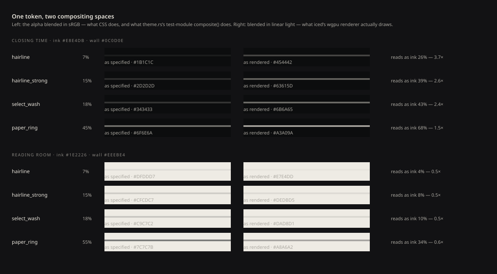
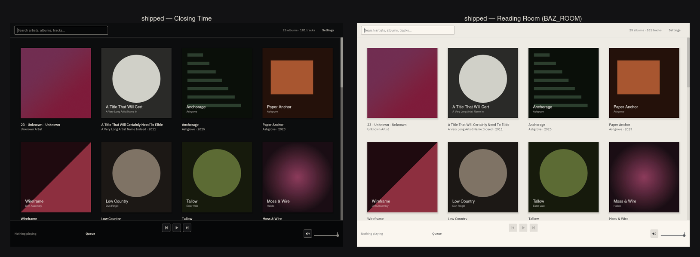
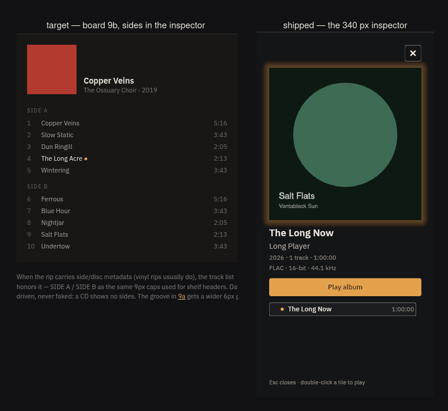
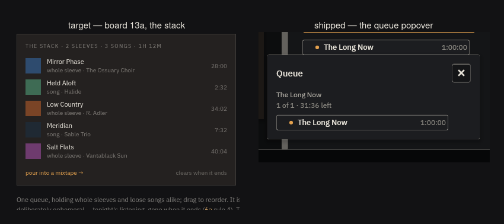
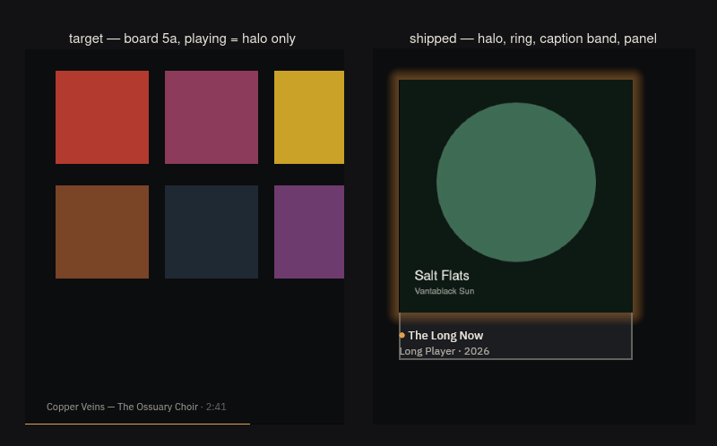
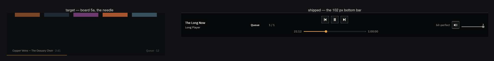
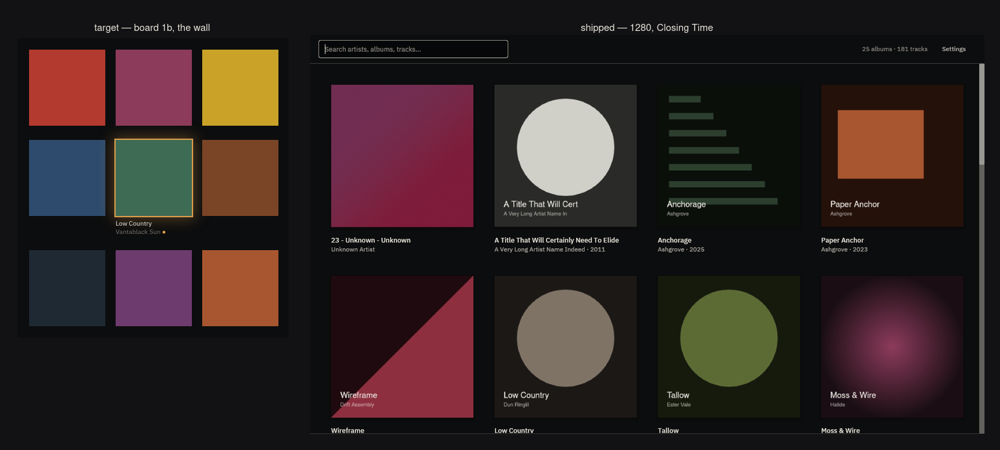

# 05 — The visual gap, measured; and whether iced is the right vehicle

> Two questions from the owner:
> *"can we compare visually to the webapp designs to understand how we need to
> adjust this UI framework to work?"* and *"are there any other fast front ends
> which are more 'beautiful' out of the box while still being fast"*.
>
> Answered here with pixels and with crate sources. Research only — this
> document changes no production code.

**The answer in one line.** The gap between what baz draws and what the design
board specifies is **not iced's fault** — five of the six largest defects are
things we did that are wrong, one is a thing we have not built yet, and none of
the top six is a thing iced cannot do. **Stay on iced, move to 0.14**, and spend
the eight weeks a migration would cost on the defect list instead.

---

## 0. How this was measured

**The target.** Two sets, both opened and screenshotted rather than read:

- `docs/design/critique/baz critique.dc.html` — the Claude Design board, and
  the highest-fidelity target that exists. It is authored in HTML, which is
  precisely the "webapp design" the owner is comparing against. The handoff's
  runtime (`support.js`, `doc-page.js`) was never shipped with the package, so
  the board could not render as authored; a 200-line local shim reimplements
  the three constructs it uses (`<helmet>`, `<sc-for>`, `<sc-if>` plus `{{ }}`
  interpolation) over a deterministic placeholder dataset, and substitutes the
  three IBM Plex Sans faces baz already bundles for the Google Fonts link the
  board carries. Rendered headless in Chrome with a throwaway profile; the
  owner's browser session was never touched. Mocks under
  [`gap/board/`](gap/board/).
- `docs/design/visual/gallery/*.png` — our own gallery mockups. Consulted, and
  **not reproduced here**, for a reason worth stating: they are drawn *from the
  tokens* by `render.py`, so they agree with `theme.rs` by construction and
  cannot show a defect whose cause is a token. They draw the hairline as
  `rgba(…, 0.07)` in an SVG, which composites in sRGB — so on defect D1, the
  most important finding below, our own mockups show the design's intent and
  the shipped app shows something else, and only the board can arbitrate.
  Where the two targets disagree, [ADR-0017](../adr/0017-design-direction.md)
  makes the board the target.

**The actual.** The real release binary, `--features device-output`, driven on a
private `Xvfb` with **all six** redirections from
[`docs/DEVELOPMENT.md`](../DEVELOPMENT.md#headless-ui-verification) — scratch
`HOME`, `XDG_DATA_HOME`, `XDG_CONFIG_HOME`, `XDG_CACHE_HOME`,
`XDG_RUNTIME_DIR`, and no session-bus address. Every run's log carries the
receipt:

```
[mpris] no session bus; desktop media controls unavailable (I/O error: No such file or directory (os error 2))
```

A throwaway 25-album / 181-track fixture of **digitally silent** FLAC (every
sample a zero) and generated cover art in six visual families, never `~/Music`;
the scratch `HOME` carries an `.asoundrc` routing ALSA's default PCM to `null`,
so the transport is real and nothing was audible. `BAZ_DEVICE_TESTS` never set.
Captured at **1280×860** and **1920×1080**, in **Closing Time** and — through
`BAZ_ROOM` — in **Reading Room**. Shots under [`gap/shipped/`](gap/shipped/).

**The ruler.** Scanline run-lengths and single-pixel probes through ImageMagick,
plus colour histograms over named regions. Every number below is a measurement
off a committed PNG, not an estimate, unless it says otherwise.

---

## 1. The measured visual gap

### 1.1 What is already right, so the defects are not read as a rout

The hang holds, exactly, at both widths. A scanline through row-one artwork,
run lengths against the wall colour `#0C0D0E`:

```
1280 px   40 | 270 | 40 | 270 | … | 270 | 30 | 10
1920 px   40 | 274 | 39 | 274 | … | 273 | 30 | 10
```

Work-to-work and work-to-wall are both `HANG` = 40, at both widths, as
[ADR-0017 §7 step 5](../adr/0017-design-direction.md) promised. The palette is
the palette: wall `#0C0D0E`, plinth `#141517`, recess `#060708`, lamp `#E3A14E`,
all exact. The room switch works and produces a genuinely different room rather
than an inverted skin. Cold start measured 321–738 ms across six runs *with a
full 181-track scan in the same frame and on llvmpipe* — Xvfb has no DRI3, so
every capture here ran on the software rasteriser, which makes that a
pessimistic number rather than a flattering one.

The trailing `30 | 10` is a defect and is D6 below.

### 1.2 The defect list

Attribution keys: **(a)** iced cannot do this · **(b)** iced can, we have not ·
**(c)** we did it and it is wrong.

| # | Defect | Attribution | Share |
|---|---|---|---|
| D1 | Every alpha-expressed token renders 2.4–3.7× too strong in the dark room and half as strong in the light one | **(c)** | ~30 % |
| D2 | The accent is drawn as an opaque 292 × 32 px fill | **(c)** | ~15 % |
| D3 | Chrome is bordered radiused chips where the design's chrome is type | **(c)** | ~15 % |
| D4 | State turns a sleeve into a card — ring round the caption, band behind it, shadow under it | **(c)** | ~12 % |
| D5 | Opening the inspector re-lays and resizes the entire wall | **(c)** | ~10 % |
| D6 | The wall's scrollbar is unstyled — iced's default, not baz's palette — and lit at rest | **(c)** | ~7 % |
| D7 | The bottom bar is 102 px where the plan says 58 | **(b)** | ~5 % |
| D8 | The wall has no chrome voice: no letterspaced caps, no shelf breaks, no group keys | **(b)** | ~4 % |
| D9 | Settings is one panel of controls in a full-window place, ~75 % empty | **(c)** | ~2 % |
| D10 | Tabular figures cannot be requested from the font | **(a)** | ~0 % |

Shares are the author's judgement of contribution to "subtly clunky", not a
measurement. Everything above the shares is measured.

---

### D1 — One token, two compositing spaces · **(c)** · ~30 %

**This is the single largest cause, and it is invisible one element at a time,
which is exactly why the owner's word for it is *subtly* clunky.**

`theme.rs` expresses four marks as an alpha over the room's ink:
`hairline` 7 %, `hairline_strong` 15 %, `select_wash` 18 %, `paper_ring` 45 %
(55 % in Reading Room). Those numbers come from the board, which specifies
*"hairline edges (ink 8–14 %)"* and is written in CSS.

**CSS composites `rgba()` in sRGB. iced composites in linear light.** Confirmed
at source: `iced_graphics-0.13.0/src/color.rs:33` packs every colour with
`color.into_linear()` before it reaches the shader, and
`iced_core-0.13.2/src/color.rs:170` is the standard sRGB→linear transfer
function. The GPU then blends source-over in linear space and the sRGB surface
encodes on write.

The consequence, predicted from that model and then measured off the committed
PNGs:

| token | alpha | as specified (sRGB blend) | as rendered (linear blend) | measured in `01-wall-1280.png` | reads as |
|---|---|---|---|---|---|
| `hairline` on wall | 7 % | `#1B1C1C` | `#454442` | **`#454442`** (top-bar rule, y = 54) | ink 26 % — **3.7×** |
| `hairline_strong` on wall | 15 % | `#2D2D2D` | `#63615D` | **`#63615D`** (scrollbar, x = 1270) | ink 39 % — **2.6×** |
| `paper_ring` on wall | 45 % | `#6F6E6A` | `#A3A09A` | **`#A3A099`** (search-field edge, x = 16) | ink 68 % — **1.5×** |

Three tokens, three channels each, predicted to the byte. This is not a theory.

And it **inverts between rooms**. On Reading Room's light ground the same
arithmetic runs the other way: `hairline` 7 % renders `#E7E4DD` against a
`#EEEBE4` wall — measured at y = 54 of `09-reading-room-1280.png` — which reads
as ink **4 %**, half its specified weight. So one token draws a shout in the
dark room and a whisper in the light one, and the "one token, four rooms"
abstraction that the whole palette indirection was built for does not hold.

**The theme's own test cannot see this.** `theme.rs`'s test-module `composite()`
carries the doc comment *"`over` composited under `under`, source-over, **in the
space the renderer blends in**"* — and then blends the sRGB-encoded components
directly:

```rust
fn composite(over: Color, under: Color) -> Color {
    let a = over.a.clamp(0.0, 1.0);
    Color { r: over.r * a + under.r * (1.0 - a), … }
}
```

That is the CSS model, not the renderer's. The contrast test is measuring a
picture the application never draws. (The error is conservative for ink-on-
surface legibility — text is *more* readable than the test believes — and
damaging for every hairline, ring and wash, which are *louder*.)

**What it costs, visually.** Every separator, every control edge, the focus
ring, the scrollbar, the selection wash and the queue popover's edge are all
one to two ink-steps too heavy simultaneously. Nothing is individually broken.
Everything is one notch loud. That is the whole of "it doesn't look amazing".





The two rooms side by side are the inversion made visible: the same `hairline`
token draws the loudest line in the dark room and the faintest in the light one.

**Why (c) and not (a).** iced offers a `web-colors` feature
(`iced_graphics-0.13.0/Cargo.toml:105`) that packs raw sRGB components instead —
but it is a whole-renderer switch that also changes the surface format, the
image-atlas format and glyphon's colour mode, so it would change how **album art**
renders. That is not a fix. The fix is ours and is arithmetic: pre-composite the
four marks into opaque colours per (room × surface), the way the ink ramp
already is. The numbers, computed:

| token | Closing Time (recess / wall / plinth / plinth-lit) | Reading Room |
|---|---|---|
| `hairline` 7 % | `#161617` `#1B1C1C` `#232325` `#2A2B2D` | `#EBE7E1` `#DFDDD7` `#D5D2CC` `#CAC7C1` |
| `hairline_strong` 15 % | `#282828` `#2D2D2D` `#343434` `#3B3B3C` | `#D9D6D1` `#CFCDC7` `#C5C3BD` `#BBB9B4` |
| `select_wash` 18 % | `#2F2F2E` `#343433` `#3A3A3A` `#414142` | `#D2D0CB` `#C9C7C2` `#C0BDB8` `#B6B4AF` |
| `paper_ring` 45/55 % | `#6C6A67` `#6F6E6A` `#73726F` `#787774` | `#818180` `#7C7C7B` `#777776` `#717271` |

Expressed as alphas instead, `hairline` would need **0.8–1.5 %** in Closing Time
and **13.0–13.4 %** in Reading Room to *look like* 7 %. A single alpha cannot
serve both rooms, which is the argument for the opaque form.

---

### D2 — The accent is an opaque fill · **(c)** · ~15 %

The inspector's **Play album** control is a 292 × 32 px rectangle filled with
`#E3A14E` — 8 973 pixels of it, exactly `Palette::lamp`, corner radius 4 —
measured by histogram over its bounding box in `04-playing-halo-1280.png`.

[ADR-0017 §6](../adr/0017-design-direction.md) refuses this in as many words:

> Amber is never an opaque fill: a ≤ 6 px mark, a 4 px rail, a 1 px line, or
> light.

and the board's accent law is *"Accent states what is true about playback right
now … Never an opaque fill, button color, or decoration."*

So the loudest object anywhere in the application is a generic call-to-action
button, painted in the one colour the design reserves for "this is playing".
Every time the inspector opens, the accent lies.



The same plate shows the second half of the defect: the target inspector is a
compact list — 84 px sleeve, name, `SIDE A` / `SIDE B` in 9 px caps, ten track
rows in 11 px — where ours spends 300 px on art and a CTA before the first track
row appears.

---

### D3 — The chrome is chips, where the design's chrome is type · **(c)** · ~15 %

Measured, at 1280, Closing Time:

| control | what is drawn |
|---|---|
| search field | 360 × 34 px, radius 4, outlined in `#A3A099` — rendered ink **68 %**, the brightest thing on the first frame, around an *empty* field |
| transport buttons | 32 px squares of `plinth` `#141517` with a 1 px `#444341` border, three of them, centred on a `recess` bar |
| settings segmented control | a 630 px outlined pill for three words, the selected segment marked by an outline rather than by ink |
| pre-amp steppers | 24 px outlined `−` / `+` squares |
| inspector close | an outlined `✕` square |
| checkbox | one checkbox, drawn once, in the whole application |

The board's entire chrome vocabulary is words: *"group keys: one row of words,
no menus"*, *"switcher is type: WALL · MARQUEE"*, *"headers are the only chrome
on the wall: 10 px caps, ivory 40 %"*. Ours is a toolbar.



The queue plate is the vocabulary difference in one frame: the board's stack is
a caption in 9 px caps (`THE STACK · 2 SLEEVES · 3 SONGS · 1H 12M`) over rows of
26 px art and type, closed by walking away; ours is a titled panel with a close
button, a drop shadow, and centred helper text.

Note what this is **not**: it is not iced's default look. iced 0.13 ships no
theme baz uses; every one of those borders and radii is a line in `theme.rs`.
`RADIUS_CTRL` is 4 by our own choice — [ADR-0017 §3](../adr/0017-design-direction.md)
records taking radii to 0 as *"declined on cost rather than principle"*. The
decision is defensible; the pile of outlines it leaves is the cost, and it is
bigger than the ADR priced it, because D1 multiplies every one of those borders
by 2.6–3.7×.

---

### D4 — State turns a sleeve into a card · **(c)** · ~12 %

The board's rule: *"Selected: ink ring 55 % + caption. Playing: accent halo +
caption + accent dot."* The ring is on the **artwork**; the caption is type on
the wall.

What ships, measured:

- the selection ring encloses **artwork and caption together**, so the tile
  reads as a bordered box rather than a marked sleeve;
- a `plinth`-coloured band is painted behind the caption inside that box;
- an **8 px drop shadow** sits under every sleeve at rest — vertical profile at
  x = 175 goes `#0A0A0B` at y = 366 and climbs back to the wall's `#0C0D0E` only
  at y = 374, i.e. two sRGB levels *darker* than the wall for eight rows;
- the queue popover carries a ~4 px drop shadow of its own (`#090A0B` at
  x = 900–903 against a `#1C1D20` surface).

ADR-0017 §6 refuses shadows outright — *"no shadows except the playing halo"* —
and the board refuses borders on artwork. The sleeve backing and shadow are
known outstanding work (the step-2-5 README names them as step 14's job); the
ring-around-the-caption and the caption band are not on any list.



---

### D5 — Opening the inspector re-lays the entire wall · **(c)** · ~10 %

At 1280 the wall is **4 columns of 270 px**. With the inspector open it is
**3 columns of 260 px** — measured by scanline in
`03-selected-inspector-1280.png`. Clicking one sleeve therefore resizes and
moves *every other sleeve on screen*, in one frame.

This is worth separating from the motion question carefully: **an animation
would not fix it.** A 340 px panel that reflows the grid is a layout decision,
and the smoothest possible transition would still end with every work in a
different place and a different size. The fixes are ours and are cheap — float
the inspector over the wall (the popover machinery already exists), or hold the
grid metric across the panel toggle the way `grid_hold` already holds it across
a drag.

---

### D6 — The wall's scrollbar is not ours · **(c)** · ~7 %

10 px wide, at x = 1270–1279, drawn down the full height of the wall **at rest**,
in every frame of every capture: a continuous rail at **`#63615D`** with a
brighter thumb at **`#9A9892`** — ink 39 % and ink 40 % as rendered. It is also
what turns the hang asymmetric: the scanline's trailing `30 | 10` means the right
margin is 30 px of wall plus a 10 px lane, against 40 px on the left.

Neither of those colours is a baz token. `theme::scrollbar` exists, draws **no
rail at all** (`background: None`) and a scroller at `hairline`, and its doc
comment names the exact failure this is:

> Quiet on purpose. A scrollbar is a *readout* of how much list there is, and
> baz's chrome recedes so the covers and the type carry the interface; the stock
> blue-grey iced draws otherwise is **the one thing on screen that is not from
> this palette**.

**And the wall never calls it.** `views/shelf.rs:88` builds the shelf's
`scrollable` with `.id()`, `.on_scroll()`, `.width()`, `.height()` — and no
`.style(…)`. So the largest widget in the application falls through to iced's
`scrollable::default`, which generates its own weights off the five colours
`iced_theme()` hands it. That function's own doc comment says those five are
*"the colours iced falls back to for widgets baz has not styled — **which should
be none of them**"*. There is exactly one, and it is the tallest object on the
first screen.

Not one board mock draws a scrollbar at all. On a surface whose entire
defensible claim is *"the wall at rest is 100 % collection"*, a permanently-lit
grey rail down one edge is the most visible piece of non-collection there is —
and the fix is one method call.

---

### D7 — The bar is 102 px, the plan says 58 · **(b)** · ~5 %

Measured: the wall ends at y = 757, a `#454442` rule at y = 758, and 101 px of
`recess` below it. [ADR-0017 §7 step 10](../adr/0017-design-direction.md) is
explicit — *"The bar at 58 px. Drop the seek row and preview lane; elapsed/total
move into the left zone…"* — and step 10 has not been built. This is **(b)**:
planned, costed, not yet done. 102 px of an 860 px window is 12 % of the
application spent on transport that the design budgets at *2 px and one line of
type*.



---

### D8 — The wall has no chrome voice · **(b)** · ~4 %

There are no 9–10 px caps at 0.14 em tracking anywhere on the shipped wall: no
shelf-break headers, no group-key row, no index rail, no album count in the
board's register. Steps 8, 9 and 14 of the build plan. Not a defect of execution
— a defect of not having got there.

The consequence is specifically about *balance*, and the distinction matters
because one half of it is a defended decision. Captions at rest are **not** a
defect: the board wanted them gone and [ADR-0017 §1.4](../adr/0017-design-direction.md)
beat that argument on evidence — *"without labels the grid has no structure and a
black sleeve on a black wall has no anchor."* That stands. What is missing is the
**counterweight** the board pairs them with. In mock 1b the wall carries two
registers — 13 px names on the tiles and 10 px letterspaced caps for the shelf
break above them — and the caps are what make the tile captions read as labels
under works rather than as rows in a list. Ship one register and you get the
list. The fix is not to delete the captions; it is to build the other voice.



---

### D9 — Settings is a place with one panel in it · **(c)** · ~2 %

The Settings place at 1280 × 860 contains a 200 px nav column with **one** item
and a 630 px content column with five controls, over roughly 75 % empty room.
The board's line is *"Not a screen. A small panel over the wall … If it grows
past one panel, something upstream went wrong."* ADR-0017 §1.3 overrode that and
made Settings a place, on evidence, and that decision stands — but a place
holding one panel's worth of content is the worst of both, and it is where the
segmented control and the steppers of D3 live.

---

### D10 — Tabular figures · **(a)** · ~0 %

The one thing in this list iced genuinely cannot do. `iced_core`'s `Font` is
`{ family, weight, stretch, style }` in both 0.13.2 and 0.14.0; grep for
`feature` across `font.rs` and `text.rs` returns nothing in either. iced 0.14
upgraded to cosmic-text 0.15, which *does* expose `Attrs::font_features`, but
`iced_graphics-0.14.0/src/text.rs:259` never calls it.

**It costs baz nothing**, and this is worth saying plainly because it is the
capability most often used to argue for a toolkit change: IBM Plex Sans's
default figures are already tabular, which is the reason commit `546d433`
deleted the monospace face in the first place. baz needs `tnum` the way it needs
a second font family.

---

## 2. How much of the gap is motion

**Of the gap measured above: none of it.**

That is not a rhetorical answer. The target itself refuses motion, twice and in
writing. The board's refusals ledger: *"no motion (hard cuts by design)"*.
ADR-0017 §6, adopting it: *"no shadows except the playing halo; **no motion —
hard cuts by design**"*. `docs/design/02-visual-language.md`'s "0 ms motion" is
listed among the things ADR-0017 explicitly did **not** supersede. So the
distance between the frame baz draws and the frame the design specifies is a
static-frame distance, and every one of D1–D9 is visible in a single screenshot.

The honest version of the owner's question is different and worth stating
separately: **is the target wrong to refuse motion?** Sizing that:

A session crosses these state changes, all currently hard cuts — hover in/out,
selection, inspector open/close, queue popover open/close, the swap to and from
the Settings place, the filter reflow on every keystroke, play/pause, the halo
appearing, and scroll. Of the nine, six are single-frame ink changes where a
hard cut is legitimate and the board argues it is *better* — a hover wash that
fades in is a hover wash you notice. **Three are discontinuities of layout**:
the inspector reflow (D5), the place swap, and the per-keystroke filter reflow.
Those three are where motion would buy something, and two of the three (D5, and
the filter's re-columning) would be better fixed by not moving the layout at all.

My estimate, flagged as an estimate: **motion is at most 15 % of the perceived
clunk, and it is the last 15 %.** It cannot be collected before the static frame
is right, because animating today's frame animates a solid amber button and a
26 %-ink hairline smoothly into place. A parallel spike is establishing whether
motion is feasible on iced 0.13; the answer matters for *after* the defect list,
not instead of it. (For the record, and without duplicating that work: 0.13 has
no animation primitive and only `window::frames()`, which pins the whole
application to vsync; 0.14 ships `iced_core::animation::Animation<T>` over the
`lilt` crate, with easings, delay, repeat and auto-reverse — paired with the
0.14 "reactive rendering" change that is what makes animating affordable at all.)

---

## 3. Can we make iced work? Yes. Here is the list.

Everything below closes a **(b)** or a **(c)**. None of it is blocked by iced
0.13, and all of it lands inside `theme.rs` and `views/**` — ADR-0006 layer 2
and 3, the disposable layer.

**Fix first, because it touches every surface at once:**

1. **Pre-composite the four alpha marks into opaque per-room, per-surface
   colours** and delete the alphas from `Palette` (D1). The table in §D1 is the
   whole change: `Palette` grows four `[Color; 4]` arrays indexed by surface, or
   four `const fn`s taking the surface. ~60 lines in `theme.rs`, plus every call
   site passing the surface it is drawing on.
2. **Correct the test module's `composite()` to blend in linear light**, so the
   doc comment becomes true and the contrast sweep measures what is drawn.
   ~15 lines, and it will move the exemption list — which is the point.

**Then, in descending order of visible return:**

3. **Delete the opaque amber fill.** `Play album` becomes type on the panel with
   a 1 px lamp rule, or a lamp-inked label; the accent goes back to meaning
   playback (D2). ~20 lines in `views/side_panel.rs` and one style fn.
4. **Take `RADIUS_CTRL` and `RADIUS_SEGMENT` to 0**, and replace the outlined
   controls with type plus a surface step (D3). ADR-0017 §3 priced this at
   "~30 style functions"; the price is unchanged, but the benefit is now
   measured rather than asserted.
5. **Stop drawing the search field as a lit box.** Its edge is the loudest ink
   on the first frame; a `recess` well with no border and the placeholder at
   `paper_faint` is the board's answer and needs no new widget.
6. **Move the selection ring onto the artwork**, delete the caption band, delete
   the sleeve shadow and the popover shadow (D4). The shadow deletions are
   already build-plan step 14.
7. **Float the inspector over the wall, or hold the grid metric across its
   toggle** (D5). The `overlay.rs` / popover machinery exists; `grid_hold`
   already proves the metric can be pinned.
8. **Add `.style(theme::scrollbar)` to `views/shelf.rs:88`** (D6). One method
   call, and the tallest object on the first screen stops being iced's. Then
   decide whether the wall wants a scrollbar at all, and reclaim its lane so
   both margins are 40 px.
9. **Build steps 8–10 and 14**: the 58 px bar, group keys, shelf breaks, the
   index rail, the tile's new vocabulary (D7, D8). Already planned and costed.

**What (a) leaves behind after all of that.** Exactly one measurable thing:
`tnum` is unreachable, and baz does not need it because Plex's figures are
already tabular. Everything else on the "hard constraints" list the design
package was written against is either false in 0.14 (rounded/clipped images
arrive with `Image::border_radius` and `Image::crop`; a real animation runtime
arrives with `Animation<T>`) or false already (iced 0.13 has `Shadow`, linear
`Gradient`, a `canvas` and an `svg` widget). Two remain true in both versions
and both matter:

- **Borders are uniform on all four sides** — `Border { color, width, radius }`,
  unchanged in 0.14. A single-edge hairline is a 1 px `container` or a `rule`.
  We already do this; it is a papercut, not a wall.
- **There is no accessibility tree, and there never has been.** `accesskit`
  appears nowhere in `iced`, `iced_core` or `iced_winit`'s manifests in 0.13 or
  0.14, and the string does not appear once in the project's entire 1 385-line
  CHANGELOG. See §5.

---

## 4. The toolkit landscape

Nine candidates, evaluated against: GPL-3.0-or-later compatibility, a built-in
animation system, styling model, custom-widget story, text quality, `tnum`,
SVG icons, accessibility, packaging weight, and whether anything shipped in it
looks good. Every row is from the crates.io API, a vendored source read, or a
build run on this machine.

| | licence vs GPL-3.0+ | built-in animation | `tnum` | SVG icons | accessibility | pure-Rust `cargo build` | proven beautiful app | verdict |
|---|---|---|---|---|---|---|---|---|
| **iced 0.13.1** (2024-09-19) | MIT ✔ | **none** — `window::frames()` pins the whole app to vsync | ✘ | `svg` widget (resvg) | **none, ever** | ✔ | — | incumbent |
| **iced 0.14.0** (2025-12-07) | MIT ✔ | **`Animation<T>` (lilt)** — easing, delay, repeat, auto-reverse + reactive rendering | ✘ | ✔ resvg 0.45 | **none, ever** | ✔ | — | **recommended** |
| **Slint 1.17.1** (2026-07-07) | GPL-3.0-**only** ✔ (see below) | **`animate` / `states` / `transitions`** — best declarative model available | ✘ (parley wired, features not pushed) | ✔ resvg + `Path` | ✔ AccessKit, default-on, AT-SPI | ✘ needs `fontconfig-devel` unless pinning an internal crate | Zeedle, Chiptrack, WesAudio | credible alternative |
| **gpui 0.2.2** (2025-10-22) | Apache-2.0 ✔ | ✔ `with_animation` + 6 easings; time-since-mount, not interruptible | **✔ `FontFeatures`** | ✔ `svg()` | **none** | ✔ (Vulkan at runtime) | **Zed** | tempting, disqualified |
| **egui 0.35/0.36** | MIT/Apache ✔ | ✔ `animate_bool*` — f32 only, but **self-repainting** | ✘ (`shape(buf, &[])`) | ✔ resvg via `egui_extras` | ✔ AccessKit unconditional + AT-SPI | ✔ (288 crates, 1 m 43 s) | Rerun — a debug tool | strong house style |
| **Makepad 1.0.0** (2025-05-13) | MIT/Apache ✔ | ✔ best-in-class animator, 30 easings | ✘ | ✔ | **none** | ✔ (77 crates, 18.7 s — the lightest) | none verifiable | **reject** |
| **Freya 0.4.1** (2026-08-02) | MIT ✔ | imperative `use_animation` hooks, no `states`/`transitions` | via Skia escape hatch | ✔ | ✔ AccessKit | ✘ **downloads 18 MB prebuilt Skia from a personal fork** | none verifiable | **reject** |
| **Xilem 0.4.0** (2025-10-29) | Apache-2.0 ✔ | **none** — one unexported linear `AnimatedF32` and a raw `on_anim_frame` tick | ✔ `StyleProperty::FontFeatures` | **no widget at all** | ✔ AccessKit **mandatory** | ✔ (256 crates, 39.5 s — the cleanest) | one hobby chess app | **reject** |
| **Dioxus desktop 0.7.10** | MIT/Apache ✔ | ✔ CSS + `dioxus-motion` springs | ✔ (WebKit) | ✔ | ✔ (WebKit ARIA) | ✘ **`cargo build` failed** — 12 GTK3/WebKit `-sys` crates | none named | **reject** |
| **Blitz 0.3.0-beta.1** | MIT/Apache + MPL stylo ✔ | ✔ **stylo CSS transitions + keyframes**, native | ✔ with dedicated unit tests | ✔ | ✔ (feature-gated) | ✔ (327 crates, 48.3 s) | none — upstream says don't ship | **reject** |
| **Qt/QML via cxx-qt 0.9.1** | cxx-qt MIT/Apache; Qt Quick **LGPLv3** ✔ | ✔✔ `Behavior` / `Transition` / `states` — decades-refined | **✔ `font.features`** | ✔ | ✔✔ native AT-SPI/UIA/NSAccessibility | ✘ **`cargo build` failed on a machine with Qt 6.11 installed** | Qt yes, cxx-qt none verifiable | **reject** |

**The rejections, on evidence:**

- **Makepad** — crates.io untouched for 15 months, no semver tags at all, the
  flagship application (Robrix) pinned to *a stranger's fork branch*, **X11
  only** (no Wayland backend: `grep -rl -i wayland makepad-platform/src` returns
  one OpenXR header), SDF-rasterised text with `rustybuzz::shape(face, &[], buf)`
  — a text-quality regression from iced — and zero accessibility.
- **Freya** — pre-1.0, no CHANGELOG, bus factor of one; it **tore Dioxus and
  `rsx!` out three weeks ago** and replaced them with a from-scratch reactive
  runtime (32 pre-releases in 13 months, 0.5.0-rc.1 already in flight); the build
  fetches an 18 MB prebuilt `libskia.a` from `marc2332/rust-skia`, which breaks
  `--offline`, reproducibility and distro packaging in one move.
- **Xilem** — fails the headline question outright. There is no animation
  system, at either layer; the one easer is `#![expect(unreachable_pub)]`-gated,
  linear-only and for variable-font weight. Also no SVG widget and no opacity
  property. Six reverse dependencies. Right foundation, two years early.
- **Dioxus desktop / Blitz** — Dioxus ships a system WebKitGTK on **GTK 3** and
  its build failed here for want of `glib-2.0` while three competitors compiled
  clean; your typography would be whatever the user's distro ships. Blitz is
  architecturally lovely — Vello 0.9/wgpu 29, stylo CSS transitions, `tnum`
  with unit tests — and its own README says *"we would not yet recommend
  building apps with it"*. Believe them.
- **Qt/cxx-qt** — the **licensing is fine** (Qt Quick and Qml are LGPLv3, which
  a GPLv3 work may use; only Quick Timeline, Quick 3D and the Qml Compiler are
  GPL-only, and baz is GPL anyway). It fails on packaging: `cargo build` panicked
  with *"Could not find Qt installation"* on a machine that has Qt 6.11.1
  installed, because cxx-qt-build needs the Qt **development** install, and
  separately warned that GNU ld.bfd "will likely fail" without mold/lld/gold.
  cxx-qt has 24 k recent downloads against iced's 641 k, is pre-1.0, and its own
  README says *"the API changes frequently"*. It would negate the property
  `Cargo.toml` deliberately maintains (`rusqlite` bundled, symphonia pure-Rust)
  in exchange for tabular figures baz already has.
- **egui** — not rejected on capability. Its animation is self-repainting, which
  is better integrated than iced 0.14's; its AccessKit is unconditional; its text
  now shapes with harfrust (a HarfBuzz port) since 0.35. It is rejected on fit:
  egui has a strong, recognisable house style, its built-in `Button`/`Slider`/
  `ComboBox` carry it, and building baz's design system means re-implementing
  most of the visible chrome rather than restyling it. We would spend the
  migration budget fighting defaults. (It also needs Rust 1.95 at 0.36; we pin
  1.92.)
- **gpui** — the hardest to reject, because it is the only candidate that
  answers `tnum`, SVG icons and declarative animation *today* and has **Zed** as
  proof that a bespoke design system looks superb in it. It is rejected on two
  counts: the published crate is a **9.5-month-old snapshot** of a repo that
  moves daily, with the vendor's own *"there will often be breaking changes"* —
  so baz would carry either a stale pin or a permanent git dependency on Zed's
  `main` — and it has **zero accessibility**, which is strictly worse than iced
  only in that iced's absence is already recorded as a defect while gpui's would
  be freshly chosen.

**Slint is the one real alternative**, and the three things to accept with open
eyes are: (1) its GPL option is **GPL-3.0-only** with no exception, so a
Slint-based baz binary could be conveyed under GPLv3 but not "or later" — baz's
own sources keep their `-or-later`, but the shipped artefact loses the upgrade
path, and that is a decision, not a footnote; its royalty-free option is
unusable here because its attribution and API clauses are GPLv3 §7 further
restrictions. (2) It **does not fix `tnum`** — `sharedparley.rs` never pushes a
font-features style property. (3) A stock `slint = "1.17"` fails to build without
`fontconfig-devel`; the `fontconfig-dlopen` feature exists but is not re-exported
on the `slint` crate, so the workaround is pinning `i-slint-common = "=1.17.1"`,
a tripwire on every upgrade.

---

## 5. The recommendation

> **Stay on iced. Move to 0.14. Do not migrate.**

### Why

1. **The measured gap is not the toolkit's.** Five of the six largest defects
   are (c) — we did it and it is wrong — one is (b), and the only (a) on the
   list costs baz nothing. A migration buys zero of D1–D9. D1 in particular
   would survive a move to Slint or gpui unchanged, because *every* GPU toolkit
   here blends in linear light; only the webview-based ones blend the way the
   board's CSS does, and those are rejected for other reasons.
2. **The two capabilities the design actually wanted from a newer toolkit
   already shipped in 0.14**, eight months ago, MIT, at MSRV 1.88 against our
   pinned 1.92: `iced_core::animation::Animation<T>` over `lilt` (easings,
   `delay`, `repeat`, `auto_reverse`, `interpolate`), and clipped/rounded
   artwork via `Image::border_radius` + `Image::crop`. Paired with 0.14's
   reactive rendering, which removes the reason 0.13's animation route was
   unaffordable.
3. **Every alternative costs the same eight to twelve weeks and buys less.**
   See the cost model below.
4. **The one thing worth changing toolkits for is not the look.** It is
   accessibility — see the counter-argument.

### The cost, in lines

Against the owner's measured baseline: `baz-core` **34 163 lines** untouched by
any of this (ADR-0003); `crates/baz` **22 328**, of which **11 751** are already
iced-free (ADR-0006 layer 1); genuinely toolkit-bound **~10 500**, i.e. 19 % of
the codebase.

**Two corrections to that inventory, from reading the files.**

**`icon.rs` (699 lines) is not iced-free.** It opens `use iced::Color; use
iced::widget::image;` and its own header declares it *"view-layer code
(ADR-0006 layer 3)"*. Moving it to the column it belongs in makes the split
**11 052 iced-free / 11 276 toolkit-bound** rather than 11 751 / 10 577 — still
almost exactly half, and still 20 % of the codebase rather than 19 %.
(`font.rs`'s 598 lines *are* correctly placed: the module holds font bytes and
family names and imports nothing from iced; only its doc comments mention it.)

**And `icon.rs` does not exist because "iced has no icon story."** It exists
because iced's `svg` widget was **rejected on dependency cost** — the file says
so: *"`iced`'s `svg` feature … `resvg`/`usvg` and their XML stack … new crates
for three glyphs, against a project rule that a dependency is a reviewed
decision."* So the honest framing is that any toolkit which already bundles
resvg — Slint, gpui, Freya, egui with `egui_extras` — makes that dependency free
at the margin and the 699 lines evaporate. **iced could delete them today**, for
the price of one reviewed dependency, and that is a decision available inside
option one.

| option | lines rewritten | lines deleted outright | new lines | elapsed |
|---|---|---|---|---|
| **stay on 0.13, fix the defects** | ~900 (`theme.rs` + ~30 style fns + `views/side_panel.rs`, `views/shelf.rs`, `app.rs`) | 0 | ~150 | **1–2 weeks** |
| **move to 0.14, then fix the defects** | ~900 as above, **plus** a styling/`Task` API port across `theme.rs` + `views/**` + `app.rs` — mechanical, roughly 1 500–2 500 lines touched | 0 | ~150, plus animation where it earns its place | **3–4 weeks** |
| migrate to **Slint** | ~7 900 rewritten (`views/**` 2 493 + `theme.rs` 2 980 + `app.rs` 2 171 → `.slint` + Rust glue); `groove.rs` 900 → a `Path` composition | **~1 300** (`icon.rs` 699 + most of `font.rs` 598) | ~3 500 `.slint` | **8–12 weeks** |
| migrate to **gpui** | ~7 900 rewritten in Rust builders; `groove.rs` → `canvas()` | ~1 300 | ~6 000 | **8–12 weeks** + a permanent git pin |
| migrate to **egui** | ~10 200 — immediate mode deletes the Elm `update`/`view` loop in `app.rs` entirely, and most chrome becomes custom widgets | ~1 300 | ~7 000 | **10–14 weeks** |

Layer 1 survives every row of that table untouched, which is ADR-0006 working
exactly as designed. What *stops being reusable* in a migration is narrower than
it looks: **`icon.rs`'s 699 lines are deleted, not ported**, by any toolkit that
bundles resvg, and most of `font.rs`'s 598 go with them, since Slint, gpui and
egui each register fonts their own way. `groove.rs`'s 900 lines lose their
`advanced::Widget` shell but keep their geometry — the hit-testing and segment
arithmetic are toolkit-agnostic and were written that way. `shelf.rs` (675,
pure), `player.rs` (4 457) and everything else in layer 1 move as-is.

### The risk, stated

iced released **0.14.0 on 2025-12-07 and has published no patch since** — only
`iced_widget` moved, to 0.14.2, four days later. The gap from 0.13.1 to 0.14.0
was fifteen months. Recent downloads are 641 k against egui's 4.7 M and
Dioxus's 753 k. baz is betting on a project with one dominant maintainer, a slow
and lumpy cadence, and **no accessibility story at any point in its history**. If
iced stalls, the exit is the same 8–12 weeks it is today, and ADR-0005's
reversibility claim is what makes that tolerable — but it is a bet, and it should
be recorded as one.

Second, smaller risk: the 0.14 port is a *styling-API* port, and `theme.rs` is
2 980 lines of styling. The mechanical part is larger than a version bump
usually implies. Budget for it.

---

## 6. The strongest argument against this recommendation

**Accessibility, and it is a good argument.**

`accesskit` does not appear in `iced`, `iced_core` or `iced_winit`'s manifests in
0.13 **or** 0.14, and the word does not occur once in the project's entire
1 385-line CHANGELOG — not as a plan, not as an aspiration, in four years.
ADR-0017 §4 already recorded the position: baz 1.0 ships with no screen-reader
support, says so publicly, and *"revisit at the first iced release exposing an
accessibility tree."*

The evidence gathered here says that release has never been on anyone's roadmap,
and 0.14 — a fifteen-month minor with reactive rendering, animation, hot reload,
time-travel debugging and seven new widgets — did not move one inch toward it.
Meanwhile **four of the alternatives already have it, shipped, with a live Linux
AT-SPI bridge**: Slint (AccessKit default-on, `accesskit_unix`, a dedicated
`accessibility.rs` and an `accessible-*` property family), egui (unconditional
since 0.34, AT-SPI in the tree), Xilem/Masonry (AccessKit a *non-optional*
dependency and `accessibility_role()` a *required* trait method — you cannot ship
an inaccessible widget by accident), Freya.

So the counter-argument runs: *the visual gap is the wrong reason to change
toolkits — this document proves that — but there is a right reason, and choosing
to stay converts "we will revisit when iced ships a tree" into "we have decided
not to be accessible."* Under that argument the recommendation flips to **Slint**,
which fixes accessibility, gives a genuine `states`/`transitions` animation model
and deletes `icon.rs`, all at once — at the price of GPL-3.0-only on the shipped
binary, a `fontconfig` dependency that ends baz's zero-system-deps property, and
8–12 weeks.

I do not adopt that argument, for one reason: **it is a decision about what baz
is for, not about how it looks**, and it should be made on its own terms rather
than smuggled in as a redesign. If the owner decides a blind user must be able to
run baz 1.0, this recommendation is wrong and Slint is the answer. If ADR-0017 §4
stands as written, this recommendation holds and the eight weeks belong to §3's
list.

---

## Appendix — reproducing this

```sh
# the board, with the shim, headless, in a throwaway Chrome profile
google-chrome --headless=new --user-data-dir=$SCRATCH/chrome-profile \
  --window-size=1140,700 --screenshot=out.png \
  "file://$BOARD/baz%20critique.dc.html?only=1b"

# the app, per docs/DEVELOPMENT.md, all six redirections
Xvfb :171 -screen 0 1280x860x24 &
env -u WAYLAND_DISPLAY -u DBUS_SESSION_BUS_ADDRESS DISPLAY=:171 \
    WINIT_UNIX_BACKEND=x11 HOME=$S/home XDG_DATA_HOME=$S/data \
    XDG_CONFIG_HOME=$S/config XDG_CACHE_HOME=$S/cache XDG_RUNTIME_DIR=$S/run \
    BAZ_ROOM=closing-time target/release/baz /tmp/baz-gap-fixture

# the ruler
magick shot.png -crop 1x460+45+60 +repage -depth 8 txt:-
magick shot.png -crop 300x32+964+528 +repage -format %c histogram:info:-
```

There is no window manager on the private display, so nothing sets input focus:
drive the app with `xdotool windowfocus --sync $WID` followed by XTEST
(`xdotool key`, no `--window`). Synthetic events sent with `--window` are
silently ignored by winit, which is why an earlier pass produced thirteen
identical screenshots.

Playback needs a state that lasts long enough to photograph. ALSA's `null` PCM
free-runs, so a 30-second track is consumed in milliseconds; the fixture carries
one **one-hour** digitally-silent FLAC, which the null sink burns through at
roughly 100× real time and which therefore holds a stable playing state for
about thirty seconds.

Files: comparison plates in [`gap/`](gap/), the real binary's frames in
[`gap/shipped/`](gap/shipped/), the design board's mocks in
[`gap/board/`](gap/board/).
