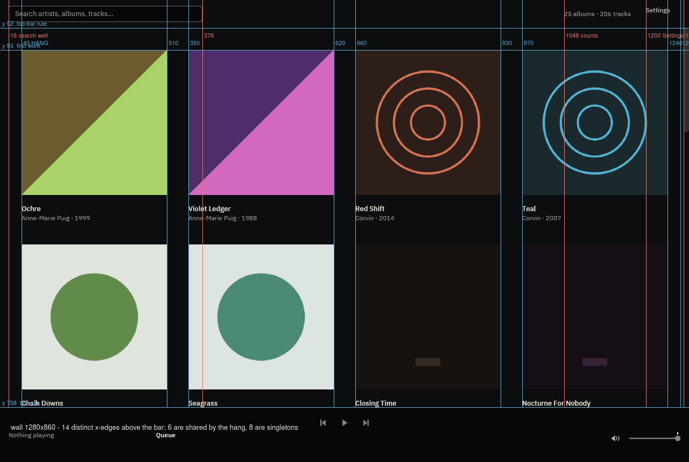
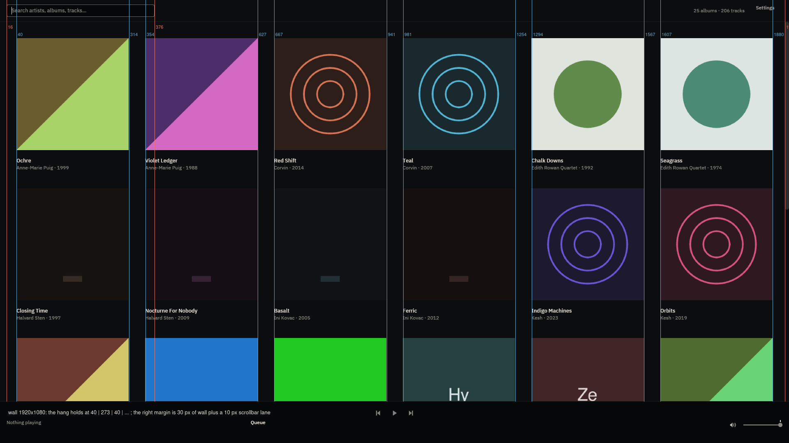
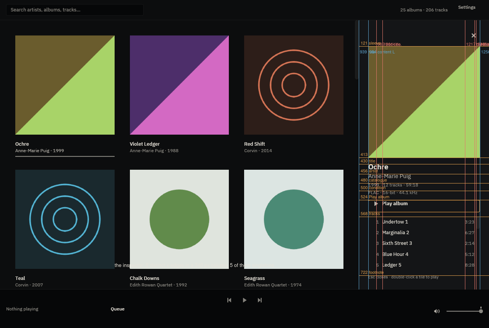
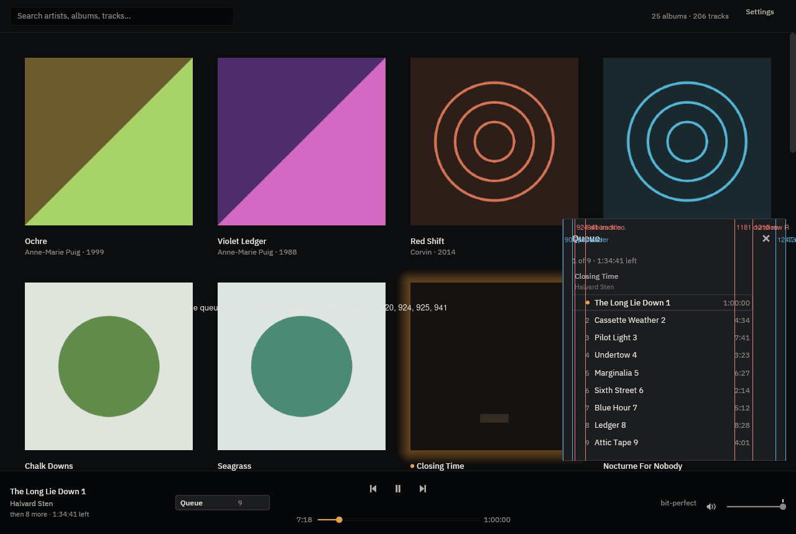
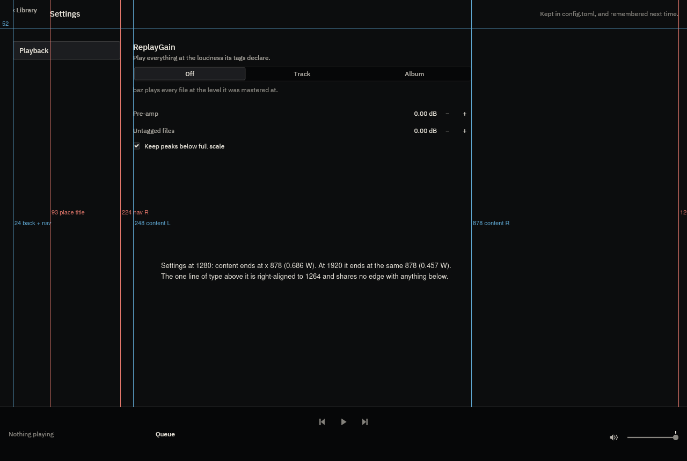
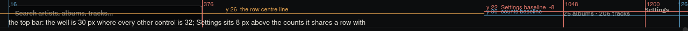
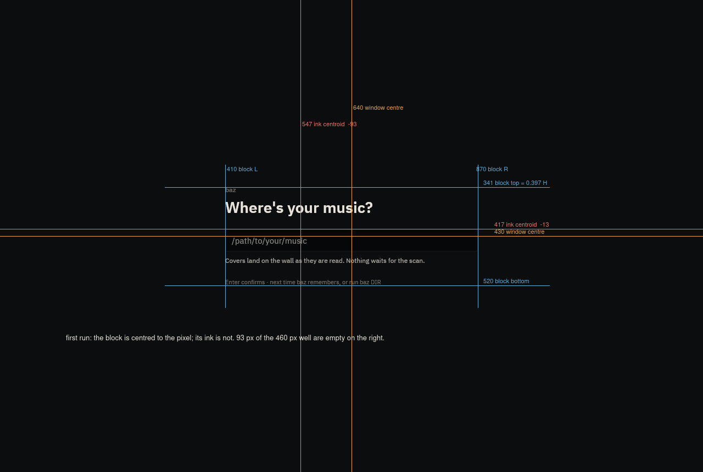
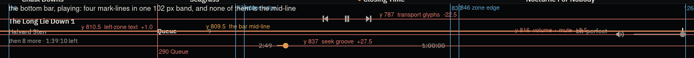

# 06 — The composition audit: where things sit relative to each other

> The owner's brief: *"ensure you are using rulers and paying attention to
> symmetry, proportion, alignment, rule of thirds, and other information
> hierarchy organisation techniques"* — against a product that is correct **per
> token** and still reads as subtly off.
>
> This document changes no production code. It is measurement and specification.
> It builds on [`05-toolkit-and-visual-gap.md`](05-toolkit-and-visual-gap.md)
> rather than repeating it: D1 (the compositing space), D2 (the amber slab), D4
> (the tile as a card) and D6 (the stock scrollbar) are **fixed and verified
> fixed** below. Everything here is new.

**The answer in one line.** Every token is right and the *lattice* is not. baz
draws its chrome on a 16 px gutter, its panels on a 24 px gutter and its
collection on a 40 px hang; it centres its bar's zones as blocks rather than its
marks as marks; and its type's line boxes are not multiples of its own spacing
unit, so no vertical rhythm can exist. Those three facts produce almost all of
the measured defects below, and none of them is visible one element at a time.

---

## 0. How this was measured

**The binary.** The real release build, `--features device-output`, rendered on
a private `Xvfb` with **all six** redirections from
[`docs/DEVELOPMENT.md`](../DEVELOPMENT.md#headless-ui-verification). Every run's
log carries the receipt:

```
[mpris] no session bus; desktop media controls unavailable (I/O error: No such file or directory (os error 2))
```

**The fixture.** A throwaway 25-album / 206-track library of **digitally silent**
FLAC (every sample a zero), never `~/Music`, with covers generated in six visual
families — near-black monoliths, paper-pale sleeves, saturated flat fields,
two-tone splits, concentric geometry and typographic sleeves — hue-varied per
album so the art-derived lamp has something to read. Album titles run from
`Teal` to a 57-character one that clips. The scratch `HOME` carries an
`.asoundrc` routing ALSA's default PCM to `null`, so the transport is real and
nothing was audible; `BAZ_DEVICE_TESTS` was never set. Album 7's first track is
**one hour** of silence, which is what holds a stable playing state for the
thirty seconds a frame sequence takes (the null sink free-runs at ~90×).

**The surfaces.** 32 frames — 16 states × two window sizes, **1280 × 860** and
**1920 × 1080**: wall at rest / hovered / selected / playing / paused /
scrolled, album inspector at rest and playing, queue popover empty and playing,
the Settings place, first run, the empty library, no-match search, and the bottom
bar in each of those. Under [`composition/shots/`](composition/shots/).

**The ruler.** A standard-library PNG decoder
([`composition/tools/ruler.py`](composition/tools/ruler.py)) so every pixel is
addressable, plus five measurement passes over it: element edges by band, ink
bounding boxes and contrast-weighted centroids, per-column and per-row
discontinuity maps, a lattice test for vertical rhythm, and ink coverage per
region. Annotated overlays in [`composition/`](composition/). Every number below
is read off a committed PNG.

### 0.1 What the last audit fixed, verified

| Defect (05) | Then | Now, measured |
|---|---|---|
| D1 alpha marks 2.4–3.7× too strong | `hairline` rendered `#454442` | **`#1B1C1C`** at `y = 758`, exactly the sRGB-composited value |
| D2 amber as a 292 × 32 opaque fill | `#E3A14E` slab | **`Play album` is a 1 px lamp outline**, no fill |
| D4 the tile as a card | ring + band + 8 px shadow | **hover = one 1 px `#2D2D2D` rule at `y = 419`; selected = two rows of `#888680`**; no shadow anywhere |
| D6 iced's stock scrollbar | rail `#63615D`, thumb `#9A9892` | **no rail; thumb `#1B1C1C`** — baz's own token |

Those are closed. The hang still holds exactly, at both widths:

```
1280   40 | 270 | 40 | 270 | 40 | 270 | 40 | 270 | 40      (row without the thumb)
1920   40 | 274 | 40 | 273 | 40 | 274 | 40 | 273 | 40 | 274 | 40
```

---

## 1. Alignment edges

> *A well-composed frame has few. Count them, list them, and identify every
> element that introduces an edge nothing else shares.*

### 1.1 The wall, 1280 × 860, nothing playing, no inspector

Every distinct x at which a drawn element's left or right edge sits.

| x | what sits on it | elements sharing it |
|---:|---|---:|
| 16 | search well L · bottom-bar left-zone ink L | **2** |
| 40 | work 1 L · its label L · its state-rule lane L | 3 (one tile) |
| 310 | work 1 R · label R · rule R | 3 (one tile) |
| 350 | work 2 L … | 3 (one tile) |
| **376** | search well R | **1** |
| 620 | work 2 R | 3 (one tile) |
| 660 | work 3 L | 3 (one tile) |
| 930 | work 3 R | 3 (one tile) |
| 970 | work 4 L | 3 (one tile) |
| **1048** | counts line ink L | **1** |
| **1172** | counts line ink R | **1** |
| **1200** | `Settings` label ink L | **1** |
| 1240 | work 4 R | 3 (one tile) |
| **1245** | `Settings` label ink R | **1** |
| 1264 | `Settings` button box R · bottom-bar right-zone R | **2** |
| **1270** | the wall's scrollbar lane L | **1** |

**16 distinct x-edges. Six are singletons.** The eight hang edges are shared
between a work, its label and its state rule, which is the composition working:
one number, 40, generates all of them.

The finding is not the count. It is this:

> **The chrome hangs from 16 and 1264. The collection hangs from 40 and 1240.
> Nothing in the top bar or the bottom bar is aligned with anything on the wall,
> at either width, by exactly 24 px.**

| | left edge | right edge | source |
|---|---:|---:|---|
| top bar (search well) | 16 | 1264 | `GAP_LG` |
| bottom bar (left/right zones) | 16 | 1264 | `GAP_LG` |
| the wall (works) | 40 | 1240 | `HANG` |
| the Settings place | 24 | 1264 | `GAP_XL` |
| the album inspector's content | 964 (= panel + 24) | 1256 | `GAP_XL` |

**Three window gutters — 16, 24 and 40 — in one application.** At 1920 the same
three, offset the same way: chrome 16 / 1904, works 40 / 1880. This is the
single highest-yield measurement in the audit and it is one line per bar to fix.



### 1.2 The wall, 1920 × 1080

Same structure, six columns: hang edges at 40, 314, 354, 627, 667, 941, 981,
1254, 1294, 1567, 1607, 1880; chrome singletons at 376, 1688, 1812, 1840, 1885,
1910. **18 distinct x-edges, six singletons.** The chrome's edges do not move
with the window; the works' do.



### 1.3 The bottom bar

| x | what | shared |
|---:|---|---:|
| 16 | left zone L (and the top bar's well) | 2 |
| **282** | `Queue` button box L | 1 |
| **290** | `Queue` label ink L | 1 |
| **390** | the queue count's ink R — 36 px inside its own button | 1 |
| 434 | left zone R | 1 (zone edge) |
| 450 | centre column L | 1 (zone edge) |
| 584 · 616 · 624 · 656 · 664 · 696 | the three 32 px transport boxes | 6 |
| 450 · 502 | elapsed stamp slot (`STAMP_W` 52, right-aligned; ink 477..502) | 2 |
| 510 · 770 | the seek groove (`SEEK_W` 260) | 2 |
| 778 · 830 | total stamp slot (left-aligned; ink 778..821) | 2 |
| 846 | right zone L | 1 (zone edge) |
| **1063** | signal note ink L | 1 |
| 1120 | signal slot R (`SIGNAL_W` 96) | 1 |
| 1136 · 1168 | mute box / fader L (`VOLUME_BLOCK_W`) | 2 |
| 1264 | right zone R | 2 |

The reserved-slot discipline is real and it shows: the transport, the stamps,
the groove, the signal slot and the volume block are all fixed and all share
their edges with themselves across states. The offenders are the **`Queue`
control**, whose readout is right-aligned inside a 56 px slot that is itself
left-aligned inside a 152 px button — so the figure floats **36 px** left of the
control's own right edge — and the **signal note**, whose left edge is content.

### 1.4 The album inspector

Panel `x 940..1280` (`PANEL_W` 340, exact), a 1 px `#1B1C1C` rule at `x = 939`,
content `964..1256` (`GAP_XL` both sides, symmetric).

| x | what | shared |
|---:|---|---:|
| 939 | the rule against the shelf | 1 |
| 964 | sleeve L · title L · artist L · catalogue L · condition L · `Play album` L · footnote L | **7** |
| **985** | track-number ink L | 1 |
| **1001** | track-title ink L | 1 |
| **1217** | duration ink L | 1 |
| **1242** | duration slot R (`DURATION_W` right-aligned inside `scroll_gutter()`) | 1 |
| **1246** | the track list's own scrollbar L | 1 |
| 1256 | sleeve R · `Play album` R · content R | 3 |

**8 distinct x-edges in a 340 px column; 5 of them singletons.** `964` is the
spine and it is a good one — seven elements sit on it. Then the track list
starts 21 px inboard of it and ends 14 px inboard of the other side, so the one
block a listener actually reads down is the one block that shares no edge with
the panel. Identical at 1920 (1604 / 1625 / 1857 / 1882 / 1896): **the inspector
does not respond to width at all.**



### 1.5 The queue popover

Surface `x 905..1263` (`POPOVER_W` 360 with `RADIUS_CTRL` 4 corners), 17 px from
the window's right edge and 18 px above the bar.

| x | what | shared |
|---:|---|---:|
| 920 | header `Queue` L · counts L · the playing row's lit background L | 3 |
| **924** | album title ink L | 1 |
| **925** | album artist ink L | 1 |
| **941** | track-number ink L | 1 |
| **1181** | duration ink L | 1 |
| 1206 | duration slot R | 2 |
| **1210** | the playing row's background R | 1 |
| 1226 · 1238 | the close ✕ ink | 2 |

**Four left edges — 920, 924, 925, 941 — inside a 358 px panel.** 920 and 941
are a defensible pair (a header lane and an indented list). 924 and 925 are not:
they are a 4 px and a 5 px inset introduced by row padding on the album group's
label, and they are the reason the popover reads as slightly loose.



### 1.6 The Settings place

| x | what | shared |
|---:|---|---:|
| 24 | `‹ Library` L · nav item box L | 2 |
| **93** | the word `Settings` L | 1 |
| **224** | nav item box R (`SETTINGS_NAV_W` 200) | 1 |
| 248 | content column L · segmented control L · checkbox L | 3 |
| 249 | every section heading and row label L (1 px inboard of 248) | many |
| 878 | content R (`SETTINGS_CONTENT_W` 640 − `scroll_gutter()` 10) | 3 |
| **1264** | the status line R | 1 |

Two things are measured here and both are new. **248 and 249 are two edges 1 px
apart** — the segmented control and the checkbox sit on 248, every piece of type
on 249 — which is a rounding artefact of a control's border, not a decision.
And the place **does not respond to width**: the content's right edge is 878 at
1280 *and* at 1920, i.e. 0.686 W and then **0.457 W**, with 1 026 px of empty
wall to its right and one line of type right-aligned into that emptiness at
1904.



### 1.7 Edge counts, summarised

| surface | distinct x-edges | singletons | worst offender |
|---|---:|---:|---|
| wall, 1280 | 16 | 6 | the search well (376) and the counts (1048/1172) |
| wall, 1920 | 18 | 6 | the same, unmoved |
| bottom bar | 19 | 4 | the `Queue` readout at 390 |
| inspector | 8 | 5 | the track list (985 / 1001 / 1217 / 1242 / 1246) |
| queue popover | 10 | 5 | the album group label at 924 / 925 |
| Settings place | 7 | 3 | the place title at 93; the status line at 1264 |
| first run | 2 | 0 | — the one surface with a clean edge set |

---

## 2. Vertical rhythm

> *Derive the unit that best fits what is already there, then list the offenders.*

Every chrome y-edge in the frame (artwork excluded), tested against a lattice of
unit *u*: the share that falls within ±1 px of it. A random set scores about
3/*u*, so those are the null columns.

| surface | n | u = 4 | u = 6 | u = 8 | u = 12 | u = 16 |
|---|---:|---:|---:|---:|---:|---:|
| top bar | 2 | 100 % | 100 % | 100 % | 50 % | 100 % |
| bottom bar, idle | 4 | 100 % | 100 % | 75 % | 75 % | 50 % |
| bottom bar, playing | 6 | 83 % | 100 % | 50 % | 50 % | 33 % |
| tile column | 10 | 90 % | 80 % | 50 % | 50 % | 30 % |
| album inspector | 26 | 88 % | 62 % | 46 % | 35 % | 35 % |
| Settings place | 12 | 92 % | 58 % | 50 % | 42 % | 33 % |
| queue popover | 30 | 87 % | 63 % | 47 % | 43 % | 30 % |
| **pooled (1280)** | **86** | **77 %** | **58 %** | **43 %** | **31 %** | **29 %** |
| **pooled (1920)** | **87** | **80 %** | **59 %** | **43 %** | **32 %** | **24 %** |
| *chance* | | *75 %* | *50 %* | *38 %* | *25 %* | *19 %* |

**There is no vertical unit.** Pooled over the whole application, a 4 px lattice
catches 77–80 % of the edges against a 75 % null, an 8 px lattice 43 % against
38 %, a 16 px lattice 24–29 % against 19 %. Nothing above 4 is distinguishable
from chance, and 4 itself is within noise. The only unit that genuinely fits is
**2**, and 2 is not a rhythm — it is the pixel grid.

### 2.1 Why, and it is one cause

The spacing ladder is a clean multiple of 4: 2 · 4 · 8 · 12 · 16 · 24 · 40, with
controls at 32. **The type's line boxes are not.**

| token | px | leading | line box | nearest multiple of 4 | deviation |
|---|---:|---:|---:|---:|---:|
| `SIZE_CAPTION` | 11 | 1.45 | **15.95** | 16 | −0.05 |
| `SIZE_META` | 12 | 1.35 | **16.20** | 16 | **+0.20** |
| `SIZE_BODY` | 13 | 1.40 | **18.20** | 20 | **−1.80** |
| `SIZE_EMPHASIS` | 15 | 1.35 | **20.25** | 20 | **+0.25** |
| `SIZE_TITLE` | 19 | 1.20 | **22.80** | 24 | **−1.20** |
| `SIZE_HERO` | 28 | 1.15 | **32.20** | 32 | **+0.20** |

Every stack of type in the product therefore accumulates a fractional error the
moment it has more than one line, and the error is different in every stack.
Concretely, in the inspector, the ink tops of the four caption lines fall at
**430, 456, 480, 500** — pitches of 26, 24, 20 — where the composition intends
one repeating measure. `LABEL_H` is `2 × 18.2 = 36.4`, so a tile's label block
ends on a fractional pixel and the state rule under it is drawn at 419.4.

**Derived unit: 4, and it must include the type.** Quantising the six line boxes
to the nearest multiple of 4 costs a maximum of 1.8 px on one token, and it makes
two numbers fall out that the system already wants:

- `SIZE_BODY` line box 18.2 → **20** ⇒ `LABEL_H` = **40** = `HANG`, so the wall
  label is exactly one hang tall and the tile pitch becomes `art + 96`;
- `SIZE_META` 16 and `SIZE_CAPTION` 16 collapse to one line box, so the bar's
  left zone becomes `20 + 2 + 16 + 2 + 16` = **56** instead of 54.35.

*(Aside, not a defect: `app.rs`'s `TOP_BAR_H` is 56 and the drawn top bar is
**53** — 10 + 32 + 10 + a 1 px rule. The constant is only the pre-first-resize
estimate for the virtualizer's viewport, replaced by a real measurement on the
first layout, so nothing is drawn wrong. It is worth renaming.)*

### 2.2 The offenders, with deviations

| element | measured y | on a 4-lattice | deviation |
|---|---:|---:|---:|
| inspector title ink top | 430 | 432 | −2 |
| inspector artist ink top | 456 | 456 | 0 |
| inspector catalogue ink top | 480 | 480 | 0 |
| inspector condition ink top | 500 | 500 | 0 |
| inspector `Play album` box | 524..557 (h 33) | h 32 | **+1** |
| inspector track rows | 568, 604, 632, 661, 689 | pitch 28.6 | **±1.4 accumulating** |
| queue rows | 510, 538, 566, 595, 623, 651, 679, 707 | pitch 28.14 | **±0.6 accumulating** |
| Settings rows | 207, 239 | pitch 32 | 0 |
| tile state rule | 419.4 | 420 | −0.6 |
| search well | 11–41 (h 30) | h 32 | **−2** |

---

## 3. Optical versus mathematical centring

The ink's centre against the container's, for every centred element.

| element | container | container centre | ink centre | Δ |
|---|---|---:|---:|---:|
| Previous glyph | 32 px hit box | x 600.0 | 600.0 | **0.0** |
| Play/Pause glyph (bbox) | 32 px hit box | x 640.0 | 641.0 | +1.0 |
| Play/Pause glyph (mass centroid) | 32 px hit box | x 640.0 | 639.3 | −0.7 |
| Next glyph | 32 px hit box | x 680.0 | 680.0 | **0.0** |
| inspector close ✕ | 32 px hit box | (1240, 93) | (1240, 93) | **0.0** |
| segmented control `Track` | 208.7 px segment | x 563.0 | 562.5 | −0.5 |
| segmented control `Album` | 208.7 px segment | x 771.7 | 772.0 | +0.3 |
| pre-amp `−` stepper | 24 px box | x 834.0 | 833.5 | −0.5 |
| pre-amp `+` stepper | 24 px box | x 866.0 | 865.5 | −0.5 |
| **`Settings` label** | **32 px button** | **y 25.9** | **y 19.5** | **−6.4** |
| **`Play album` label + triangle** | **32 px button, y** | **y 540.5** | **y 534.5** | **−6.0** |
| **`Play album` label + triangle** | **292 px button, x** | **x 1110.0** | **x 1023.5** | **−86.5** |
| first-run block (box) | 1280 × 860 window | (640.0, 430.0) | (640.0, 430.5) | 0.0, +0.5 |
| first-run block (ink) | 1280 × 860 window | (640.0, 430.0) | (547.3, 417.6) | **(−92.7, −12.4)** |
| empty-library block | shelf area | (640.0, 405.5) | (640.5, 407.0) | +0.5, +1.5 |

**Every glyph in a hit box is centred to a pixel.** That part of the craft is
done, and it is worth saying because it means the two failures below are a
single, locatable mistake rather than a habit.

**The two failures are the same bug.** `button` with a fixed `height` and no
vertical alignment on its content lays the content out at the *top* of the box.
`views/top_bar.rs::settings_toggle` and `views/side_panel.rs`'s `Play album`
both do this, and both land `(32 − 18.2)/2 ≈ 6.9` px high. In the top bar the
consequence is visible without a ruler: **`Settings` and `25 albums · 206 tracks`
share a row, and their baselines are 8 px apart** (y ≈ 22 against y = 30).



**The first-run block is centred to the pixel and its ink is not.** The block is
`x 410..870` — mathematically dead centre — but the ink inside it is
left-aligned and ragged-right: the hero line reaches 678 of 870, the hint 773,
the footnote 694. Only the input well's border reaches 870, so **93 px of the
block's right half is the outline of an empty field.** Vertically the block's
centre is at 0.501 H, which for a single question on an empty wall is the one
place a hero block should not be — the optical convention and the rule of thirds
both put it nearer 0.40.



---

## 4. Proportion and the rule of thirds

| division | 1280 × 860 | 1920 × 1080 | thirds? | verdict |
|---|---:|---:|---|---|
| top bar / window height | 0.062 | 0.049 | — | deliberate: a slim bar, and it scales |
| bottom bar / window height | **0.119** | **0.094** | — | the bar is a fixed 102 px; ADR-0017 step 10 takes it to 58 (0.067 / 0.054) |
| body (the collection) / window | 0.820 | 0.857 | — | the defensible claim, and it holds |
| inspector / window width | **0.266** | **0.177** | — | `PANEL_W` is a constant 340; ADR-0017 step 16 specifies `clamp(0.28 W, 340, 420)` and it is not built |
| shelf / window width | 0.734 | 0.823 | 0.667 | not thirds, and should not be |
| inspector sleeve / panel width | 0.859 | 0.859 | — | arbitrary — it is *panel minus two paddings* and nothing else |
| inspector sleeve bottom / panel height | **0.510** | **0.389** | 0.333 | arbitrary: it is wherever a square 292 px sleeve happens to end |
| tile: art / (art + gap + label) | 0.838 | 0.840 | — | deliberate and stable across widths — the best proportion in the product |
| Settings content R / window width | **0.686** | **0.457** | — | **arbitrary**: a constant 878 px in both |
| queue popover height / body height | 0.550 | 0.420 | — | `POPOVER_MAX_H` 0.6 of the *window*, so it is 0.55 of the body at one size and 0.42 at another |

Two divisions are deliberate and good: the tile's 0.838 art-to-block ratio holds
to three decimal places across widths, and the body's 0.82–0.86 share is the
claim the whole direction rests on. Four are arbitrary in the strict sense —
they are whatever a constant happened to produce at one window size:
`PANEL_W`, the inspector sleeve, `SETTINGS_CONTENT_W`, and `POPOVER_MAX_H`
measured against the wrong denominator.

**Do not force thirds.** The wall wants a hang, not a ratio, and 0.734 is the
right answer for a 340 px panel next to a 940 px shelf. But the inspector's
*internal* division is the one place a ratio would earn its keep: the sleeve
currently ends at 0.51 of the panel's height at 1280 and 0.39 at 1920, so the
same surface reads as half-and-half at one size and as thirds at the other, by
accident.

---

## 5. Symmetry

| surface | symmetric? | measured |
|---|---|---|
| the wall's horizontal margins | **accidentally asymmetric** | left 40 px of wall; right **30 px of wall + a 10 px `#1B1C1C` scrollbar lane**. The block is centred, the *lane* is not part of it. |
| the wall's vertical margins | symmetric | top `HANG` 40, and each row carries its own trailing 40 |
| the tile | deliberately asymmetric | left-aligned label under a square work — the wall-label signature |
| the top bar | deliberately asymmetric | one well left, status right; both hang from 16 / 1264 ✓ |
| the bottom bar, horizontally | **symmetric by construction** | left fill 418, centre 380, right fill 418 at 1280; 738/380/738 at 1920. Left ink starts +0/+1 from the inner edge, right ink ends +0. This is correct and it is the bar's best property. |
| the bottom bar, vertically | **accidentally asymmetric** | §5.1 |
| the album inspector | symmetric horizontally | 24 px both sides; but the track list is inset 21 left and 14 right inside it — **accidentally asymmetric by 7 px** |
| the queue popover | symmetric | 16 px both sides |
| the Settings place | **accidentally asymmetric** | 24 px left, 402 px right at 1280; 24 px left, 1042 px right at 1920 |
| first run | mathematically symmetric, optically not | §3 |

### 5.1 The bottom bar's three zones — the obvious test, and it fails

The three zones are equal-weight fills flanking a fixed centre column, all
`align_y(Center)`. They are therefore centred **as blocks**, and the blocks are
different heights, so their **marks** land on four different lines.

| mark | y | Δ from the bar's mid-line (809.5) |
|---|---:|---:|
| transport glyph centres | 787.0 | **−22.5** |
| now-playing title ink centre | 792.5 | −17.0 |
| now-playing artist / signal note ink centre | 810.5 | +1.0 |
| `Queue` label ink centre | 811.0 | +1.5 |
| **volume rail and mute glyph centres** | **816.0** | **+6.5** |
| continuation note ink centre | 828.0 | +18.5 |
| **seek groove centre** | **837.0** | **+27.5** |

A 50 px spread inside a 102 px band, in the one surface whose own documentation
says *"three zones on one centre line"*. Identical at 1920 (1007 / 1029.5 /
1036 / 1057). The transport — the thing the eye goes to — is the furthest from
the centre of anything.



The cause is structural, not a stray number: the centre column is
`TRANSPORT_HIT + GAP_SM + SEEK_ROW_H` = 77 px and therefore *defines* the bar's
content height, while the left zone (≈54 px of stacked lines) and the right zone
(`VOLUME_ROW_H` 45) are centred inside it. Three blocks, three heights, one
centring rule, four lines. ADR-0017 step 10 deletes the seek row and the problem
does not go away with it — it just gets smaller, because the transport row will
then be the whole column and the volume block will still be 45 px against 32.

---

## 6. Information hierarchy

Intended order against measured dominance. Dominance is **contrast-weighted ink
mass**: for every pixel that differs from its region's ground, the absolute
luminance difference, summed — which is area × contrast, and which counts a
large faint rectangle and a small bright glyph on the same scale.

### 6.1 The top bar

| intended | measured | mass | share |
|---|---|---:|---:|
| 1. how big the collection is | 1. **the search well's outline** — a 360 × 30 `#6C6A67` rectangle around nothing | 6.73 × 10⁴ | **33.2 %** |
| 2. the way to filter it | 2. the placeholder string inside it | 6.83 × 10⁴ | 33.7 % |
| 3. the way out to Settings | 3. `25 albums · 206 tracks` | 4.10 × 10⁴ | 20.2 % |
| | 4. `Settings` | 2.61 × 10⁴ | 12.9 % |

**The two loudest objects on the first frame are a box drawn around an empty
field and the grey instructions for it.** `05` §3.5 asked for this and it has not
been taken: the well still carries a 1 px `paper_ring` border at rest. Deleting
that border at rest removes 33 % of the top bar's total ink and makes the
collection's own count the second-loudest thing in the bar rather than the third.

### 6.2 The bottom bar, playing

| intended | measured | share |
|---|---|---:|
| 1. what is sounding | 1. the left zone | **46.9 %** |
| 2. transport | 2. the transport | **17.4 %** |
| 3. where the playhead is | 3. the volume block | 13.6 % |
| 4. what is next | 4. `Queue` | 8.7 % |
| 5. everything else | 5. the signal note | 6.2 % |
| | 6. **the seek row** | **2.5 %** |

The first two are right. **Position — the third thing a listener needs — is
last of six**, at 2.5 %, and it is last while occupying 37 of the bar's 77 px of
content height. That is the strongest possible argument for ADR-0017 §1.1's
needle, measured rather than asserted.

And inside the left zone the order inverts:

| line | mass | |
|---|---:|---|
| track title | 9.17 × 10⁴ | |
| **continuation** (`then 8 more · 1:39:10 left`) | **4.14 × 10⁴** | |
| artist | 3.35 × 10⁴ | |

**The ambient third line is 1.24× the weight of the artist above it.** The
block reads title → *something* → artist, which is not the order it is written
in. The continuation is longer than the artist name, and it is set at
`SIZE_CAPTION` in `paper_faint` against the artist's `SIZE_META` in `paper_dim`
— the ink step is not enough to overcome the length.

### 6.3 The album inspector

| intended | measured | share of the panel |
|---|---|---:|
| 1. which album this is | 1. **the sleeve** | **93.6 %** |
| 2. play it | 2. the track list | 2.5 % |
| 3. its tracks | 3. `Play album` | 1.6 % |
| 4. its condition | 4. catalogue + condition | 0.63 % |
| | 5. **the title** | **0.57 %** |
| | 6. the artist | 0.50 % |
| | 7. the footnote | 0.48 % |
| | 8. the close ✕ | 0.09 % |

**The album's name is fifth of eight in its own inspector**, at 1/164th of the
weight of a picture that is already on the wall 24 px to the left, at 260 px, in
the same frame. This is the clearest hierarchy inversion in the product. The
arithmetic of the fix:

| sleeve edge | sleeve share of the panel's ink |
|---:|---:|
| 292 (today) | 93.6 % |
| 200 | 87.3 % |
| 160 | 81.5 % |
| **120** | **71.2 %** |
| 84 (the critique's number) | 54.8 % |

### 6.4 The wall

| intended | measured |
|---|---|
| 1. the works | one sleeve = 19.7 % of the whole wall's ink |
| 2. which record each is | its label = 0.15 % — **a ratio of 135 : 1** |
| 3. which one is playing | the halo and the dot |
| 4. how big the collection is | the counts, in the top bar |

135 : 1 is the direction working exactly as specified — *the works are lit; the
room is not* — and it is the reason `05` §D8's "the wall has no chrome voice"
matters. The label is not competing with the sleeve; it is not on the same
scale at all. The counterweight the board pairs it with (9–10 px caps for shelf
breaks and group keys) is ADR-0017 step 8 and is in flight in a parallel agent.

### 6.5 The Settings place

Intended: 1. what you can change, 2. what it is set to now. Measured: the
loudest object is the **630 px outline of the segmented control**; the place's
overall ink coverage is 1.89 % at 1280 and 0.96 % at 1920. There is one nav item
in a 200 px column. Nothing here disagrees with `05` §D9 except the scale of it
at the larger window.

---

## 7. Density — ink against ground

Share of pixels in a region differing from that region's own ground by more than
8 sRGB levels.

| surface | 1280 × 860 | 1920 × 1080 |
|---|---:|---:|
| the wall (body) | **65.3 %** | **61.2 %** |
| album inspector panel | 38.5 % | 31.1 % |
| *— of which the sleeve* | *35.6 %* | *27.2 %* |
| queue popover | 5.0 % | 5.0 % |
| top bar | 3.5 % | 2.4 % |
| bottom bar, playing | 2.7 % | 1.8 % |
| Settings place body | 1.9 % | **1.0 %** |
| bottom bar, idle | 1.1 % | 0.7 % |
| first run | 0.6 % | 0.3 % |
| empty library | 0.2 % | 0.1 % |

The gallery's claim of generous air is **verified where it matters**: 65 % art
coverage on the wall with 0 px of dead gutter is exactly the redistribution
`.interface-design/system.md` §7 promised, and it is stable across widths.

The inversion is at the other end. **The two surfaces that exist to state
things — the Settings place and the idle bar — are the emptiest in the
application, by two orders of magnitude.** A place at 1.0 % ink is not calm; it
is a room with one chair in it. And every one of these falls as the window grows,
because only the wall is a function of width.

---

## 8. The defect list, ranked by contribution to *subtly off*

Ranked by how much each contributes to a reading of the whole frame, not by size.

| # | defect | measured | corrected |
|---|---|---|---|
| **1** | **Three window gutters.** Chrome hangs from 16, panels from 24, the collection from 40. Nothing in either bar lines up with anything on the wall. | left edges 16 / 24 / 40; right edges 1264 / 1264 / 1240 at 1280, and 16 / 24 / 40 · 1904 / 1904 / 1880 at 1920 | **one gutter: `HANG` 40.** Top and bottom bar padding `GAP_LG` → `HANG`; `PLACE_PAD` `GAP_XL` → `HANG`. Every window-edge element then sits on 40 and W − 40. Panel-internal padding stays `GAP_XL`. |
| **2** | **The bottom bar's zones are centred as blocks, so no two marks share a line.** | 7 mark-lines spanning 787 → 837, a 50 px spread inside a 102 px band; the bar's own mid-line at 809.5 carries nothing | **centre the marks.** Transport row centred on the bar (`y 809.5`, not 787); volume rail on the same line (816 → 809.5); the seek row hangs below both rather than pushing the transport up. Spread ≤ 2 px. |
| **3** | **No vertical rhythm, because the type's line boxes are not multiples of the spacing unit.** | pooled 4-lattice hit rate 77–80 % against a 75 % null; 8-lattice 43 % against 38 % | **quantise the six line boxes to multiples of 4**: caption 15.95→16, meta 16.20→16, body 18.20→**20**, emphasis 20.25→20, title 22.80→24, hero 32.20→32. Max cost 1.8 px on one token; `LABEL_H` becomes 40 = `HANG`. |
| **4** | **Two controls put their label 6–8 px above their own centre.** Same bug both times: `button` with a fixed height and top-aligned content. | `Settings` ink centre y 19.5 against a box centre of 25.9 (**−6.4**), so its baseline is **8 px** above the counts line it shares a row with; `Play album` ink centre y 534.5 against 540.5 (**−6.0**) | `align_y(Center)` on both. `Settings` baseline 22 → 30; `Play album` ink centre 534.5 → 540.5. And `Play album`'s content is **86.5 px** left of its own horizontal centre — either centre it or state that primary buttons are left-set, and apply it to both. |
| **5** | **The album's name is fifth of eight in its own inspector.** The sleeve is 93.6 % of the panel's ink and it is a second, larger copy of a work already on screen 24 px away. | sleeve 1.04 × 10⁷; title 6.36 × 10⁴; a ratio of **164 : 1** | **cap the inspector sleeve at 120 px** (share 71.2 %), or take the critique's 84 (54.8 %). At 120 the title, the artist and the track list together become 21 % of the panel instead of 3.6 %. |
| 6 | **The empty search well is the loudest object in the top bar.** | its border alone is 6.73 × 10⁴ — **33.2 %** of the whole bar's ink, drawn around nothing | no border at rest; `RECESS` well, placeholder at `paper_faint`, ring on focus only. Top-bar ink falls 33 %. |
| 7 | **The product's controls stand at five heights.** | transport 32 · first-run input **40** · search well **30** · steppers 24 · checkbox **13** | the well's `SEARCH_PAD_V` solves for a 2 px border iced draws *inside* the box: `(32 − 18.2 − 2)/2 = 5.9` should be `(32 − 18.2)/2 = 6.9`, making the well 32. The first-run input takes `GAP_MD` padding and lands at 40; the checkbox is `SIZE_BODY` 13 and has no floor at all. `theme` asserts `TRANSPORT_HIT >= 32` and `STEPPER_HIT < TRANSPORT_HIT` and nothing about either of these. |
| 8 | **The wall's margins are asymmetric by the scrollbar.** | left 40 px of wall; right 30 px of wall + a 10 px `#1B1C1C` lane | either reclaim the lane (block width − `SCROLLBAR_LANE`, both margins 40) or accept it explicitly and say so in the hang's specification. |
| 9 | **The Settings place does not respond to width.** | content right edge 878 at 1280 *and* 1920 → 0.686 W then **0.457 W**; 1 026 px of empty wall with one right-aligned line of type at 1904 | centre the nav + content block in the place, or let `SETTINGS_CONTENT_W` grow to `clamp(0.5 W, 640, 880)`. Either way the status line joins the content's right edge instead of the window's. |
| 10 | **The inspector's track list shares no edge with its own panel.** | panel content 964..1256; the list reads 985..1242 — inset **21** left and **14** right, and asymmetrically | the number column's slot should start at the content edge and its *ink* raggedness accepted, or the list's gutter should be symmetric. 7 px of asymmetry is the part that reads as a mistake. |
| 11 | **The queue popover has four left edges in 358 px.** | 920 (header, counts, row background), **924** (album title), **925** (album artist), 941 (track numbers) | collapse 924/925 onto 920. Two lanes — 920 for headings, 941 for rows — is a composition; four is a leak. |
| 12 | **The first-run block is centred mathematically and not optically.** | block centre (640.0, 430.0); ink centroid (**547.3**, **417.6**); block centre at 0.501 H | set the block's *ink* on the vertical axis, or narrow the well to the width of the longest line (773 − 410 = 363, not 460). Raise the block so its centre lands near 0.40 H. |
| 13 | **The `Queue` readout floats inside its own control.** | ink ends at x 390 inside a button whose right edge is 434 — **36 px** of empty control | right-align the readout to the button's inner edge (`POSITION_W` flush at 426), or shrink `UP_NEXT_W` from 152 to 116. |
| 14 | **The selection mark disappears when the inspector is hidden.** | with `Ctrl+B` the selected tile's 2 px `#888680` rule is not drawn at all — the wall carries no mark for a selection that `Enter` will still play | draw the selected rule from the selection, not from whether a panel is showing it. |
| 15 | **The Settings content column has two left edges 1 px apart.** | controls on 248, type on 249 | one edge. A 1 px offset is not a decision anyone made. |

---

## 9. Proposed composition laws for `.interface-design/system.md`

Proposed text only — **this document does not edit that file**; a parallel agent
may be in it. Each law is assertable and carries how.

### L1 — One gutter per window edge

> Every surface that touches a window edge hangs from the same two lines:
> `x = HANG` and `x = W − HANG`, `y = HANG` where a surface has a free top.
> `GAP_LG` is a gap *between* things and `GAP_XL` is padding *inside* a panel;
> neither is ever a window margin. A panel's own content keeps `GAP_XL` from the
> panel's edge, which is a different edge.

*How it is pinned.* Render each frame and collect the leftmost and rightmost
drawn edge in the top bar, the body and the bottom bar. The set must have exactly
two members, `HANG` and `W − HANG`. `composition/tools/census2.py` already
produces the list; the test is `assert set(edges) == {HANG, W - HANG}`.

### L2 — The vertical unit is 4, and the type is inside it

> Base unit **4**. Every gap, every reserved slot height, every control height
> **and every line box** is an exact multiple of 4. A leading is chosen so that
> `size × leading` is a multiple of 4, not the other way round.

*How it is pinned.* Six `const { assert!(...) }` in `theme.rs` over
`SIZE_* × LEADING_*`, and the same over `LABEL_H`, `CAPTION_LINE_H`,
`CONTINUATION_H`, `SETTING_NOTE_H`, `DETAIL_ROW_H`, `SEEK_ROW_H`,
`VOLUME_ROW_H`, `MUTE_TOP`. Compile-time, zero runtime cost, and it fails the
build rather than the review.

### L3 — Optical centring: the box centres the ink, not the line box

> Content shorter than the box that holds it is centred in **both** axes by the
> box. A `button` with a fixed height always states its content's vertical
> alignment; a `container` with a fixed width always states its horizontal one.
> Where a mark's optical centre differs from its bounding box — the play
> triangle is the only one in the product — the *mass centroid* is what is
> centred.

*How it is pinned.* A render assertion over the named controls: for each, the
ink's contrast-weighted centroid must be within **1 px** of its box's centre.
`composition/tools/ruler.py::ink_mass` is the measurement; the list of controls
is the test's fixture, and adding a control means adding a row.

### L4 — One centre line per bar

> A bar has one horizontal centre line and every *mark* in it sits on that line:
> glyph centres, rail centres, and the baseline of any single-line label. A zone
> taller than one line hangs its extra lines symmetrically about that line. Zones
> are centred by their marks, never by their blocks.

*How it is pinned.* Measure the ink centre of each zone's primary mark in a
rendered bar frame; assert the spread is **≤ 2 px** and that the bar's own
mid-line is one of them. Today the spread is **50 px**.

### L5 — The permitted alignment edges, per surface

> Each surface declares its alignment edges. An element that introduces an edge
> outside the list is a defect, and adding an edge means arguing for it in the
> list — the same rule the contrast exemption list already uses.

| surface | permitted x-edges |
|---|---|
| the wall | `HANG` and the hang's derived column edges; nothing else |
| the top bar | `HANG`, `W − HANG`, and the search well's right edge |
| the bottom bar | `HANG`, `W − HANG`, the zone boundaries, and the reserved slots' own edges |
| the album inspector | panel edge, panel + `GAP_XL`, panel width − `GAP_XL` — **one content lane** |
| the queue popover | popover + `GAP_LG` and one indent lane for rows |
| the Settings place | `HANG`, nav right edge, content left edge, content right edge |

*How it is pinned.* `composition/tools/census2.py` emits the edge set per band;
the test compares it to a checked-in list and prints the diff. This is the
measurement that catches the next regression before a human sees it.

### L6 — Hierarchy is declared and then measured

> Each surface declares what a listener should notice first, second and third.
> The measured order — contrast-weighted ink mass over the named regions — must
> agree. Where it cannot (the wall, where one sleeve is 135× its label, and
> deliberately so), the declaration says by how much.

| surface | declared order |
|---|---|
| the wall | the works ≫ their labels ≫ the playing mark ≫ the counts |
| the top bar | the counts → the well → `Settings` |
| the bottom bar | what is sounding → the transport → the position → what is next |
| the album inspector | the title → `Play album` → the track list → the sleeve → the condition |
| the Settings place | the section → its controls → their current values |
| first run | the question → the field → the hint |

*How it is pinned.* Run `ink_mass` over the named regions of a rendered frame
and assert the ranking. It is a slow test and it belongs behind the same
`--ignored` gate the render harness already uses, run in CI once per surface
change.

### L7 — One control height

> Every pointer target is `TRANSPORT_HIT` 32 tall. The only exception is
> `STEPPER_HIT` 24, and it is named. A control that is neither is a defect,
> including a checkbox, a text well and the first-run input. The product draws
> five heights today — 40, 32, 30, 24, 13 — and the floor it publishes is 32.

*How it is pinned.* `const` asserts for the tokens; a render assertion that every
drawn control box in a frame has a height in `{32, 24}`.

---

## 10. What is already right

Said plainly, because the list above is long and the frame is not a rout.

- **The hang is exact** at both widths and 0 px of gutter is dead.
- **The bottom bar is horizontally symmetric by construction** — 418 / 380 / 418
  at 1280 and 738 / 380 / 738 at 1920, with the ink reaching both inner edges.
- **Every glyph in a hit box is centred to a pixel**, and so is every segmented
  control label and every stepper.
- **The reserved slots hold.** Starting a track moves nothing: `STAMP_W`,
  `SIGNAL_W`, `POSITION_W`, `UP_NEXT_W`, `VOLUME_BLOCK_W` and the transport
  boxes all keep their edges across every state captured.
- **The tile's proportion is stable**: 0.838 art-to-block at 1280 and 0.840 at
  1920.
- **The inspector's outer padding is symmetric** to the pixel.
- **Ink coverage on the wall is 65 %**, which is the gallery's claim, measured.
- **D1, D2, D4 and D6 of `05` are closed**, verified against the palette byte
  for byte.

---

## Appendix — reproducing this

```sh
# the fixture: 25 albums of digital silence with generated covers
bash docs/design/composition/tools/mkfixture.sh /tmp/baz-comp-fixture

# one scenario at one size, on a private display, all six redirections
SCEN=A W=1280 H=860 DISP=:171 bash docs/design/composition/tools/capture.sh

# the rulers
python3 docs/design/composition/tools/census2.py 1280x860   # element edges
python3 docs/design/composition/tools/census3.py 1280x860   # optical centring
python3 docs/design/composition/tools/census4.py 1280x860   # rhythm, proportion, density
python3 docs/design/composition/tools/census5.py 1280x860   # lattice test, hierarchy mass
python3 docs/design/composition/tools/overlay.py docs/design/composition
```

Scenarios: `A` library at rest, `B` playing, `C` first run, `D` empty library.
There is no window manager on the private display, so nothing sets input focus:
`xdotool windowfocus --sync $WID` first, then XTEST without `--window`.

Frames in [`composition/shots/`](composition/shots/), overlays in
[`composition/`](composition/), tools in
[`composition/tools/`](composition/tools/).
