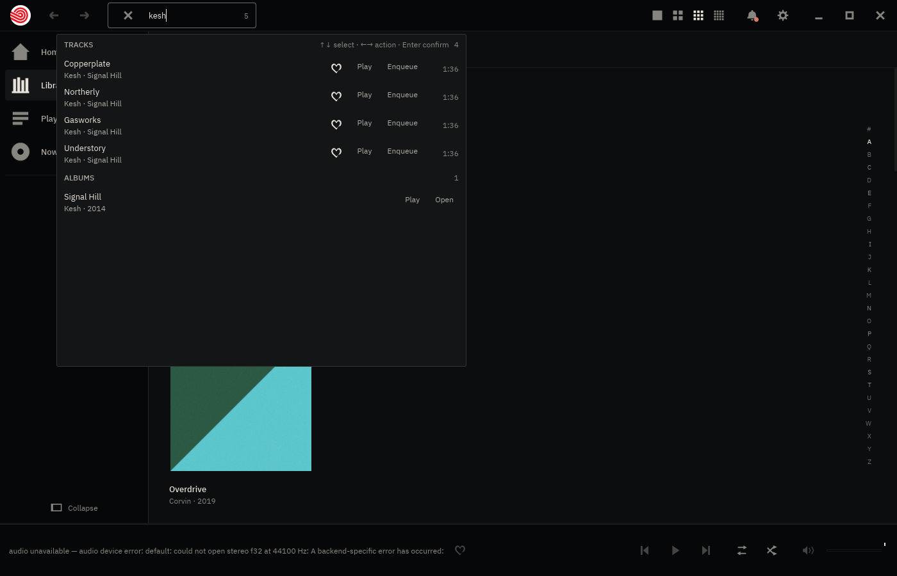
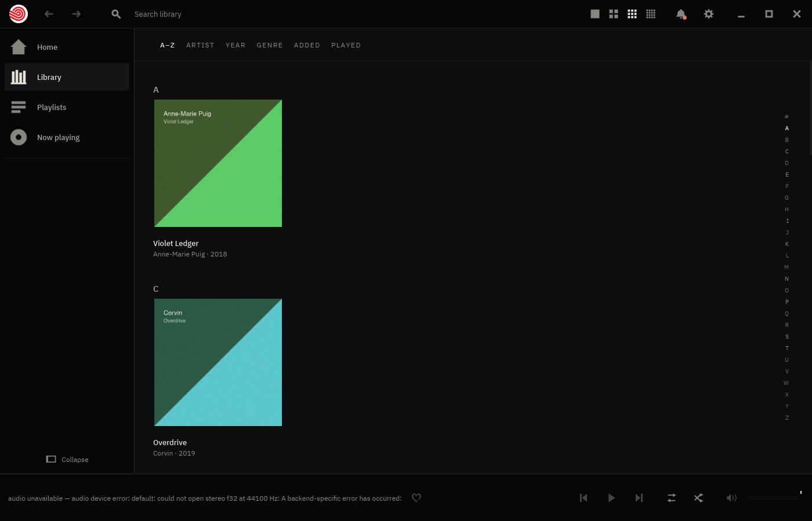

# Escape answers the well on the first press

**2026-08-17.** Backlog, *No keyboard route out of the search field*, second
bullet: **<kbd>Esc</kbd> takes two presses to peel a query you are still
typing.**

## What was actually wrong

Not the binding table. iced's `text_input` consumes <kbd>Esc</kbd> to blur
itself and reports the press **captured**, and `crate::keys`' focus rule — *a
captured press is the field's* — dropped it on the floor. So the first press
moved the caret and the three letters you had typed stayed on the wall; the
second press, now that nothing was focused, reached `Message::EscapePressed`
and cleared them.

The entry called this "a toolkit limit rather than a design choice", and said
a proper fix wanted "a focus-aware shell (or a toolkit that reports focus
synchronously)".

**That capability had already arrived.** baz is on iced 0.14 and `keys.rs`
reads `iced::event::Status` into its own `Focus` — the entry was written
against 0.13 and never revisited. `Captured` *is* the synchronous focus
report, and it says precisely the thing needed: the caret is in the well.

## The fix

<kbd>Esc</kbd> becomes the second key to survive the focus rule, alongside
`F11` — and for the opposite reason. `F11` survives because the field has no
business with it. <kbd>Esc</kbd> survives because the field's business with it
is only *half* of what the listener asked for.

Captured, it binds to `Message::EscapeInField` and `App::escape_in_field`
clears the query on the same press iced is blurring on. One press, wall back.

It peels **nothing else**, deliberately. Fullscreen, a drag in flight, the
context menu and the place are all reachable with the caret in the well, and
letting one press take the field's blur *and* a layer underneath would trade a
key that did too little for one that does too much. With an empty query the
press is spent on the blur alone — which is why clicking into an empty well
and pressing <kbd>Esc</kbd> puts the caret away rather than sending you home.

## The proof

`prove.sh` here drives a release baz on a private Xvfb with all six XDG
variables redirected into a scratch tree, types `kesh` into the wall
(type-anywhere, so the letters open the well and put the caret in it), presses
<kbd>Esc</kbd> **once**, and photographs both moments.

| | |
|---|---|
|  |  |

Left: `kesh` in the well, the chooser open on four tracks and one album, the
clear mark showing. Right: **after a single press** — query gone, placeholder
back, caret out, chooser closed, wall restored, and still on Library rather
than navigated somewhere.

(The bottom bar reads *audio unavailable* because Xvfb has no sound card. It
is unrelated to the key and is the honest reading of a machine with no output
device.)

## What this does not fix

<kbd>Ctrl</kbd>+<kbd>B</kbd> still asks for nothing while the caret is in the
well, and the same is true of every other chord. That is **the focus rule
working**, not a leftover: `a_focused_text_field_swallows_every_binding` pins
it, and the field needs its clipboard chords. Letting modified keys through
would be a real design change with a real risk of stealing
<kbd>Ctrl</kbd>+<kbd>A</kbd>/<kbd>C</kbd>/<kbd>V</kbd>/<kbd>X</kbd> from the
field, so it is not bundled in here. <kbd>Esc</kbd> was the one the docs
themselves called a toolkit limit rather than a design choice.

The larger entry — *nothing in baz can be reached by keyboard except the search
well* (WORK item 78) — is untouched. That wants a focus order per place and a
ring that shows it, and it is a feature rather than a defect.
