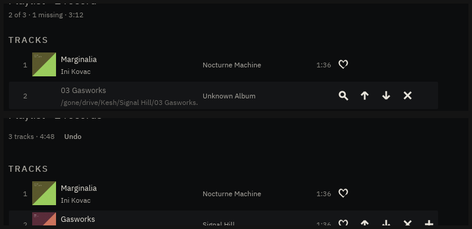
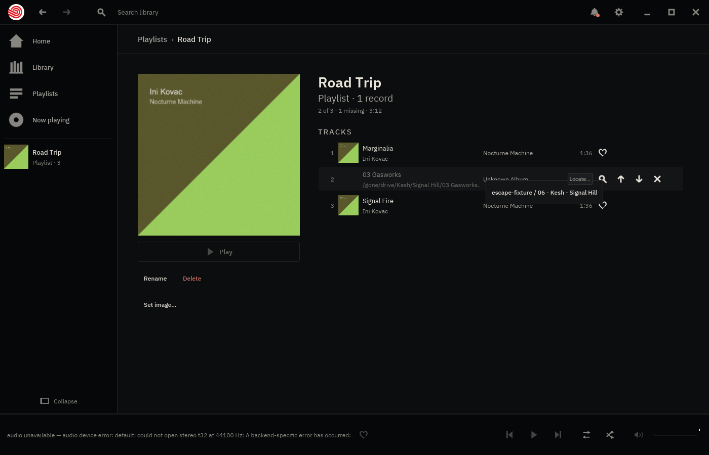

# `Locate…` — repairing a missing playlist entry

**2026-08-17.** Backlog: *A missing playlist entry cannot be repaired in
place.* ADR-0024 §3 specified the surface and the page only ever counted the
breakage.

> Repair is **offered, never automatic**: candidate matches (same filename
> under a current root) proposed per entry, confirmed by the user; the
> confirmation is the only thing that writes the file.

## The shape it took

**`crate::repair`** proposes and cannot write. It matches on **filename**, not
on tags, and the reason is worth keeping: a missing entry's `#EXTINF` was
written by whatever made the playlist, so a tag match compares the index's
confident reading against a string of unknown provenance — and its failure
mode is the expensive one, where two different rips of the same song match
perfectly and the listener confirms a swap they cannot see. A filename match
is dumber and fails cheaply.

*"Under a current root"* needed no code: the index holds what the scanner
walked, and the scanner walks the roots, so iterating the index **is** the
constraint.

Candidates are ordered by **shared path tail** — a drive remounted elsewhere
keeps `Kesh/Signal Hill/03 Gasworks.flac` and changes only what is in front of
it, so the true match leads. That is a fact about the paths rather than a
guess at likelihood, which is the most a proposal should claim.

**The control** is a slot, in the position a missing row leaves free: an entry
whose file has gone cannot be favourited, so the heart's place takes the
magnifier and the row keeps its anatomy instead of growing a column for one
state.

**The card** is `crate::menu`'s float, opened by `chooser_area` — the one
place in the product where that widget answers a *left* press. `Locate…`
cannot act on its press; it has to show the candidates first. A `button` would
have captured the press and left the card nowhere to open from.

This makes `Target::LocatePlaylistEntry` the **only target outside the mirror
layer**, and the distinction is pinned by a test rather than left to be
rediscovered: every other target offers verbs a visible control already sends,
and this one offers a list of paths, which no control "sends".

**The write** goes through `Playlists::edit_open` like every other edit, so it
inherits the externally-edited re-read, the save, and the undo snapshot — a
repair confirmed by mistake is one <kbd>Ctrl</kbd>+<kbd>Z</kbd> away. The
`#EXTINF` rides along untouched: this gesture is about where a file lives, not
what it is.

### What the cap does instead of lying

Only eight candidates are offered. The obvious way to be honest about that is
a final row reading `32 more elsewhere` — and that is exactly what this
module's own mirror test calls a lie: *"an inert item presses nothing"*. So
the overflow goes to the health log, which is somewhere a person can actually
read it (Settings → Debug), and every row on the card stays pressable.

## The proof

`prove.sh` writes a playlist by hand whose middle entry points at
`/gone/drive/Kesh/Signal Hill/03 Gasworks.flac` — a path that does not exist,
whose filename does, under a different prefix in the fixture library. Then it
does what a listener would, on a release build driven through a private Xvfb.



Top: `2 of 3 · 1 missing · 3:12`, the entry dimmed with its dead path one
glance away, no artwork, no duration. Bottom, **after one press on one
candidate**: `3 tracks · 4:48`, the byline up from `1 record` to `2 records`,
the row resolved to *Gasworks · Kesh · Signal Hill* with its sleeve and length
— and `Undo` standing beside the counts.

The card itself, mid-gesture:



One candidate, labelled by where it sits — `escape-fixture / 06 - Kesh -
Signal Hill` — because the filename is the part every candidate shares and
therefore the part that distinguishes none of them.

And the file, which is the only thing that actually matters:

```
 #EXTM3U
 …/01 - Ini Kovac - Nocturne Machine/01 Marginalia.flac
-/gone/drive/Kesh/Signal Hill/03 Gasworks.flac
+…/06 - Kesh - Signal Hill/03 Gasworks.flac
 …/01 - Ini Kovac - Nocturne Machine/02 Signal Fire.flac
```

One line changed. Nothing else in the file moved, and nothing was written
until the press.
