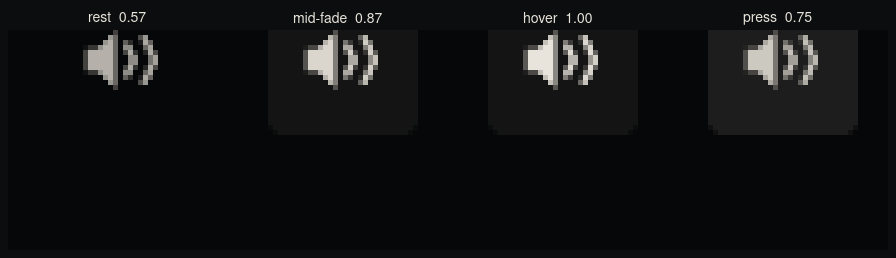
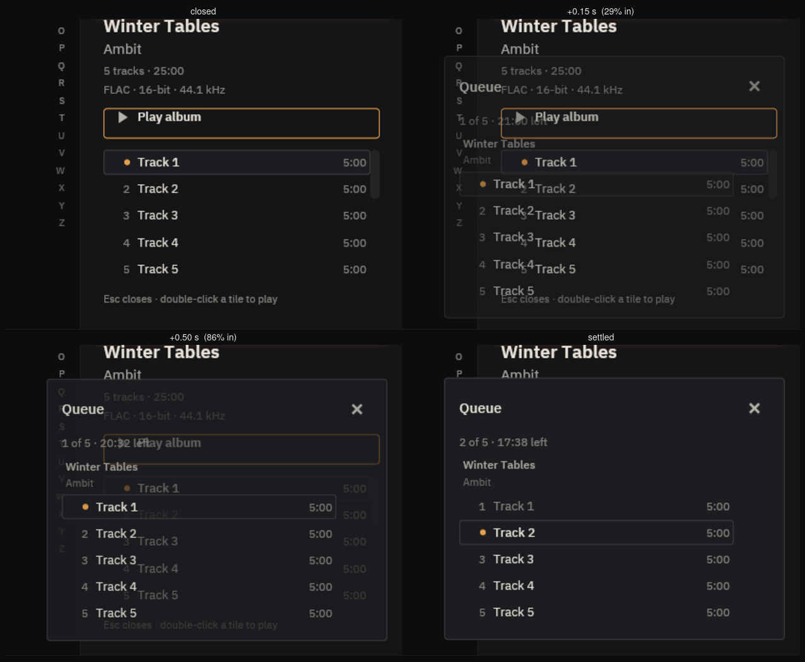
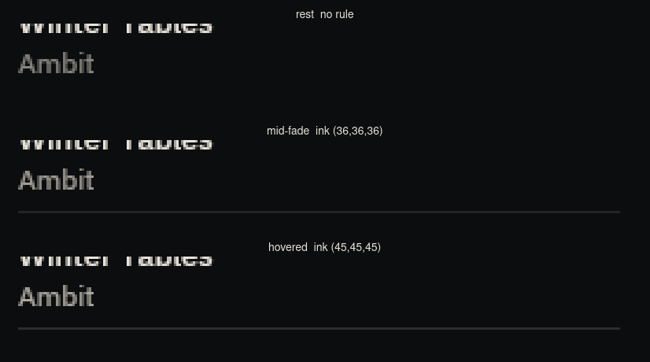
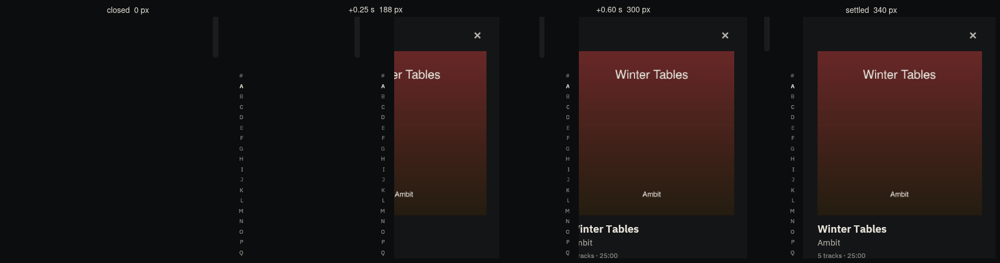
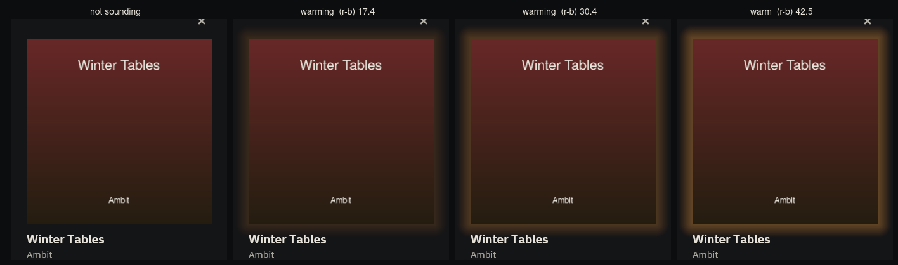
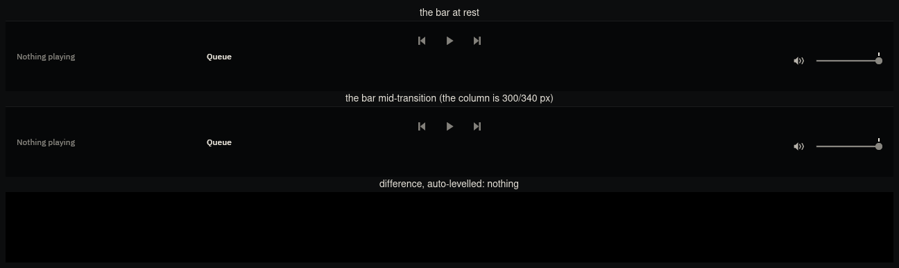

# ADR-0020 — motion, as rendered and as measured

Pixel and cost evidence for the five transitions
[ADR-0020](../../../adr/0020-motion.md) permits. Every image is the real
binary; every number in this file is read off a render or off `/proc`, not
eyeballed.

## How the frames were made

The six-variable isolation of [`docs/DEVELOPMENT.md`](../../../DEVELOPMENT.md),
with the receipt quoted verbatim from every run:

```
[mpris] no session bus; desktop media controls unavailable (I/O error: No such file or directory (os error 2))
```

- a private `Xvfb :141` at 1400 × 1000; the app opens at its shipped 1280 × 860
  and there is no window manager to move it;
- scratch `HOME`, `XDG_DATA_HOME`, `XDG_CONFIG_HOME`, `XDG_CACHE_HOME`,
  `XDG_RUNTIME_DIR`, and `DBUS_SESSION_BUS_ADDRESS` unset — the maintainer's
  library, config and session bus were never opened;
- a throwaway 16-album / 80-track fixture of generated covers and **digitally
  silent** FLAC, never `~/Music`; the scratch `HOME` carries an `.asoundrc`
  routing ALSA's default PCM to `null`, so the run is inaudible twice over. One
  album carries five-minute tracks rather than four-second ones: a `null` sink
  accepts writes as fast as they arrive, so a short album free-wheels to its end
  in under half a second and the lamp is out before a camera can see it;
- captures targeted at *this* process's window by pid, never "the active
  window";
- the build carries `device-output`, since three of the five transitions are in
  or under the bar.

**Two temporary instruments, both reverted before the commit and neither in the
shipped binary.** They are named because a frame taken with a modified binary
that does not say so is a false receipt:

1. **A frame counter inside `App::view`.** `view()` runs once per rendered
   frame, so a line per call *is* the frame log. This is the same passive
   instrument the ADR-0020 spike used, and it lives inside `view` for the same
   reason: it cannot change what the event loop decides to do.
2. **The five durations × 10** for the photographs only. A 90 ms fade cannot be
   photographed by a tool that takes ~100 ms to take a picture. Geometry, colour
   and curve are the shipped ones; only the clock is slowed. Every *cost* number
   below was taken at the shipped durations.

## The clock stops

`view()` calls, counted, before and after. The "before" binary is `76880d4` —
`main` with no motion in it — instrumented with the same counter.

| phase | before (no motion) | after (five transitions) |
|---|---|---|
| idle, 6.0 s | 0 frames | 0 frames |
| **burst: 20 crossings of a live icon button, 5.1 s** | **0 frames** | **260 frames** |
| **idle, the 4 s after the last tween settles** | 0 frames | **0 frames** |
| wall time since the last frame drawn, at the end | 21.89 s | 5.66 s |

Three things, in order of importance:

- **0 frames in the 4 s after the last tween settles.** The spike's decisive
  line was *"frames after the last tween settled: 1, over the 3.9 s since"*;
  baz's own binary draws none at all. The subscription is a function of state,
  the last tick of the last tween removes it, and the event loop parks.
- **260 frames for 20 fades** is 13 frames each — a 90 ms tween at an 8 ms tick
  is 11 ticks, and the rest are the crossings' own redraws. The transitions run.
- **0 frames, before.** Twenty crossings of the mute speaker drew *nothing at
  all*: the hover changed nothing the renderer had a reason to redraw, so not
  even the button's own hover wash was ever painted. That is `04-fluidity.md`
  §3.1's finding (2) — *"hover never touches the mark"* — measured rather than
  argued, and stronger than the document claimed.

## CPU, and why it is not the number to quote here

| phase | before | after |
|---|---|---|
| idle, 6 s | 100.00 % of one core | 99.83 % |
| burst, 5 s | 52.30 % | 74.10 % |
| the 4 s after the last tween settles | 100.00 % | 99.75 % |

**These are software-rasterisation figures and they do not transfer.** baz burns
about one core under Xvfb/llvmpipe *while drawing zero frames* — identically in
both binaries, so it is neither new nor mine — and that constant swamps
everything. `04-fluidity.md` §1.5 says exactly this about the same environment:
the absolute percentages are an artefact and **the frame counts are what
transfer**. What these rows do establish is the comparison: motion costs
**nothing** at idle (100.00 % → 99.83 %) and nothing after it settles
(100.00 % → 99.75 %), and the burst delta is the cost of llvmpipe actually
rasterising 260 frames. The real-GPU figure for the identical bounded driver —
**0.0 % CPU, 8 frames per 4 s** — is in ADR-0020's own measurement table.

## Startup-to-interactive

Twelve runs of each `--release` binary, same fixture, same isolation:

| | mean | **median** | min | max |
|---|---|---|---|---|
| before | 346.8 | **345.3** | 336.6 | 357.6 |
| after | 355.1 | **345.8** | 332.4 | 441.2 |

**0.5 ms apart on the median**, and the fastest single launch of the twenty-four
is an *after* run at 332.4 ms. The means differ by 8.3 ms and that difference is
one outlier: a single 441.2 ms launch, against a 21 ms spread across the other
eleven. It is reported rather than dropped — the median is the statistic that
survives it, and the raw runs are:

```
before  343.0 336.6 357.6 343.1 343.5 343.1 347.5 350.5 355.9 350.9 347.1 342.6
after   337.2 344.2 338.8 441.2 332.4 339.2 347.4 351.9 362.7 358.1 365.1 342.5
```

The driver cannot affect this in principle either: the subscription is first
consulted *after* the first update.

## The five, photographed

### 1 · Icon-button ink fade — 90 ms



The mute speaker at 5×, because it is the one icon button that is live on the
first frame — a Previous with nothing playing is **disabled**, and a disabled
control is deliberately unmoved by a pointer crossing it.

Peak glyph ink, read off the render (mean of R, G, B; the renderer blends in
linear light, which is why these are not the sRGB arithmetic of the opacity):

| state | opacity | drawn |
|---|---|---|
| rest | 0.57 | 176.0 |
| **mid-fade** | **0.87** | **212.7** |
| hover | 1.00 | 226.3 |
| press | 0.75 | 199.3 |

0.87 is a genuine intermediate: 0.687 of the way along the 0.57 → 1.00 ramp,
against the 0.703 an ease-out is at 0.30 s into a 900 ms flight. The curve is
doing what it says.

The three transport glyphs read **127.7** — opacity 0.28 — in all four frames.
Nothing lifts a dead control.

### 2 · Queue popover arrival — fade + 8 px rise, 140 ms



Measured at column x = 1000 and row y = 700:

| frame | ground over the wall | ground over the panel | bottom edge |
|---|---|---|---|
| +0.15 s | (24, 25, 27) | (20, 21, 23) | ~745 |
| +0.50 s | (26, 27, 30) | (27, 28, 31) | ~742 |
| settled | (28, 29, 32) `plinth_lit` | (28, 29, 32) | **741** |

**The horizontal edges never move.** In every frame the popover's ground runs
`x 905..1262` with its 1 px border at 904 and 1263 — 360 px, `POPOVER_W` exactly
— and the right inset is `1280 − 1 − 1263 = 16` = `GAP_LG` in every frame of the
flight. Only the bottom edge travels, and only *upward*, from 8 px below its
resting place: no frame of the arrival is above where it lands.

That the same alpha composites to two different values on the two grounds is the
proof that this really is the one transient alpha baz draws — and the reason it
is one: a popover floats over ten thousand covers and there is no ground to
pre-composite against. At `arriving == 1` the fade is the identity, so the
values the contrast laws were measured on are the values that ship
(`the_popovers_arrival_lands_on_the_shipped_colours`).

### 3 · Shelf tile hover rule — 90 ms



| frame | rule lane | thickness | ink |
|---|---|---|---|
| rest | — | 0 px | none drawn |
| mid-fade | y 444 | **1 px** | (36, 36, 36) |
| hovered | y 444 | **1 px** | (45, 45, 45) |

(45, 45, 45) is `hairline_strong` over the wall to the byte: `12 + 0.15 × (232 −
12) = 45.0`. (36, 36, 36) is that mark at **0.73** of its weight — an ease-out at
0.30 s into a 900 ms flight is at 0.703.

**The thickness is 1 px in both frames and the lane is the same row.** Only the
ink moves: a rule that interpolated its *thickness* would spend most of the
transition asking the rasteriser to draw two thirds of a pixel, which is a blur
rather than a thin line.

### 4 · Inspector width — 150 ms



Panel left edge, read off row y = 90:

| frame | left edge | column width |
|---|---|---|
| closed | — | 0 px |
| +0.25 s | x 1092 | **188 px** |
| +0.60 s | x 980 | **300 px** |
| settled | x 940 | **340 px** = `PANEL_W` |

**The column is revealed, not compressed** — and the first attempt at this
*was* a compression, which is why the distinction is drawn in the code. iced
0.13's flex layout hands each non-fill child the width that is left, so a panel
simply given a narrower box re-lays itself out inside it: measured, and it
wrapped every track title onto two lines and scaled the sleeve on every frame of
the way in. The shipped version puts the panel behind a viewport that uncovers
it, and the receipts are:

- the dismissal ✕'s ink is at **x 1239..1240 in every frame**;
- a 260 × 240 block of the sleeve — `x 980..1240, y 140..380` — is
  **pixel-identical** across the frames;
- the sleeve's own edge is at `y = 121` in all of them.

Nothing inside the column moves. At rest the viewport is not built at all
(`Shelf::revealing` returns the panel untouched at `PANEL_W`), so the settled
composition is the one baz shipped before there was any motion.

### 5 · Lamp warming — 200 ms, linear



Started from the inspector's own `Play album` rather than from a tile, so the
only thing that changes between these frames is the light: a double-click on a
tile also opens the column, and a reflow under the measurement would make "the
sleeve did not move" unprovable.

Mean (R − B) on the panel ground just above the sleeve — the halo is amber, so
this is how much light there is:

| frame | (R − B) |
|---|---|
| not sounding | −3.00 |
| warming | 17.39 |
| warming | 30.39 |
| warm | 42.54 |

And the artwork itself — `x 980..1240, y 140..380` — is **pixel-identical** in
all four. The halo's blur is `HALO_BLUR` in every frame; what moves is the
light's strength and nothing else.

The lamp warms **when the light moves to another record**. A track change within
the same album leaves the tween already at its target, so it settles immediately
and asks for no clock — dipping the halo to zero and back on every track
boundary would be a flicker on a record that never stopped playing.

## The bar did not move



The promise ADR-0020 could not be allowed to cost, checked **during** a
transition rather than only at rest. The bottom bar's 1280 × 102 region is
byte-identical between the closed frame and every frame of the inspector's
width tween, and between the resting frame and every frame of the tile hover.

Under the popover's arrival the bar's *ink* changes — the `Queue` control lights
up, which is what it is for — so that one is measured as geometry rather than
diffed:

| | closed | +0.15 s | +0.50 s | settled |
|---|---|---|---|---|
| bar's top hairline row | 758 | 758 | 758 | 758 |
| transport glyph runs (x) | 595–604 · 636–643 · 675–684 | same | same | same |
| mute glyph (x) | 1136–1150 | same | same | same |
| fader rail (x) | 1169–1263 | same | same | same |

The transport block's centre is x 639.5 in every frame of every transition. The
`Queue` control's lit border appears as two 1 px runs at x 282 and x 431 — a
border that is 1 px in all four states by construction (`theme::now_playing`),
so lighting it moves the title under it by nothing.

## What is not here, and is refused

No shelf-grid stagger and no pop-in; no fade as a thumbnail decodes (a thumbnail
replacing its placeholder is still an instant swap); no album-art crossfade; and
no animation of the bar's geometry. the product's standing rules carries the list, and
ADR-0020 §3 is what put it there.
