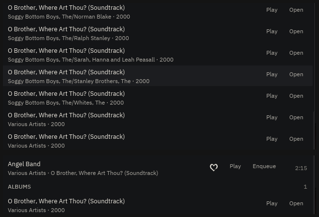

# The untagged compilation

**2026-08-17.** The owner, over a photograph of his own Home: *"it seems some
albums are not grouped properly e.g. look at the home.png, it contains a bunch
of different things from the same album — maybe worth investigating that
album."*

The album was `O Brother, Where Art Thou? (Soundtrack)`. It stood as **fifteen
records**.

## Investigating the album, which is what he asked for

Nothing in ADR-0008's fallback chain was wrong. Reading his actual
`library.db`:

- every one of those files declares **the same album title**,
- every one sits in **the same folder**,
- **none** names an album artist,
- **none** sets the compilation flag,
- and their track-artist strings are `Soggy Bottom Boys, The`,
  `Soggy Bottom Boys, The/John Hartford`, `Soggy Bottom Boys, The/Alison
  Krauss`, and a dozen more.

So step 3 of the chain groups them by track artist, exactly as designed, and
fifteen artist strings make fifteen records. The tag that would have said
otherwise is simply not in the files.

**Measured across the whole library first**, because one loud album is not a
reason to change a grouping rule: of **663 records, 3 shatter**, producing
**18 spurious tiles**. Small, and entirely visible — one of them is fifteen of
the eighteen.

## The rule

`SearchIndex::merge_folders`, a sibling of the existing `merge_discs`, and
built to the posture that one states: *decline where there is no signal*.

**The signal is a fact about the library, not a guess about a track**: tracks
in one folder, declaring one album title, that disagree about the artist.
Files a person put in one directory under one album name are one release, and
artists disagreeing is what a compilation *is*.

Three things keep it from over-reaching.

**It merges and never splits.** The folder is evidence, never part of the key,
so a record whose discs live in `d1/` and `d2/` is untouched and still merges
by title.

**A majority, not a plurality.** The merged record keeps the artist a majority
of its tracks name, and is `Various` only when none does. This is what stops
the rule wrecking the commonest two-artist folder there is — an album by one
artist with a guest credit on one track. Nine of ten is a majority, so
`Radiohead` stays `Radiohead`. A plurality would not have done: three of
nineteen is the largest bloc in the soundtrack above, and naming a
various-artists record after three-nineteenths of it would be inventing a
fact.

**A record has one track 5.** A folder whose tracks claim the same number
twice is not one record however much else it agrees on, and this is the guard
that tells a nineteen-track soundtrack apart from a directory of loose files
that happen to share a common album title — two different `Greatest Hits`
dropped in one folder are both track 1, and stay two records. It keeps
`same_album_title_by_different_artists_stays_separate` true, which is a
decision this pass had no business overturning.

## A decision reversed, and the measurement that justified it

That got his record from fifteen tiles to **two**. The last one is a separate
rule, and reversing it needs saying out loud.

`AlbumArtist::of` treated a tag literally reading `Various Artists` as a
**name**. The test said so in as many words: *"It is a name, not baz's
compilation bucket. The owner's library has one; the two must stay
distinguishable."*

His library has **345** of them now. And the distinction was measured across
all 4 880 tracks: folding the phrase into `AlbumArtist::Various` changes
**exactly one record** — this one, which was two tiles because one folder's
files set the flag and another's wrote the phrase. Two spellings of the same
fact, filed apart.

Nothing was bought by keeping them apart: `Various` is what a listener sees
either way, so the distinction was invisible where it was right and duplicated
a record where it was wrong. The list is closed and matched whole —
`various artists` and `various`, so `Various Production` survives as a band —
and **`VA` is deliberately not on it**, being a plausible name.

**This is a reversal of an argued decision, on one album's evidence.** It is
recorded here rather than buried so it can be argued back.

## The proof

`prove.sh` runs the real binary against a **copy** of the owner's real
`library.db` in a scratch XDG tree, and searches for the record. The `before`
frame is the build from immediately before the change.

Top, before: rows and rows of `O Brother, Where Art Thou? (Soundtrack)`, each
under a different `Soggy Bottom Boys, The/…`, and more above the fold. Bottom,
after: **`ALBUMS · 1`**, `Various Artists · 2000`.

The hit count falls from 74 to 39 in the same move, and that is the same fix
rather than a second one: rows that were separate records become **editions**
of one, which is ADR-0007's double-rip handling finally getting the chance to
work on them.

No scan ran and the NAS was never walked — `music_dirs` points at a folder
that does not exist, so the scanner's positive-evidence gate keeps every row
and the wall is drawn from the index alone. baz reports `1 folder is not
reachable` in the corner throughout, which is true and is the honest reading.

## Migration got faster as a side effect

`a_v2_database_migrates_in_place_without_losing_anything` asserted that a
shattered soundtrack **stays** shattered after a v2 → v3 upgrade, until a
rescan reads the files again. That was true on its own premise: v2 has no
album-artist column and no compilation flag, so nothing could group those rows.

This pass needs neither column. It reads the folder and the album title, which
a v2 database already holds — so the rows are grouped on the first launch
after the upgrade rather than on the first rescan. The test now says that, and
every column assertion in it is unchanged.
